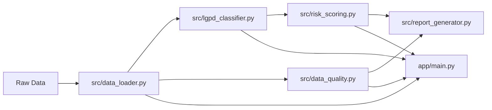

# Governed Analytics Platform

[](https://github.com/samuelmaia-analytics/Governed-Analytics-Platform/actions/workflows/ci.yml)
[](https://github.com/samuelmaia-analytics/Governed-Analytics-Platform/actions/workflows/lint.yml)
[](https://www.python.org/)
[](https://codecov.io/gh/samuelmaia-analytics/Governed-Analytics-Platform)
[](https://governed-analytics-platform.streamlit.app/)

**Language:** [PT-BR](README.md) | `EN`

Portfolio-grade governed analytics platform focused on Analytics Engineering, data governance, LGPD-inspired controls, data quality, and executive delivery.

## Executive Summary

This project transforms raw relational CSV datasets into a privacy-aware published analytical layer.
It combines:

- modular data pipeline;
- LGPD-inspired classification;
- explainable privacy risk scoring;
- publication controls;
- Streamlit executive app;
- testing and CI quality gates.

## Business Impact

- Reduces exposure risk by separating internal analytics from published executive consumption.
- Improves trust with explicit publication status (`Approved`, `Needs Review`, `Blocked`).
- Speeds up technical review with reproducible governance evidence.
- Demonstrates product-oriented analytics engineering, not only dashboarding.

## Why this project matters

Most portfolio projects focus only on visual output.
This repository demonstrates the full governed journey from ingestion to controlled publication.

## Architecture Overview

Core flow:

ingestion -> standardization -> analytical enrichment -> data quality checks -> LGPD-inspired classification -> explainable risk score -> controlled publication -> executive app.

Key boundary:

the app should consume the published layer only (`data/published/dashboard`), not the full internal curated layer.



## Implemented vs Simulated

### Implemented

- Modular Python pipeline with reproducible steps.
- Column classification by heuristics + YAML contract rules.
- Explainable privacy risk score and publication decision logic.
- Rule-based quality checks and governance evidence.
- Streamlit executive pages including publication rationale.
- Tests, lint, mypy, and CI workflows.

### Simulated

- Processing inventory metadata (controller/operator/DPO) with fictional entities.
- Mini RIPD in Markdown for demonstration.
- Legal basis and retention as governance simulation.
- Enterprise IAM and centralized audit stack integration.

## What this project demonstrates

- Analytics Engineering mindset with governance-by-design.
- Clear internal vs published data boundaries.
- Reproducible local run with quality gates.
- Executive communication of risk, quality, and publication readiness.

## How to run locally

### Linux / macOS

```bash
python -m venv .venv
source .venv/bin/activate
make install
cp .env.example .env
make test
make app
```

### Windows PowerShell

```powershell
python -m venv .venv
.venv\Scripts\Activate.ps1
make install
copy .env.example .env
make test
make app
```

## How to review this project in 5 minutes

1. Read this README until **Implemented vs Simulated**.
2. Open `docs/architecture.md` and `docs/privacy_governance.md`.
3. Run `make test`.
4. Open the Streamlit app and inspect **Governance Control Center**.
5. Review `docs/semantic_layer.md` and `docs/recruiter_summary.md`.

## How a recruiter should read this project in 60 seconds

1. Check **Business Impact**.
2. Check **Implemented vs Simulated**.
3. Confirm publication decision states in the app.
4. Confirm CI and tests exist and run.
5. Scan `docs/recruiter_summary.md` for role alignment.

## Streamlit Executive App

Main pages:

- Executive Overview
- Data Catalog
- LGPD & Privacy Risk
- Data Quality
- EDA
- Governance Report
- Governance Control Center (Publication Decision focus)

## Main Structure

| Path | Purpose |
| --- | --- |
| `app/` | Streamlit executive interface |
| `src/` | Pipeline and governance logic |
| `contracts/` | Data quality and governance contracts |
| `docs/` | Technical and executive documentation |
| `tests/` | Automated tests |
| `.github/workflows/` | CI/CD |
| `powerbi/` | BI export artifacts |

## Recruiter Notes

This repository is a strong interview discussion artifact for:

- Data Analyst / Senior Data Analyst
- Analytics Engineer
- Data Engineer
- BI Analyst
- Data Governance / Data Platform profiles

because it shows delivery, controls, and trade-offs clearly.

## Improved Case Snapshot

Scenario:
e-commerce relational data is turned into an executive product under publication controls.

Risk:
without governance, personal and quasi-identifying fields may be exposed.

Approach:
classification + risk scoring + quality checks + controlled publication + evidence reporting.

Outcome:
executive consumers get a minimized, privacy-aware, production-oriented view.

## Limitations and Production Considerations

- Portfolio-grade and production-oriented scope.
- LGPD-inspired controls, not legal compliance certification.
- Simulated governance metadata and RIPD sample.
- Real-world rollout still requires legal/security approval and enterprise IAM.

## Links

- Streamlit app: <https://governed-analytics-platform.streamlit.app/>
- Repository: <https://github.com/samuelmaia-analytics/Governed-Analytics-Platform>
- Technical docs index: [docs/README.en.md](docs/README.en.md)
