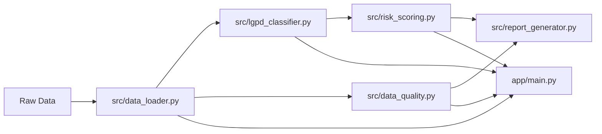

# Governed Analytics Platform

[](https://github.com/samuelmaia-analytics/Governed-Analytics-Platform/actions/workflows/ci.yml)
[](https://github.com/samuelmaia-analytics/Governed-Analytics-Platform/actions/workflows/lint.yml)
[](https://www.python.org/)
[](https://codecov.io/gh/samuelmaia-analytics/Governed-Analytics-Platform)
[](https://creativecommons.org/licenses/by-nc/4.0/)
[](https://governed-analytics-platform.streamlit.app/)

**Language:** [PT-BR](README.md) | `EN`

A portfolio-grade governed analytics platform.
This repository shows Analytics Engineering practices with governance controls and executive delivery.

> This is not only a dashboard.
> It is a privacy-aware, production-oriented analytics case with publication controls.

## Executive Summary

The project demonstrates how to transform relational CSV inputs into a governed published analytics layer.
It combines data pipeline execution, privacy classification, explainable risk scoring, data quality checks, and executive reporting.

## Why this project matters

Many analytics portfolios stop at visualizations.
This one highlights controlled publication, quality evidence, and reproducibility.

## What this project demonstrates

- Internal vs published layer separation.
- LGPD-inspired privacy controls.
- Explainable privacy risk scoring.
- Data quality checks with explicit rules.
- CI quality gates and test coverage.
- Executive-facing Streamlit experience.

## How to review this project in 5 minutes

1. Read **Business Problem** and **Solution**.
2. Inspect **Architecture** and publication boundaries.
3. Run `make install`, `make test`, `make app`.
4. Review key app pages:
   - Executive Overview
   - LGPD & Privacy Risk
   - Data Quality
   - Governance Control Center
5. Open `docs/privacy_governance.md` and `docs/semantic_layer.md`.

## Business Problem

Analytics outputs are often published without clear controls for privacy, quality, and traceability.
That creates delivery risk, trust issues, and inconsistent decision criteria.

## Solution

This repository implements a governed analytics flow:

- modular Python pipeline;
- explicit published-layer constraints;
- privacy classification and risk scoring;
- contract-driven quality checks;
- executive documentation and operational evidence.

## Problem -> Solution -> Evidence

| Problem | Solution | Evidence |
| --- | --- | --- |
| Uncontrolled exposure | Minimized and pseudonymized published layer | `docs/privacy_governance.md` |
| Weak quality confidence | Declarative rules + automated checks | `contracts/data_quality_rules.yml` |
| Metric inconsistency | Documented semantic layer | `docs/semantic_layer.md` |
| Low operational trust | CI, lint, test gates | `.github/workflows/ci.yml` |

## Architecture



## Data Governance and Privacy Controls

- LGPD-inspired column classification.
- Explainable privacy risk score with action hints.
- Publication checks before executive exposure.
- Privacy-aware published layer for dashboard consumption.

These controls are technical controls and do not replace legal assessment.

## Data Quality

- Rule categories include completeness, validity, consistency, and critical publication checks.
- Results are aggregated for executive visibility and detailed for engineering diagnosis.

## Streamlit App

Main pages:

- Executive Overview
- Data Catalog
- LGPD & Privacy Risk
- Data Quality
- EDA
- Governance Report
- Governance Control Center

## Main Structure

| Path | Purpose |
| --- | --- |
| `app/` | Executive Streamlit interface |
| `src/` | Pipeline, governance, and quality modules |
| `contracts/` | Declarative contracts and rules |
| `docs/` | Governance and semantic documentation |
| `tests/` | Automated tests |
| `.github/workflows/` | CI/CD workflows |
| `powerbi/` | BI export support artifacts |

## How to run locally

### Linux / macOS

```bash
python -m venv .venv
source .venv/bin/activate
make install
cp .env.example .env
```

### Windows PowerShell

```powershell
python -m venv .venv
.venv\Scripts\Activate.ps1
make install
copy .env.example .env
```

## Run

```bash
make test
make app
```

## Recruiter Notes

This project is suitable to discuss:

- governed analytics architecture decisions;
- privacy-aware publication boundaries;
- quality-control evidence and contracts;
- reproducible local setup and CI gates.

## Limitations and Production Considerations

- This is a portfolio-grade and production-oriented implementation.
- Controls are simulated for demonstration with public/synthetic context.
- Real production environments require IAM, centralized audit, and legal/security validation workflows.
- The published layer is intentionally constrained for executive use.

## Links

- Streamlit app: <https://governed-analytics-platform.streamlit.app/>
- Repository: <https://github.com/samuelmaia-analytics/Governed-Analytics-Platform>
- Technical index: [docs/README.en.md](docs/README.en.md)

## License

CC BY-NC 4.0.
See: <https://creativecommons.org/licenses/by-nc/4.0/>.
