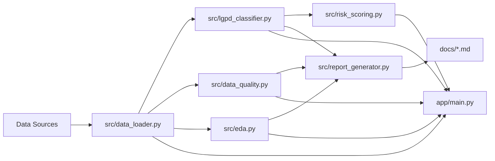
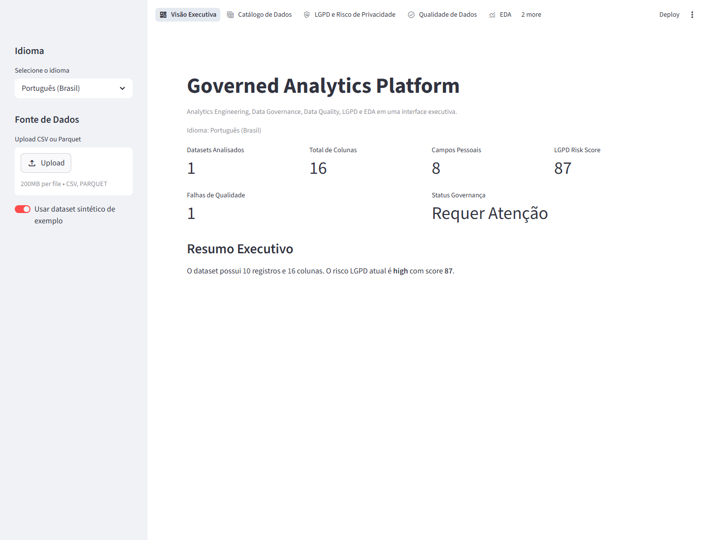
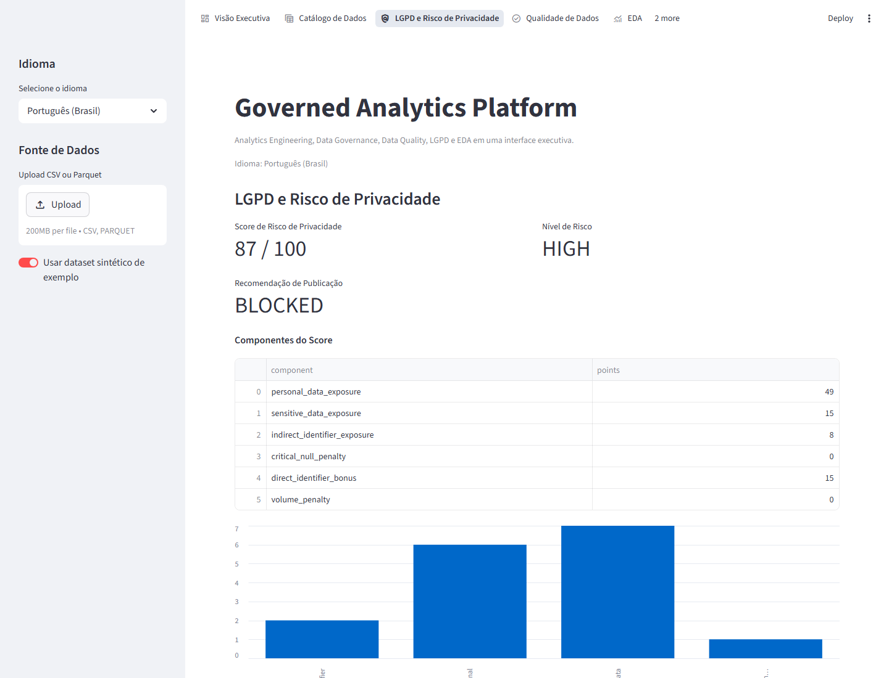
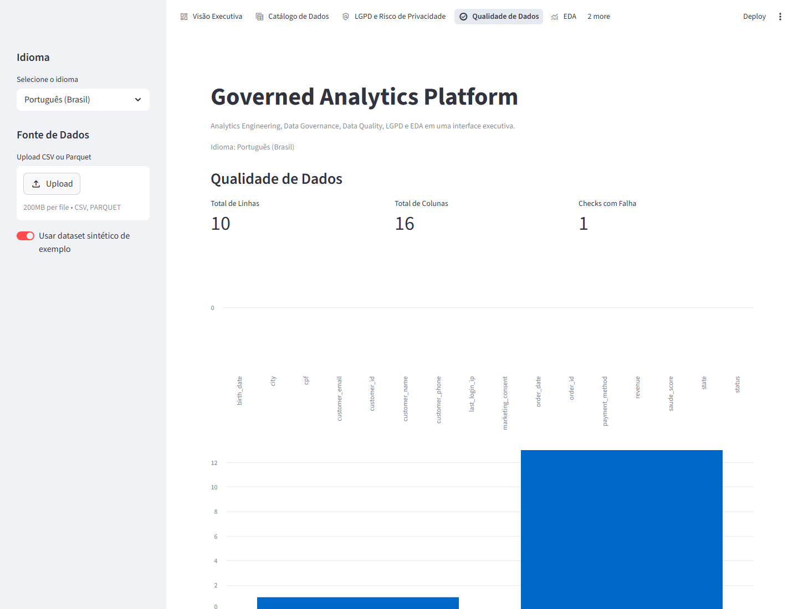
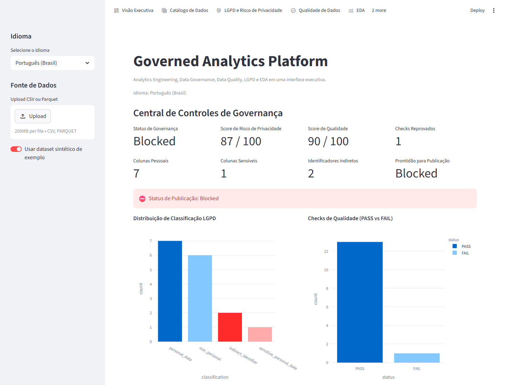
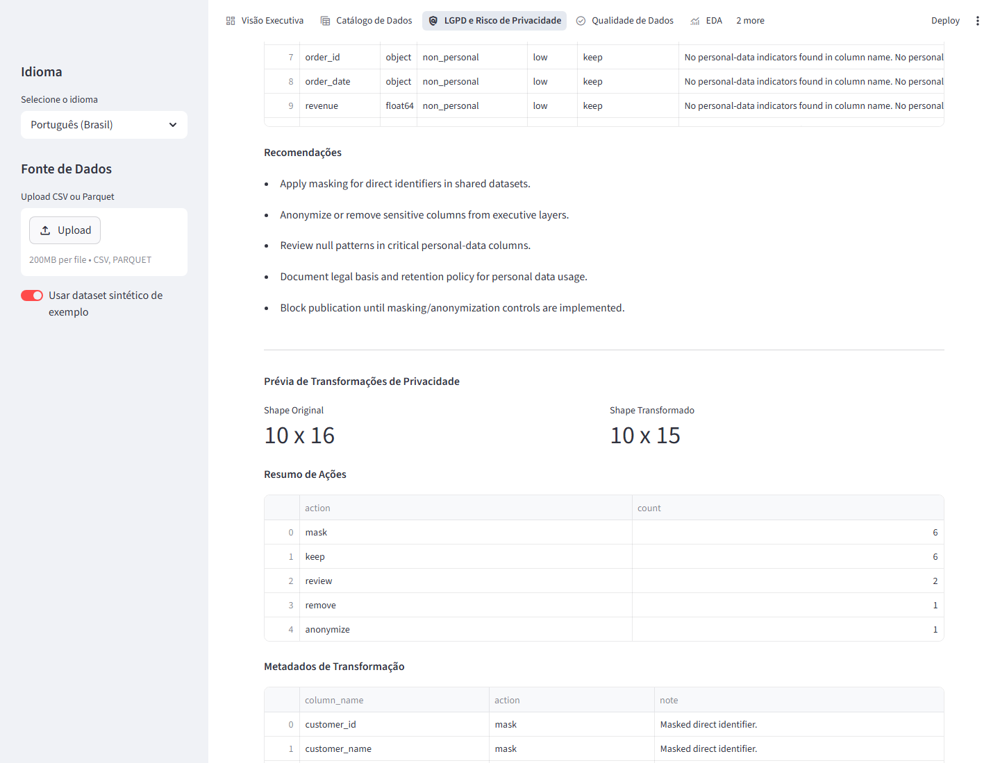

# Governed Analytics Platform

[](https://github.com/samuelmaia-analytics/Governed-Analytics-Platform/actions/workflows/ci.yml)
[](https://github.com/samuelmaia-analytics/Governed-Analytics-Platform/actions/workflows/lint.yml)
[](https://www.python.org/)
[](https://codecov.io/gh/samuelmaia-analytics/Governed-Analytics-Platform)
[](https://creativecommons.org/licenses/by-nc/4.0/)
[](https://governed-analytics-platform.streamlit.app/)
[](https://github.com/samuelmaia-analytics/Governed-Analytics-Platform)

**Language:** `PT-BR` | [EN](README.en.md)

Plataforma analítica governada em Streamlit para demonstrar governança de dados, classificação LGPD, qualidade, EDA automatizada e geração de relatórios executivos.

## Posicionamento Executivo

Este repositório simula um produto analítico governado para uso executivo: com privacidade, qualidade, auditabilidade e decisão de publicação explicável.

## TL;DR

- foco: Analytics Engineering com controles de governança desde a ingestão até a camada publicada;
- entrega: app Streamlit, pipeline Python, contratos e documentação operacional;
- público: engenharia de dados, analytics e liderança técnica.

## Visão rápida para recrutadores

- Produto analítico governado, não apenas um dashboard.
- Pipeline Python modular da ingestão à camada publicada.
- Classificação LGPD por coluna.
- Score de risco de privacidade explicável.
- Regras declarativas de qualidade em YAML.
- Data Quality Score e decisão de publicação no app.
- Privacy masking/anonymization preview na interface.
- Screenshots automatizadas com Playwright.
- Testes, CI, Ruff, Pytest e execução local reproduzível.

## Problema de negócio

Times analíticos frequentemente aceleram entregas sem formalizar controles de qualidade, privacidade e rastreabilidade. O resultado é risco regulatório, baixa confiança nos dados e decisões executivas com pouca governança.

## Solução

O projeto implementa uma abordagem de produto analítico governado:

- pipeline Python com fronteira explícita entre camada interna e camada publicada;
- classificação LGPD por coluna com score de risco de privacidade;
- checks de qualidade de dados reutilizáveis;
- EDA automatizada para suporte analítico rápido;
- geração de relatórios Markdown para documentação executiva e técnica.

## Resumo de Arquitetura

1. `src/data_loader.py` carrega dados sintéticos de exemplo.
2. `src/lgpd_classifier.py` classifica colunas por categoria LGPD.
3. `src/risk_scoring.py` calcula score de risco explicável e recomendação de publicação.
4. `src/data_quality.py` + `src/data_quality_rules.py` executam checks de qualidade heurísticos e declarativos em YAML.
5. `src/report_generator.py` gera artefatos de governança em `docs/`.
6. `app/main.py` entrega a interface executiva no Streamlit.

## Funcionalidades

- Executive Overview com KPIs de governança e risco.
- Data Catalog com dicionário e metadados de colunas.
- LGPD & Privacy Risk com classificação e recomendações.
- Data Quality com checks e severidade por regra.
- EDA com estatísticas descritivas, nulos, outliers e correlação.
- Governance Report com relatórios em `docs/`.
- Políticas LGPD versionadas por domínio em `contracts/governance/policies/`.
- Regras de negócio declarativas por contrato em `contracts/governance/business_rules/`.
- Lineage técnico automatizado em `data/curated/catalog/technical_lineage.json`.
- Scorecards de governança por dataset em `data/published/monitoring/governance_scorecards.csv`.
- Página Governance Control Center com prontidão de publicação e principais riscos.
- Módulo de transformações de privacidade (`src/privacy_transformations.py`) com ações de mascaramento/anonimização.
- Histórico de monitoramento de governança em `data/published/monitoring/governance_history.csv`.

## O que isso demonstra para recrutadores

- Analytics Engineering com controles de governança reproduzíveis.
- Privacidade por design orientada a LGPD.
- Qualidade de dados declarativa via contratos/regras.
- Python tipado, testes automatizados, CI e entrega de produto executivo.

## Fluxo de dados



## Stack técnica

- Python 3.11+
- Pandas e NumPy
- Streamlit e Plotly
- Pytest, Pytest-Cov e Ruff
- GitHub Actions (CI)

## Estrutura principal

| Caminho | Finalidade |
| --- | --- |
| `app/` | nova interface executiva Streamlit por abas |
| `src/` | módulos de Analytics Engineering, LGPD e qualidade |
| `data/samples/` | datasets sintéticos para demonstração |
| `docs/` | relatórios e documentação de governança |
| `tests/` | suíte automatizada de testes |

## Setup rápido

```bash
python -m venv .venv
.venv\Scripts\activate
uv sync
cp .env.example .env
```

## Como executar

App executivo:

```bash
streamlit run app/main.py
```

## Exemplos de uso

1. Carregar `data/samples/sample_governance_dataset.csv` no app.
2. Validar classificação LGPD por coluna.
3. Revisar score de risco e recomendações.
4. Avaliar checks de qualidade com status/severidade.
5. Gerar relatórios automáticos em `docs/`.

## Governança e LGPD

- Classificação de colunas: `non_personal`, `personal_data`, `sensitive_personal_data`, `indirect_identifier`.
- Níveis de risco: `low`, `medium`, `high`.
- Ações sugeridas: `keep`, `mask`, `anonymize`, `remove`, `review`.
- Relatório de controles: `docs/lgpd_controls.md`.

## Qualidade e testes

```bash
ruff check src app tests
pytest --cov=src --cov=app --cov-report=term-missing
```

Testes novos incluídos:

- `tests/test_lgpd_classifier.py`
- `tests/test_risk_scoring.py`
- `tests/test_data_quality.py`
- `tests/test_privacy_transformations.py`
- `tests/test_data_quality_rules.py`
- `tests/test_governance_history.py`

## Features de Governança

- Score de risco de privacidade explicável por componente.
- Checks declarativos de qualidade em `contracts/data_quality_rules.yml`.
- Estados de decisão de publicação: `Approved`, `Needs Review`, `Blocked`.
- Função de histórico de monitoramento: `src.governance_history.append_governance_history`.

```bash
python -c "from pathlib import Path; import pandas as pd; from src.data_quality import run_data_quality_checks; from src.lgpd_classifier import classify_dataframe_columns; from src.governance_history import append_governance_history_from_dataframes; df = pd.read_csv('data/samples/sample_governance_dataset.csv'); classification = classify_dataframe_columns(df); quality = run_data_quality_checks(df); append_governance_history_from_dataframes(df=df, classification_df=classification, quality_result=quality, publication_status='Needs Review'); print(Path('data/published/monitoring/governance_history.csv').resolve())"
```

## Mini estudo de caso

Com um dataset sintético de e-commerce contendo identificadores pessoais e problemas de qualidade, a plataforma classifica risco LGPD, valida regras de qualidade e recomenda decisão de publicação com ações de remediação objetivas.

## Screenshots

### Executive Overview


### LGPD & Privacy Risk


### Data Quality


### Governance Control Center


### Privacy Transformation Preview


### Como atualizar screenshots localmente

```bash
uv sync --extra dev
python -m playwright install chromium
python scripts/capture_streamlit_screenshots.py
```

## Targets do Makefile

- `make install`: instala dependências com `uv sync`
- `make lint`: executa `ruff check src app tests`
- `make test`: executa `pytest --cov=src --cov=app --cov-report=term-missing`
- `make pipeline`: executa o pipeline em sequência (`data_loader` -> `lgpd_classifier` -> `risk_scoring` -> `data_quality` -> `report_generator`)
- `make app`: inicia o app com `streamlit run app/main.py`
- `make screenshots`: captura screenshots com `python scripts/capture_streamlit_screenshots.py`

## Governança operacional (implementado)

- versionamento de políticas LGPD por domínio com validação no pipeline de publicação;
- checks de regras de negócio por contrato com relatório dedicado;
- lineage técnico automatizado integrado ao catálogo;
- scorecards de governança por dataset em rotina agendada.

## Links

- Streamlit app: [governed-analytics-platform.streamlit.app](https://governed-analytics-platform.streamlit.app/)
- GitHub: [samuelmaia-analytics/Governed-Analytics-Platform](https://github.com/samuelmaia-analytics/Governed-Analytics-Platform)
- índice técnico: [docs/README.md](docs/README.md)

## License

This work is licensed under a Creative Commons Attribution-NonCommercial 4.0 International License (CC BY-NC 4.0).

To view a copy of this license, visit:
https://creativecommons.org/licenses/by-nc/4.0/

[](https://creativecommons.org/licenses/by-nc/4.0/)

