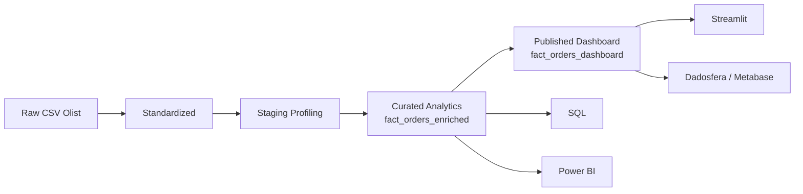

# Projeto Olist | Case Técnico de Dados

[](https://github.com/samuelmaia-analytics/SAMUEL_MAIA_DDF_TECH_032026/actions/workflows/ci.yml)
[](https://github.com/samuelmaia-analytics/SAMUEL_MAIA_DDF_TECH_032026/actions/workflows/lint.yml)
[](https://samuelmaia-032026.streamlit.app/)

Entrega de analytics engineering orientada a produto sobre o dataset Olist. O projeto transforma dados transacionais em um ativo analítico governado, testado e consumível por dashboard, SQL, catálogo e BI externo.

## Executive Summary

O ativo central da solução é `fact_orders_enriched`, modelado com granularidade de item de pedido e `112.650` registros. A partir dele, o projeto deriva `fact_orders_dashboard`, camada publicada e minimizada para consumo executivo, com pseudonimização de identificadores e redução de exposição desnecessária.

A proposta não foi apenas “fazer um dashboard”. O repositório foi estruturado para demonstrar ciclo de vida completo de dados: ingestão, padronização, modelagem, qualidade, contratos, publicação, documentação, evidência operacional e automação de engenharia.

## Snapshot

| Item | Valor |
| --- | --- |
| Ativo principal | `fact_orders_enriched` |
| Granularidade | `1 linha por item de pedido` |
| Volume final | `112.650` registros |
| Camada publicada | `fact_orders_dashboard` |
| Colunas publicadas | `22` |
| Consumo | Streamlit + Dadosfera/Metabase + Power BI |
| Status | implementado, evidenciado, automatizado e testado |

## Entregáveis Públicos

- App Streamlit: [samuelmaia-032026.streamlit.app](https://samuelmaia-032026.streamlit.app/)
- Vídeo de apresentação: [YouTube](https://youtu.be/SqJ0UF1Em9k)
- Coleção na Dadosfera: [Samuel Maia - 03_2026](https://metabase-treinamentos.dadosfera.ai/collection/1101-samuel-maia-03-2026)
- Modelo principal na Dadosfera: [fact-orders-dashboard](https://metabase-treinamentos.dadosfera.ai/model/2719-fact-orders-dashboard)

## O Que Está Implementado

- pipeline local reprodutível em `src/run_case_pipeline.py`
- camada analítica interna em `data/curated/analytics/fact_orders_enriched.parquet`
- camada publicada para consumo em `data/published/dashboard/fact_orders_dashboard.parquet`
- ativo em CSV para publicação manual em `data/published/dashboard/fact_orders_dashboard.csv`
- sincronização programática de catálogo via API em `src/dadosfera_catalog_sync.py`
- dashboard Streamlit publicado
- exportações auxiliares para Power BI
- CI, lint e promoção automática do branch `streamlit-prod`

O branch `streamlit-prod` já está provisionado no repositório remoto para ser usado diretamente como branch de deploy no Streamlit Cloud.

## Escopo Core vs Bônus

O escopo core do case está concentrado em ingestão, padronização, modelagem analítica, qualidade, contratos, catálogo, publicação segura e dashboard. Artefatos como GenAI e exportação de texto/PDF são complementares e não alteram a operação principal do case.

## Leitura Recomendada

1. [docs/case_answers.md](docs/case_answers.md)
2. [docs/operating_model.md](docs/operating_model.md)
3. [docs/02_carga_e_modelagem.md](docs/02_carga_e_modelagem.md)
4. [docs/03_catalogacao.md](docs/03_catalogacao.md)
5. [docs/05_dashboard.md](docs/05_dashboard.md)
6. [docs/dadosfera_evidencias.md](docs/dadosfera_evidencias.md)
7. [docs/release_runbook.md](docs/release_runbook.md)
8. [powerbi/evidencia_query.md](powerbi/evidencia_query.md)
9. [docs/genai_bonus.md](docs/genai_bonus.md)
10. [docs/10_apresentacao_final.md](docs/10_apresentacao_final.md)

## Arquitetura



- `raw`: origem preservada
- `standardized`: padronização para reuso técnico
- `staging`: profiling e artefatos intermediários
- `curated`: camada analítica interna
- `published`: camada de exposição controlada

A separação entre `curated` e `published` é uma decisão central do projeto. Ela melhora governança, reduz acoplamento entre engenharia e consumo e evita que o dashboard dependa da camada interna completa.

## Por Que Esta Solução É Forte

- trata modelagem, governança e consumo como uma única arquitetura, não como entregas isoladas
- diferencia claramente ativo interno de ativo publicado
- sustenta o dashboard com uma camada controlada, e não com a base completa
- conecta evidência visual, catálogo, testes e automação ao mesmo ativo analítico

## Evidências-Chave

- publicação do ativo principal na Dadosfera/Metabase
- dashboard Streamlit público consumindo a camada publicada
- SQLs versionadas com resultados exportados
- sync de catálogo via API do Maestro
- CI, lint e promoção do branch de deploy

## Execução

```bash
pip install -r requirements.txt
python src/run_case_pipeline.py
python -m pytest tests
streamlit run streamlit_app/app.py
python src/dadosfera_catalog_sync.py --dry-run
```

## Governança

- `fact_orders_enriched` permanece como camada interna de engenharia, qualidade e SQL
- `fact_orders_dashboard` é a camada oficial de consumo executivo
- `order_id` e `customer_unique_id` são pseudonimizados na publicada
- upload manual na plataforma deve usar `fact_orders_dashboard.csv`
- ativos públicos complementares podem ser sincronizados por API do Maestro
- ownership do repositório, contribuição e política de segurança foram formalizados em `CODEOWNERS`, `CONTRIBUTING.md` e `SECURITY.md`

Observação operacional: a sincronização em GitHub Actions exige credencial não interativa. Se a conta da Dadosfera usar MFA/TOTP, o workflow entra em modo seguro e não tenta o login automatizado.

Referências:

- [docs/privacy_governance.md](docs/privacy_governance.md)
- [docs/data_classification.md](docs/data_classification.md)
- [docs/governance_policy.md](docs/governance_policy.md)
- [docs/engineering_governance.md](docs/engineering_governance.md)
- [docs/operating_model.md](docs/operating_model.md)
- [docs/release_runbook.md](docs/release_runbook.md)
- [docs/rollback_runbook.md](docs/rollback_runbook.md)
- [docs/branch_protection_recommendation.md](docs/branch_protection_recommendation.md)
- [docs/dadosfera_api_sync.md](docs/dadosfera_api_sync.md)

## O Que Não Está Sendo Vendido Como Feito

- pipeline nativo executando dentro da Dadosfera
- operação de transformação totalmente absorvida pela plataforma

Essa distinção é deliberada. O projeto já demonstra engenharia, publicação e automação relevantes, mas evita inflar o escopo para além do que está objetivamente comprovado.
