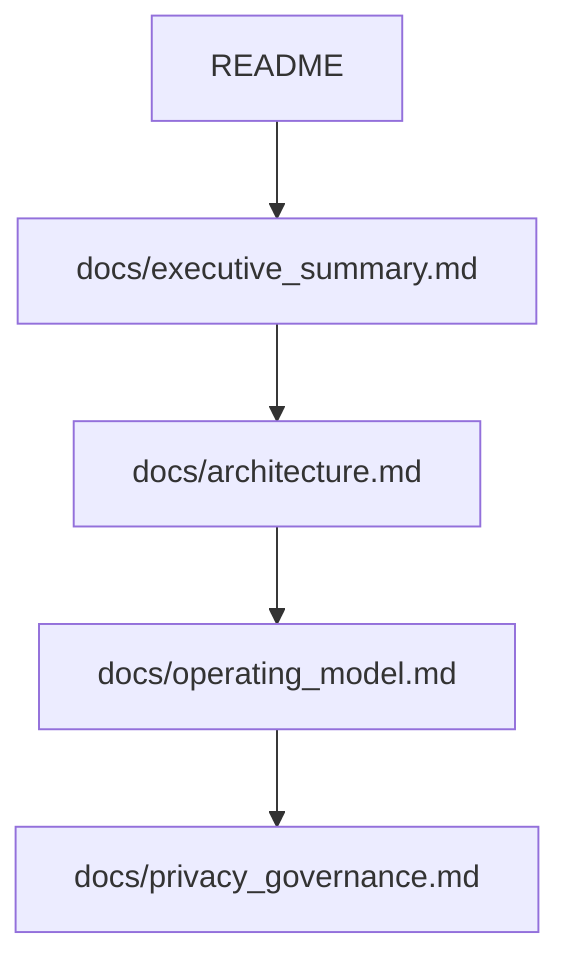
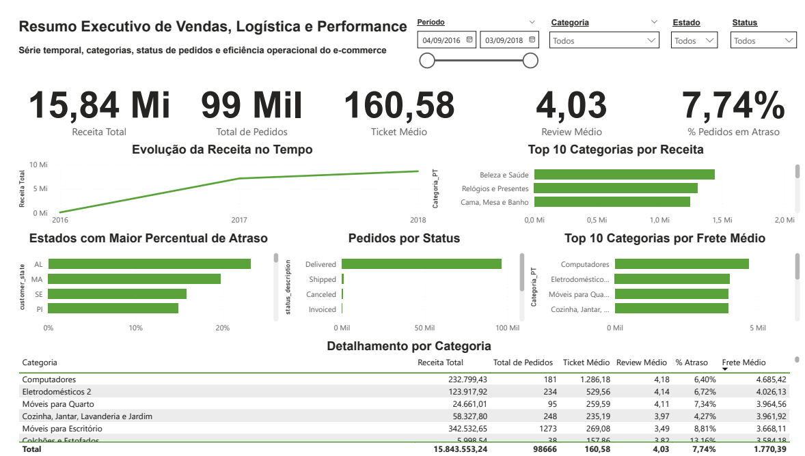
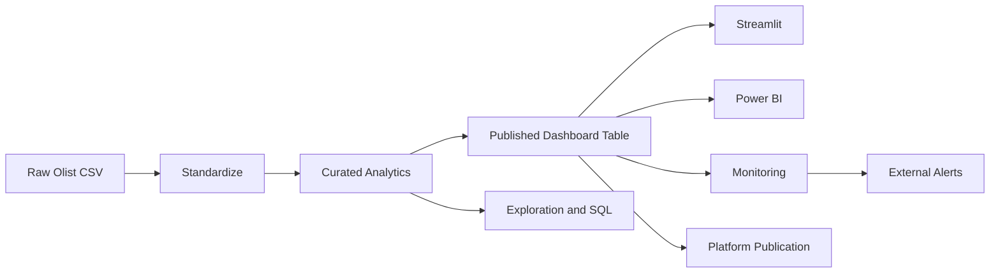
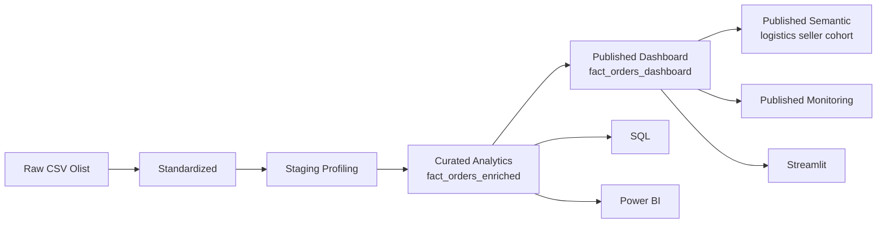

# Olist Governed Analytics Platform

[](https://github.com/samuelmaia-analytics/olist-governed-analytics-platform/actions/workflows/ci.yml)
[](https://github.com/samuelmaia-analytics/olist-governed-analytics-platform/actions/workflows/lint.yml)
[](https://olist-governed-analytics-platform.streamlit.app/)

Pipeline de Analytics Engineering construído sobre o dataset público da Olist para transformar dados brutos em um ativo analítico governado, reutilizável e pronto para consumo executivo em múltiplos canais.

O diferencial do projeto é tratar publicação como parte do pipeline, e não como detalhe do dashboard. Em vez de conectar a visualização diretamente à camada analítica completa, a solução cria uma camada publicada, minimizada e observável para exposição executiva.

Isso cria uma fronteira clara entre:

- engenharia analítica e consumo executivo
- exploração interna e exposição controlada
- evolução do dado e operação do produto analítico

Fonte de dados: `Brazilian E-Commerce Public Dataset by Olist` no Kaggle.

## Em Uma Frase

O projeto demonstra como transformar um dataset relacional bruto em um produto analítico utilizável, com separação explícita entre engenharia, governança e consumo.

## Visão Rápida

- `112.650` registros publicados na camada final
- `34` colunas na tabela exposta ao dashboard
- consumo em `Streamlit` e `Power BI`
- `5` marts semânticos publicados para recortes operacionais e executivos
- contratos, testes, lint e CI na mesma base

## Por Que Este Projeto É Relevante

- materializa uma separação prática entre `curated` e `published`
- reduz acoplamento entre pipeline, semântica e visualização
- reaproveita a mesma camada publicada em mais de um canal de consumo
- combina governança, entrega analítica e evidência operacional no mesmo repositório

## Acessos

- App Streamlit: [olist-governed-analytics-platform.streamlit.app](https://olist-governed-analytics-platform.streamlit.app/)
- Dashboard Power BI: [app.powerbi.com](https://app.powerbi.com/links/Xto6lIUiRF?ctid=b1b9d429-7862-4440-a25b-6ca19f868f47&pbi_source=linkShare)
- Repositório: `github.com/samuelmaia-analytics/olist-governed-analytics-platform`
- Vídeo: [YouTube](https://youtu.be/SqJ0UF1Em9k)

## Leitura Recomendada



- comece por este `README` para entender a proposta e os ativos publicados
- siga para `docs/executive_summary.md` para a leitura executiva
- use `docs/architecture.md` e `docs/operating_model.md` para a visão técnica e operacional

## Produto Em Uso


<p align="center">
  
</p>

## Fluxo Operacional



Leitura operacional:

- `curated` concentra transformação, qualidade e exploração analítica
- `published` delimita o que pode ser exposto para consumo recorrente
- `monitoring` acompanha a camada publicada como ativo operacional
- alertas externos podem ser disparados quando há falhas operacionais
- a publicação em plataforma pode sincronizar catálogo e pipeline de forma idempotente
- aplicações e dashboards reutilizam a mesma base preparada para exposição

## O Que Este Projeto Entrega

- pipeline reproduzível em Python para ingestão, padronização, modelagem e publicação
- ativo analítico interno `fact_orders_enriched`
- camada publicada `fact_orders_dashboard` com minimização e pseudonimização
- marts semânticos publicados para logística, seller, cohort, categoria e performance por UF
- dashboard em Streamlit consumindo somente a camada publicada
- SQL analítico versionado e exportações para Power BI
- contratos, testes, lint e automações de CI
- catálogo, documentação técnica e evidências operacionais
- monitoramento recorrente da camada publicada
- alertas externos via webhook para falhas de monitoramento
- automação de publicação em ambiente de plataforma para catálogo e pipeline

## Decisões Que Elevam o Projeto

- a camada publicada é tratada como produto operacional, não como export casual
- o dashboard consome exclusivamente a base minimizada
- SQL, catálogo, monitoramento e BI reutilizam o mesmo ativo central
- governança aparece como implementação concreta, não só como texto de apoio

## Arquitetura



Leitura arquitetural:

- `curated` concentra transformação, qualidade, exploração e ativos internos
- `published` desacopla consumo executivo da base analítica completa
- Streamlit e Power BI reutilizam ativos preparados para exposição

## Resultado

| Item | Valor |
| --- | --- |
| Ativo analítico central | `fact_orders_enriched` |
| Granularidade | `1 linha por item de pedido` |
| Volume final | `112.650` registros |
| Camada publicada | `fact_orders_dashboard` |
| Colunas publicadas | `34` |
| Marts semânticos | `5` |
| Consumo | Streamlit + Power BI |

## Por Que A Arquitetura Importa

Em muitos projetos, o dashboard é conectado diretamente à base tratada. Aqui, a publicação é tratada como etapa explícita do pipeline. Isso reduz acoplamento, melhora governança e cria uma fronteira clara entre desenvolvimento analítico e consumo executivo.

Na prática, isso permitiu:

- aplicar minimização e pseudonimização antes do consumo executivo
- manter a camada analítica interna livre para exploração e evolução
- publicar o mesmo ativo em múltiplos canais sem duplicar lógica
- monitorar a camada publicada como produto operacional

## Stack

- Python
- DuckDB
- Pandas
- Pytest
- Ruff
- GitHub Actions
- Streamlit
- SQL
- Power BI

## Evidências

- Dashboard Streamlit: [olist-governed-analytics-platform.streamlit.app](https://olist-governed-analytics-platform.streamlit.app/)
- Dashboard Power BI: [app.powerbi.com](https://app.powerbi.com/links/Xto6lIUiRF?ctid=b1b9d429-7862-4440-a25b-6ca19f868f47&pbi_source=linkShare)
- Artefatos Power BI: [powerbi/](powerbi)
- Consultas analíticas versionadas: [sql/](sql)
- Relatório da camada semântica: [docs/semantic_layer.md](docs/semantic_layer.md)
- Relatório de publicação em plataforma: [docs/platform_publication.md](docs/platform_publication.md)

## Estrutura

| Caminho | Papel |
| --- | --- |
| `src/` | pipeline, publicação, catálogo, monitoramento e utilitários |
| `streamlit_app/` | aplicação analítica |
| `sql/` | consultas analíticas e exploratórias |
| `contracts/` | contratos de schema e governança |
| `docs/` | arquitetura, documentação técnica e evidências |
| `powerbi/` | artefatos de consumo complementar |
| `data/` | camadas do lake e outputs gerados |

## Como Executar

### 1. Preparar ambiente

```bash
python -m venv .venv
.venv\Scripts\activate
pip install -r requirements.txt
```

### 2. Gerar os ativos principais

```bash
python src/run_platform_pipeline.py
```

### 3. Rodar qualidade

```bash
python -m pytest tests
ruff check .
```

### 4. Subir a aplicação

```bash
streamlit run streamlit_app/app.py
```

## O Que Vale Ver Primeiro

1. `src/run_platform_pipeline.py`
2. `src/build_analytics.py`
3. `src/publish_dashboard.py`
4. `streamlit_app/app.py`
5. `docs/architecture.md`

## Navegação do Repositório

| Se você quer | Comece por |
| --- | --- |
| entender o valor entregue | `README.md` e `docs/executive_summary.md` |
| revisar a arquitetura | `docs/architecture.md` |
| revisar operação e governança | `docs/operating_model.md` e `docs/privacy_governance.md` |
| inspecionar implementação | `src/run_platform_pipeline.py` e `streamlit_app/app.py` |

## Evoluções Recentes

- marts semânticos ampliados com `category_slice` e `state_performance_slice`
- webhook opcional para alertas externos de falha operacional
- orquestração de publicação em plataforma com catálogo e pipeline idempotentes
