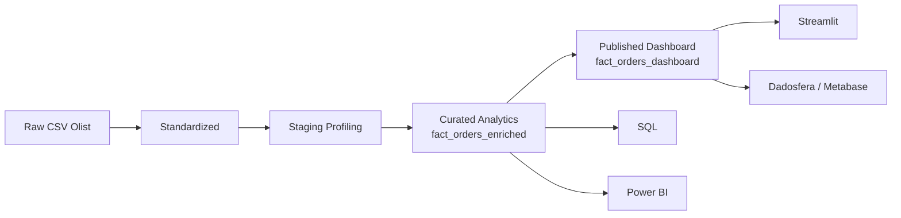

# Projeto Olist | Case Técnico de Dados

[](https://github.com/samuelmaia-analytics/SAMUEL_MAIA_DDF_TECH_032026/actions/workflows/ci.yml)
[](https://github.com/samuelmaia-analytics/SAMUEL_MAIA_DDF_TECH_032026/actions/workflows/lint.yml)
[](https://samuelmaia-032026.streamlit.app/)

Entrega de analytics engineering orientada a produto sobre o dataset Olist. O projeto transforma dados transacionais em um ativo analítico governado, testado e consumível por dashboard, SQL, catálogo e BI externo.

## Para Cada Leitor

- banca e liderança: comece por [docs/executive_summary.md](docs/executive_summary.md)
- avaliação técnica: siga [docs/case_answers.md](docs/case_answers.md) e [docs/operating_model.md](docs/operating_model.md)
- operação e handoff: use [docs/release_runbook.md](docs/release_runbook.md), [docs/rollback_runbook.md](docs/rollback_runbook.md) e [CONTRIBUTING.md](CONTRIBUTING.md)
- consumo analítico: veja [docs/05_dashboard.md](docs/05_dashboard.md), [docs/04_analises_sql.md](docs/04_analises_sql.md) e [powerbi/README.md](powerbi/README.md)

## Como Ler Este Repositório

- `README.md`: índice executivo, snapshot da solução e links principais
- `docs/executive_summary.md`: mensagem executiva curta para banca e liderança
- `docs/case_answers.md`: defesa técnica e narrativa da solução
- `docs/operating_model.md`: fluxo operacional, branches, deploy e guardrails
- `docs/05_dashboard.md`: decisões e evidências da camada de consumo

## Snapshot Executivo

O ativo central da solução é `fact_orders_enriched`, modelado com granularidade de item de pedido e `112.650` registros. A partir dele, o projeto deriva `fact_orders_dashboard`, camada publicada e minimizada para consumo executivo, com pseudonimização de identificadores e redução de exposição desnecessária.

O objetivo deste repositório não é vender apenas um dashboard, mas demonstrar ciclo de vida completo de dados: ingestão, padronização, modelagem, qualidade, contratos, publicação, documentação, evidência operacional e automação de engenharia.

## Snapshot

| Item | Valor |
| --- | --- |
| Ativo principal | `fact_orders_enriched` |
| Granularidade | `1 linha por item de pedido` |
| Volume final | `112.650` registros |
| Camada publicada | `fact_orders_dashboard` |
| Colunas publicadas | `22` |
| Consumo | Streamlit + Dadosfera/Metabase + Power BI |
| Status | implementado, evidenciado, automatizado e testado |

## Entregáveis Públicos

- App Streamlit: [samuelmaia-032026.streamlit.app](https://samuelmaia-032026.streamlit.app/)
- Vídeo de apresentação: [YouTube](https://youtu.be/SqJ0UF1Em9k)
- Coleção na Dadosfera: [Samuel Maia - 03_2026](https://metabase-treinamentos.dadosfera.ai/collection/1101-samuel-maia-03-2026)
- Modelo principal na Dadosfera: [fact-orders-dashboard](https://metabase-treinamentos.dadosfera.ai/model/2719-fact-orders-dashboard)
- Dashboard na Dadosfera: [Dashboard Executivo de Vendas](https://metabase-treinamentos.dadosfera.ai/dashboard/294-dashboard-executivo-de-vendas)
- Tabela pública na Dadosfera: [PUBLIC.SAMUELMAIA-03_2026](https://app.dadosfera.ai/pt-BR/catalog/data-assets/2d044685-b897-4cfb-8010-b8c19c1e669d)

## O Que Está Implementado

- pipeline local reprodutível em `src/run_case_pipeline.py`
- camada analítica interna em `data/curated/analytics/fact_orders_enriched.parquet`
- camada publicada para consumo em `data/published/dashboard/fact_orders_dashboard.parquet`
- ativo em CSV para publicação manual em `data/published/dashboard/fact_orders_dashboard.csv`
- sincronização programática de catálogo via API em `src/dadosfera_catalog_sync.py`
- dashboard Streamlit publicado
- exportações auxiliares para Power BI
- CI, lint e promoção automática de `main` para `streamlit-prod`

O fluxo operacional recomendado usa `main` como branch fonte e promove automaticamente o commit validado para `streamlit-prod`, branch dedicada de deploy no Streamlit Cloud. Em contingência, o app também pode apontar diretamente para `streamlit-prod`.

## Escopo Core vs Bônus

O escopo core do case está concentrado em ingestão, padronização, modelagem analítica, qualidade, contratos, catálogo, publicação segura e dashboard. Artefatos como GenAI e exportação de texto/PDF são complementares e não alteram a operação principal do case.

## Tradeoffs Deliberados

- `Streamlit` foi escolhido para acelerar prova de valor e consumo executivo
- a transformação principal roda localmente em Python, com publicação comprovada na Dadosfera
- a solução explicita o que está automatizado e o que ainda é backlog, em vez de inflar escopo de plataforma

## Leitura Recomendada

1. [docs/executive_summary.md](docs/executive_summary.md)
2. [docs/case_answers.md](docs/case_answers.md)
3. [docs/operating_model.md](docs/operating_model.md)
4. [docs/02_carga_e_modelagem.md](docs/02_carga_e_modelagem.md)
5. [docs/03_catalogacao.md](docs/03_catalogacao.md)
6. [docs/05_dashboard.md](docs/05_dashboard.md)
7. [docs/dadosfera_evidencias.md](docs/dadosfera_evidencias.md)
8. [docs/release_runbook.md](docs/release_runbook.md)
9. [powerbi/evidencia_query.md](powerbi/evidencia_query.md)
10. [docs/10_apresentacao_final.md](docs/10_apresentacao_final.md)

## Arquitetura



- `raw`: origem preservada
- `standardized`: padronização para reuso técnico
- `staging`: profiling e artefatos intermediários
- `curated`: camada analítica interna
- `published`: camada de exposição controlada

A separação entre `curated` e `published` é uma decisão central do projeto. Ela melhora governança, reduz acoplamento entre engenharia e consumo e evita que o dashboard dependa da camada interna completa.

## Por Que Esta Solução É Forte

- trata modelagem, governança e consumo como uma única arquitetura, não como entregas isoladas
- diferencia claramente ativo interno de ativo publicado
- sustenta o dashboard com uma camada controlada, e não com a base completa
- conecta evidência visual, catálogo, testes e automação ao mesmo ativo analítico

## Evidências-Chave

- publicação do ativo principal na Dadosfera/Metabase
- dashboard Streamlit público consumindo a camada publicada
- SQLs versionadas com resultados exportados
- sync de catálogo via API do Maestro
- CI, lint e promoção automática de `main` para o branch de deploy

## Execução

```bash
pip install -r requirements.txt
python src/run_case_pipeline.py
python -m pytest tests
ruff check .
streamlit run streamlit_app/app.py
python src/dadosfera_catalog_sync.py --dry-run
```

## Quickstart

### 1. Preparar ambiente

```bash
python -m venv .venv
.venv\Scripts\activate
pip install -r requirements.txt
```

### 2. Gerar ativos locais

```bash
python src/run_case_pipeline.py
python src/run_analytics_queries.py
```

### 3. Validar qualidade

```bash
python -m pytest tests
ruff check .
```

### 4. Subir aplicação

```bash
streamlit run streamlit_app/app.py
```

## Mapa do Repositório

| Caminho | Papel |
| --- | --- |
| `src/` | pipeline, qualidade, publicação, catálogo e utilitários |
| `streamlit_app/` | aplicação analítica publicada |
| `sql/` | análises exploratórias e consultas executivas |
| `contracts/` | contratos de schema por camada |
| `docs/` | narrativa técnica, governança, runbooks e evidências |
| `presentation/` | deck, roteiro e material de defesa |
| `powerbi/` | evidências e exportações para consumo complementar |
| `data/` | lake local versionado apenas nas camadas necessárias ao case |

## Sinais de Maturidade

- pipeline ponta a ponta reproduzível por comando
- contratos por camada analítica e publicada
- testes automatizados com gate mínimo de cobertura
- lint e workflows separados para qualidade e integração
- branch de deploy dedicada para publicação do Streamlit com promoção automatizada a partir de `main`
- runbooks explícitos de release, rollback e captura de evidências

## Governança

- `fact_orders_enriched` permanece como camada interna de engenharia, qualidade e SQL
- `fact_orders_dashboard` é a camada oficial de consumo executivo
- `order_id` e `customer_unique_id` são pseudonimizados na publicada
- upload manual na plataforma deve usar `fact_orders_dashboard.csv`
- ativos públicos complementares podem ser sincronizados por API do Maestro
- ownership do repositório, contribuição e política de segurança foram formalizados em `CODEOWNERS`, `CONTRIBUTING.md` e `SECURITY.md`

Observação operacional: a sincronização em GitHub Actions exige credencial não interativa. Se a conta da Dadosfera usar MFA/TOTP, o workflow entra em modo seguro e não tenta o login automatizado.

Referências:

- [docs/privacy_governance.md](docs/privacy_governance.md)
- [docs/data_classification.md](docs/data_classification.md)
- [docs/governance_policy.md](docs/governance_policy.md)
- [docs/engineering_governance.md](docs/engineering_governance.md)
- [docs/operating_model.md](docs/operating_model.md)
- [docs/release_runbook.md](docs/release_runbook.md)
- [docs/rollback_runbook.md](docs/rollback_runbook.md)
- [docs/branch_protection_recommendation.md](docs/branch_protection_recommendation.md)
- [docs/dadosfera_api_sync.md](docs/dadosfera_api_sync.md)

## O Que Não Está Sendo Vendido Como Feito

- pipeline nativo executando dentro da Dadosfera
- operação de transformação totalmente absorvida pela plataforma

Essa distinção é deliberada. O projeto já demonstra engenharia, publicação e automação relevantes, mas evita inflar o escopo para além do que está objetivamente comprovado.

## Evolução Natural

- automatizar publicação da camada `published` com credencial não interativa na plataforma
- adicionar monitoramento recorrente de freshness e qualidade da camada publicada
- empacotar execução operacional em jobs agendados com observabilidade de falha
- expandir camada semântica para novos recortes de logística, seller e cohort
