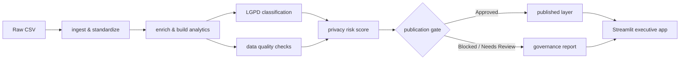

# Governed Analytics Platform

[](https://github.com/samuelmaia-analytics/Governed-Analytics-Platform/actions/workflows/ci.yml)
[](https://github.com/samuelmaia-analytics/Governed-Analytics-Platform/actions/workflows/lint.yml)
[](https://www.python.org/)
[](https://codecov.io/gh/samuelmaia-analytics/Governed-Analytics-Platform)
[](https://governed-analytics-platform.streamlit.app/)

**Language:** `English` | [Português](README.pt-BR.md)

Portfolio-grade governed analytics platform focused on Analytics Engineering, Data Governance, LGPD-inspired controls, data quality, and executive delivery.

## Executive Summary

This project transforms relational CSV inputs into a privacy-aware published analytical layer.
It combines:

- modular data pipeline;
- LGPD-inspired classification;
- explainable privacy risk scoring;
- data quality controls;
- publication decision states;
- Streamlit executive app;
- testing and CI quality gates.

## Business Impact

- Reduces exposure risk by separating internal analytics from published executive consumption.
- Improves trust with explicit publication status (`Approved`, `Needs Review`, `Blocked`).
- Accelerates technical review with reproducible governance evidence.
- Demonstrates product-oriented analytics engineering, not only dashboarding.

## Why this project matters

Many portfolio projects stop at visual output.
This repository demonstrates the governed journey from ingestion to controlled publication.

## Architecture Overview

Core flow:

ingestion -> standardization -> analytical enrichment -> data quality checks -> LGPD-inspired classification -> explainable risk score -> controlled publication -> executive app.

Key boundary:

the app consumes the published layer (`data/published/dashboard`) instead of the full internal curated layer.



## Implemented vs Simulated

### Implemented

- Modular Python pipeline with reproducible execution.
- Column classification by heuristics plus YAML contract rules.
- Explainable privacy risk score and publication decision logic.
- Rule-based quality checks and governance evidence artifacts.
- Streamlit executive views including publication rationale.
- Tests, linting, mypy checks, and CI workflows.

### Simulated

- Processing inventory metadata (controller/operator/DPO) with fictional entities.
- Mini RIPD document for demonstration.
- Legal basis and retention model represented for governance simulation.
- Full enterprise IAM and centralized audit platform integration.

## Production Readiness Boundaries

- This is a **production-inspired portfolio project**.
- It uses **sample, synthetic, or public data only**.
- It **does not process real personal data**.
- It implements **LGPD-inspired controls**, not legal certification.
- It demonstrates engineering patterns such as:
  - data contracts;
  - quality gates;
  - LGPD-inspired classification;
  - observability;
  - lineage;
  - CI/CD.
- It does **not** include enterprise IAM, centralized audit logging, formal DPO workflow, or real DPA processing agreements.
- A real production rollout would require legal, security, and infrastructure approval.
- It is **not** a live enterprise production system.

## What this project demonstrates

- Analytics Engineering mindset with governance-by-design.
- Clear internal vs published data boundaries.
- Reproducible local run with quality gates.
- Executive communication of risk, quality, and publication readiness.

## How to run locally

### Linux / macOS

```bash
python -m venv .venv
source .venv/bin/activate
make install
cp .env.example .env
make test
make app
```

### Windows PowerShell

```powershell
python -m venv .venv
.venv\Scripts\Activate.ps1
make install
copy .env.example .env
make test
make app
```

## How to review this project in 5 minutes

1. Read until **Implemented vs Simulated**.
2. Open `docs/architecture/architecture.md` and `docs/governance/privacy_governance.md`.
3. Run `make test`.
4. Open the Streamlit app and inspect **Governance Control Center**.
5. Review `docs/architecture/semantic_layer.md` and `docs/executive/recruiter_summary.md`.

## Recruiter / Hiring Manager Summary

- This project is not only a dashboard; it demonstrates an end-to-end governed analytics workflow.
- It combines pipeline engineering, governance controls, privacy-aware publication, and executive delivery.
- It is designed to show Analytics Engineering and Data Governance ownership in a portfolio context.

## Technical Reviewer Notes

- Core governance decisions are explainable and tested (publication gate, risk scoring, quality checks).
- Contracts and monitoring artifacts are versioned and reproducible.
- The Streamlit interface is expected to consume published/governed outputs for executive use.
- See: `docs/technical_review.md` and `docs/production_readiness.md`.

## Streamlit Executive App

Main pages:

| Page | What it shows |
| --- | --- |
| Executive Overview | Key metrics with trend deltas, data freshness, LGPD-suppressed columns |
| Data Catalog | Searchable column inventory with LGPD classification filter |
| LGPD & Privacy Risk | Risk score, classification breakdown, privacy transformation preview |
| Data Quality | Quality checks, null profile, severity distribution |
| EDA | Statistical overview, narrative insights, and statistical tests |
| Revenue Analytics | Monthly revenue trend, category Pareto, cohort ticket, top sellers |
| Seller Performance | Seller ranking, volume-tier distribution, and delivery SLA metrics |
| Cohort Retention | Cohort retention heatmap and average ticket heatmap |
| GenAI Insights | Product-text feature extraction outputs and category inventory |
| Governance Report | Rendered governance markdown reports with raw view |
| Governance Control Center | Publication gate, rationale, snapshot history trends |
| Snowflake Explorer | Browse Snowflake tables and run read-only queries |

## FastAPI Endpoints

Governance and Snowflake data can be consumed via REST API:

| Method | Path | Description |
| --- | --- | --- |
| `GET` | `/health` | Health check |
| `GET` | `/api/v1/governance/status` | Publication gate status and quality scores |
| `GET` | `/api/v1/snowflake/health` | Snowflake connection status |
| `GET` | `/api/v1/snowflake/tables` | List tables in the configured schema |
| `POST` | `/api/v1/snowflake/query` | Execute a read-only SELECT query |

Run locally:

```bash
uvicorn src.api:app --reload --port 8000
```

## Snowflake Configuration

Add to your `.env` to enable Snowflake integration:

```env
SNOWFLAKE_ACCOUNT=your-account
SNOWFLAKE_USER=your-user
SNOWFLAKE_PASSWORD=your-password
SNOWFLAKE_WAREHOUSE=your-warehouse
SNOWFLAKE_DATABASE=your-database
SNOWFLAKE_SCHEMA=your-schema
SNOWFLAKE_ROLE=PUBLIC
```

The Streamlit app and API degrade gracefully when these variables are absent.

## Main Structure

| Path | Purpose |
| --- | --- |
| `app/` | Streamlit executive interface |
| `src/` | Pipeline and governance logic |
| `contracts/` | Data quality and governance contracts |
| `docs/` | Technical and executive documentation |
| `tests/` | Automated tests |
| `.github/workflows/` | CI/CD |
| `powerbi/` | BI export artifacts |

## Links

- Streamlit app: <https://governed-analytics-platform.streamlit.app/>
- Repository: <https://github.com/samuelmaia-analytics/Governed-Analytics-Platform>
- Technical docs index: [docs/README.en.md](docs/README.en.md)
