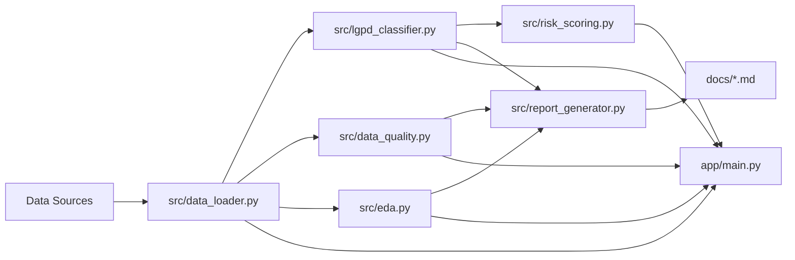

# Governed Analytics Platform

[](https://github.com/samuelmaia-analytics/Governed-Analytics-Platform/actions/workflows/ci.yml)
[](https://github.com/samuelmaia-analytics/Governed-Analytics-Platform/actions/workflows/lint.yml)
[](https://governed-analytics-platform.streamlit.app/)
[](https://github.com/samuelmaia-analytics/Governed-Analytics-Platform)

**Language:** `PT-BR` | [EN](README.en.md)

Plataforma analítica governada em Streamlit para demonstrar governança de dados, classificação LGPD, qualidade, EDA automatizada e geração de relatórios executivos.

## TL;DR

- foco: Analytics Engineering com controles de governança desde a ingestão até a camada publicada;
- entrega: app Streamlit, pipeline Python, contratos e documentação operacional;
- público: engenharia de dados, analytics e liderança técnica.

## Problema de negócio

Times analíticos frequentemente aceleram entregas sem formalizar controles de qualidade, privacidade e rastreabilidade. O resultado é risco regulatório, baixa confiança nos dados e decisões executivas com pouca governança.

## Solução

O projeto implementa uma abordagem de produto analítico governado:

- pipeline Python com fronteira explícita entre camada interna e camada publicada;
- classificação LGPD por coluna com score de risco de privacidade;
- checks de qualidade de dados reutilizáveis;
- EDA automatizada para suporte analítico rápido;
- geração de relatórios Markdown para documentação executiva e técnica.

## Funcionalidades

- Executive Overview com KPIs de governança e risco.
- Data Catalog com dicionário e metadados de colunas.
- LGPD & Privacy Risk com classificação e recomendações.
- Data Quality com checks e severidade por regra.
- EDA com estatísticas descritivas, nulos, outliers e correlação.
- Governance Report com relatórios em `docs/`.
- Políticas LGPD versionadas por domínio em `contracts/governance/policies/`.
- Regras de negócio declarativas por contrato em `contracts/governance/business_rules/`.
- Lineage técnico automatizado em `data/curated/catalog/technical_lineage.json`.
- Scorecards de governança por dataset em `data/published/monitoring/governance_scorecards.csv`.

## Fluxo de dados



## Stack técnica

- Python 3.11+
- Pandas e NumPy
- Streamlit e Plotly
- Pytest, Pytest-Cov e Ruff
- GitHub Actions (CI)

## Estrutura principal

| Caminho | Finalidade |
| --- | --- |
| `app/` | nova interface executiva Streamlit por abas |
| `streamlit_app/` | app legado preservado (compatibilidade) |
| `src/` | módulos de Analytics Engineering, LGPD e qualidade |
| `data/samples/` | datasets sintéticos para demonstração |
| `docs/` | relatórios e documentação de governança |
| `tests/` | suíte automatizada de testes |

## Setup rápido

```bash
python -m venv .venv
.venv\Scripts\activate
pip install -r requirements.txt
cp .env.example .env
```

## Como executar

App executivo:

```bash
streamlit run app/main.py
```

App legado:

```bash
streamlit run streamlit_app/app.py
```

## Exemplos de uso

1. Carregar `data/samples/sample_governance_dataset.csv` no app.
2. Validar classificação LGPD por coluna.
3. Revisar score de risco e recomendações.
4. Avaliar checks de qualidade com status/severidade.
5. Gerar relatórios automáticos em `docs/`.

## Governança e LGPD

- Classificação de colunas: `non_personal`, `personal_data`, `sensitive_personal_data`, `indirect_identifier`.
- Níveis de risco: `low`, `medium`, `high`.
- Ações sugeridas: `keep`, `mask`, `anonymize`, `remove`, `review`.
- Relatório de controles: `docs/lgpd_controls.md`.

## Qualidade e testes

```bash
ruff check src streamlit_app app tests
pytest --cov=src --cov=streamlit_app --cov-report=term-missing
```

Testes novos incluídos:

- `tests/test_lgpd_classifier.py`
- `tests/test_risk_scoring.py`
- `tests/test_data_quality.py`

## Governança operacional (implementado)

- versionamento de políticas LGPD por domínio com validação no pipeline de publicação;
- checks de regras de negócio por contrato com relatório dedicado;
- lineage técnico automatizado integrado ao catálogo;
- scorecards de governança por dataset em rotina agendada.

## Links

- Streamlit app: [governed-analytics-platform.streamlit.app](https://governed-analytics-platform.streamlit.app/)
- GitHub: [samuelmaia-analytics/Governed-Analytics-Platform](https://github.com/samuelmaia-analytics/Governed-Analytics-Platform)
- índice técnico: [docs/README.md](docs/README.md)

## License

This work is licensed under a Creative Commons Attribution-NonCommercial 4.0 International License (CC BY-NC 4.0).

To view a copy of this license, visit:
https://creativecommons.org/licenses/by-nc/4.0/

[](https://creativecommons.org/licenses/by-nc/4.0/)

