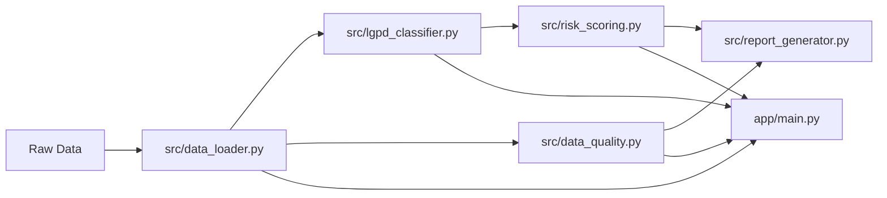

# Governed Analytics Platform

[](https://github.com/samuelmaia-analytics/Governed-Analytics-Platform/actions/workflows/ci.yml)
[](https://github.com/samuelmaia-analytics/Governed-Analytics-Platform/actions/workflows/lint.yml)
[](https://www.python.org/)
[](https://codecov.io/gh/samuelmaia-analytics/Governed-Analytics-Platform)
[](https://creativecommons.org/licenses/by-nc/4.0/)
[](https://governed-analytics-platform.streamlit.app/)

**Idioma:** `PT-BR` | [EN](README.en.md)

Plataforma analítica governada para portfólio.
O foco é Analytics Engineering com controles de governança, qualidade e privacidade.

> Este projeto não é apenas dashboard.
> É um case de engenharia analítica com camada publicada, critérios de prontidão e entrega executiva.

## Resumo executivo

Este repositório demonstra um fluxo completo:

1. ingestão e transformação de dados;
2. classificação de privacidade inspirada em LGPD;
3. avaliação de risco explicável;
4. validação de qualidade;
5. publicação controlada para consumo executivo.

## Como revisar este projeto em 5 minutos

1. Leia as seções de problema e solução.
2. Veja a arquitetura e a separação entre camadas.
3. Rode `make install`, `make test`, `make app`.
4. Abra o app e confira:
   - Executive Overview
   - LGPD & Privacy Risk
   - Data Quality
   - Governance Control Center
5. Revise `docs/privacy_governance.md` e `docs/semantic_layer.md`.

## Problema de negócio

Em muitos times, dashboards são publicados sem critérios claros de qualidade e privacidade.
Isso aumenta risco operacional, risco regulatório e perda de confiança.

## Solução

O projeto aplica uma abordagem de produto analítico governado:

- pipeline modular em Python;
- separação explícita entre camada interna e camada publicada;
- classificação e risco de privacidade;
- regras de qualidade em contrato;
- documentação operacional e executiva versionada.

## Problema -> Solução -> Evidência

| Problema | Solução | Evidência |
| --- | --- | --- |
| Exposição indevida de dados | Minimização e pseudonimização antes de publicar | `docs/privacy_governance.md` |
| Qualidade inconsistente | Regras declarativas + checagens automatizadas | `contracts/data_quality_rules.yml`, `src/data_quality_rules.py` |
| Métricas ambíguas | Camada semântica documentada | `docs/semantic_layer.md`, `src/semantic_layer.py` |
| Baixa confiança operacional | CI, lint e testes | `.github/workflows/ci.yml` |

## Arquitetura resumida



## Estrutura principal

| Caminho | Finalidade |
| --- | --- |
| `app/` | Interface Streamlit executiva |
| `src/` | Pipeline, governança e qualidade |
| `contracts/` | Contratos e regras declarativas |
| `docs/` | Relatórios e documentação |
| `tests/` | Testes automatizados |
| `.github/workflows/` | CI/CD |
| `powerbi/` | Artefatos de apoio para BI |

## Stack

- Python 3.11+
- Pandas, NumPy, DuckDB
- Streamlit, Plotly
- Pytest, Ruff, MyPy
- GitHub Actions

## Setup local

### Linux / macOS

```bash
python -m venv .venv
source .venv/bin/activate
make install
cp .env.example .env
```

### Windows PowerShell

```powershell
python -m venv .venv
.venv\Scripts\Activate.ps1
make install
copy .env.example .env
```

## Execução

```bash
make test
make app
```

## Targets do Makefile

- `make install`: instala dependências com `uv sync`
- `make lint`: executa `ruff check src app tests`
- `make test`: executa `pytest --cov=src --cov=app --cov-report=xml`
- `make pipeline`: executa os módulos do pipeline em sequência
- `make app`: inicia o app Streamlit principal
- `make screenshots`: captura screenshots do app
- `make clean`: remove caches e artefatos locais

## Governança e privacidade

- Controles **LGPD-inspired** aplicados na camada publicada.
- Classificação de colunas por sensibilidade.
- Privacy Risk Score explicável.
- Publication Readiness com estados claros para decisão.

O projeto não declara conformidade jurídica plena.
Ele demonstra controles técnicos de engenharia orientados à privacidade.

## Qualidade de dados

- Regras de `not_null`, unicidade, faixas e consistência temporal.
- Resultado consolidado para leitura executiva.
- Evidências de validação integradas à documentação.

## Notas para recrutadores

Este repositório demonstra:

- pensamento de produto analítico;
- separação de camadas e controles de publicação;
- rastreabilidade técnica;
- documentação orientada a decisão.

## Limitações e considerações de produção

- Projeto **portfolio-grade** e **production-oriented**.
- Foco em execução local e CI no GitHub Actions.
- Controles são simulados para contexto de demonstração.
- Para produção real, ainda seriam necessários IAM, auditoria centralizada e governança organizacional formal.

## Links

- Streamlit app: <https://governed-analytics-platform.streamlit.app/>
- Repositório: <https://github.com/samuelmaia-analytics/Governed-Analytics-Platform>
- Índice técnico: [docs/README.md](docs/README.md)

## Licença

CC BY-NC 4.0.
Veja: <https://creativecommons.org/licenses/by-nc/4.0/>.
