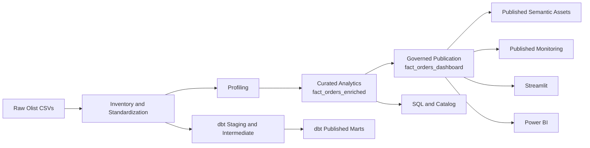
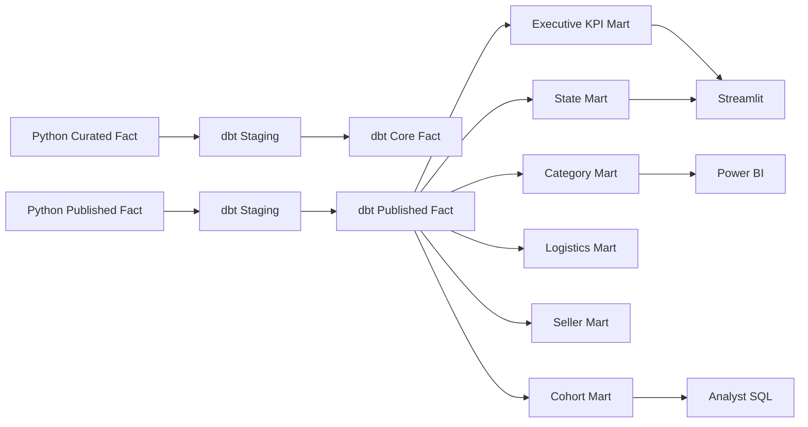

# Governed Analytics Platform

[](https://github.com/samuelmaia-analytics/Governed-Analytics-Platform/actions/workflows/ci.yml)
[](https://github.com/samuelmaia-analytics/Governed-Analytics-Platform/actions/workflows/lint.yml)
[](https://governed-analytics-platform.streamlit.app/)
[](https://github.com/samuelmaia-analytics/Governed-Analytics-Platform)

**Language:** `EN` | [PT-BR](docs/README.md)

Governed Analytics Platform is a portfolio-grade analytics product built on top of the public Olist dataset to show how raw transactional data can be transformed into a governed analytical asset with an explicit publication boundary for executive consumption.

## In one sentence

This repository shows how to move from raw relational CSVs to a governed analytics product with quality checks, privacy-aware publication, semantic assets, operational monitoring, executive consumption and a realistic evolution path toward dbt and auditable GenAI.

## Why this project is different

- it separates internal analytical modeling from published executive consumption
- it treats publication as a formal pipeline step
- it applies privacy-by-design controls before exposure
- it reuses the same published layer across Streamlit, Power BI and monitoring
- it already uses published semantic assets to power the main executive KPI cards in Streamlit
- it keeps governance, runbooks, evidence and code in the same repository

## What the repository delivers

- end-to-end Python pipeline for inventory, profiling, modeling, publication and exports
- internal analytical fact table: `fact_orders_enriched`
- governed published layer: `fact_orders_dashboard`
- published semantic assets for logistics, seller, category, cohort, geography and executive KPIs
- Streamlit executive app consuming only the published layer and prioritizing semantic assets for its main KPI layer
- Power BI exports aligned with the published executive boundary
- schema contracts, data-quality checks, monitoring artifacts, anomaly checks and CI
- local catalog, executive documentation, operational runbooks and evidence
- optional integrations with webhooks, OpenAI and Dadosfera Maestro
- initial `dbt-duckdb` foundation for modular SQL modeling and documentation

## Architecture at a glance



## Core stack

- Python 3.11+
- Pandas, NumPy and DuckDB
- Streamlit, Altair and Plotly
- versioned SQL
- Pytest, Ruff and GitHub Actions
- optional `dbt-duckdb` extra for modular SQL modeling

## Repository structure

| Path | Role |
| --- | --- |
| `src/` | pipeline, publication, governance, monitoring, catalog and exports |
| `streamlit_app/` | executive application in Streamlit |
| `dbt/` | initial dbt layer for staged and published SQL models |
| `tests/` | automated validation suite |
| `sql/` | versioned analytical queries |
| `contracts/` | schema and governance contracts |
| `docs/` | executive, technical and operational documentation |
| `powerbi/` | complementary BI artifacts |
| `data/` | local lake layout and generated outputs |

## Quick start

### 1. Set up the environment

```bash
python -m venv .venv
.venv\Scripts\activate
pip install -r requirements.txt
```

Optional extras:

```bash
pip install -e .[dev]
pip install -e .[dbt]
```

For the validated locked set:

```bash
pip install -r requirements.lock
```

### 2. Configure environment variables

The main flow runs without mandatory secrets. Optional integrations can be enabled through `.env`.

Main groups:

- `DADOSFERA_*`
- `OPENAI_*`
- `LOG_FORMAT`

### 3. Inspect available pipeline steps

```bash
python src/run_platform_pipeline.py --list-steps
```

### 4. Run the main pipeline

```bash
python src/run_platform_pipeline.py
```

### 5. Run local quality gates

```bash
pytest
ruff check .
```

### 6. Launch the executive app

```bash
streamlit run streamlit_app/app.py
```

The app now exposes a regional selector in the sidebar and defaults to `Português (Brasil)`.

## dbt semantic layer

The repository includes a production-minded `dbt/` layer, but it is intentionally positioned above the Python pipeline rather than as a replacement for it.

Python remains the system of record for:

- ingestion and standardization
- analytical fact construction
- governed publication
- semantic asset export
- monitoring, contracts, catalog, and operational automation

dbt is used for the right analytics engineering concerns:

- staging trusted Python outputs into a documented SQL graph
- representing the curated and published facts in lineage
- building reusable semantic marts for executive consumption
- adding schema tests, grain tests, exposures, and business-friendly documentation

This separation keeps the architecture honest: operational transformation and privacy controls stay in Python, while dbt strengthens semantic consistency, governance, trust, and maintainability for downstream consumers.

Current semantic lineage:



You can generate local dbt documentation and inspect the graph with:

```bash
cd dbt
copy profiles.yml.example profiles.yml
dbt docs generate --profiles-dir .
dbt docs serve --profiles-dir .
```

See [docs/dbt_lineage.md](docs/dbt_lineage.md) for the repository-specific lineage reading guide.

The current Streamlit app already demonstrates the target operating pattern: the main KPI cards preferentially consume `executive_kpis_slice`, while the detailed analytical exploration continues to read from the governed published fact table.

The monitoring layer now also persists a simple health-score history and latest-month anomaly checks for revenue, order volume and delay rate, making operational drift more visible in the executive app.

## Main pipeline steps

1. `inventory`
2. `profiling`
3. `build`
4. `publish`
5. `semantic`
6. `classify`
7. `contracts`
8. `quality`
9. `monitor`
10. `catalog`
11. `queries`
12. `screenshots`
13. `bi`

## Key outputs

- `data/curated/analytics/`
- `data/published/dashboard/`
- `data/published/semantic/`
- `data/published/monitoring/`
- `data/curated/catalog/`
- `data/curated/ops/`
- `docs/published_layer_monitoring.md`
- `docs/metric_catalog.md`
- `docs/business_glossary.md`
- `docs/product_brief.md`
- `docs/target_architecture_and_roadmap.md`
- `docs/semantic_layer.md`

## Public links

- Streamlit app: [governed-analytics-platform.streamlit.app](https://governed-analytics-platform.streamlit.app/)
- Power BI dashboard: [app.powerbi.com](https://app.powerbi.com/links/Xto6lIUiRF?ctid=b1b9d429-7862-4440-a25b-6ca19f868f47&pbi_source=linkShare)
- Presentation video: [YouTube](https://youtu.be/SqJ0UF1Em9k)

## Portfolio evidence

- Streamlit executive views already captured in `images/dashboard/`
- governance and publication evidence available in `docs/privacy_governance.md` and `docs/platform_publication.md`
- monitoring and health evidence available in `docs/published_layer_monitoring.md`
- semantic asset evidence available in `docs/semantic_layer.md`
- a reproducible walkthrough is documented in `docs/demo_mode.md`

## Recommended reading

### Start here

1. [docs/executive_summary.md](docs/executive_summary.md)
2. [docs/product_brief.md](docs/product_brief.md)
3. [docs/architecture.md](docs/architecture.md)
4. [docs/target_architecture_and_roadmap.md](docs/target_architecture_and_roadmap.md)
5. [docs/operating_model.md](docs/operating_model.md)
6. [docs/demo_mode.md](docs/demo_mode.md)

### Documentation language

The repository README is written in English for international positioning.

The documentation under `docs/` remains primarily in Portuguese because:

- the project targets a Brazilian business dataset and operating context
- the Streamlit executive app is intentionally optimized for `Português (Brasil)`
- the repository preserves the original presentation and business-defense materials

## Architectural thesis

The key idea behind this project is simple: executive consumers should not depend directly on the full internal analytical layer. Publication is treated as an explicit product boundary between:

- internal exploration and recurring exposure
- model evolution and consumer stability
- analytical data and governed analytical product

That boundary is now reinforced inside the app itself: the main executive KPI cards are backed by a published semantic asset instead of relying only on ad hoc app-side calculations.

