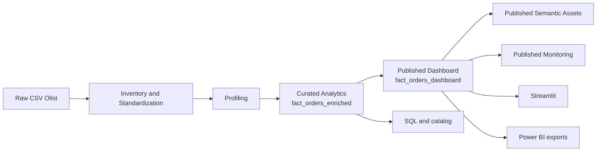

# Olist Governed Analytics Platform

[](https://github.com/samuelmaia-analytics/olist-governed-analytics-platform/actions/workflows/ci.yml)
[](https://github.com/samuelmaia-analytics/olist-governed-analytics-platform/actions/workflows/lint.yml)
[](https://olist-governed-analytics-platform.streamlit.app/)

Pipeline de Analytics Engineering construído sobre o dataset público da Olist para transformar dados brutos em um ativo analítico governado, com separação explícita entre camada analítica interna e camada publicada para consumo executivo.

## Em uma frase

O projeto mostra como sair de CSVs relacionais brutos para um produto analítico com qualidade, contratos, monitoramento, catálogo, publicação controlada e consumo em `Streamlit` e `Power BI`.

## O que o projeto entrega

- pipeline ponta a ponta em Python para ingestão, profiling, modelagem, publicação e exportação
- tabela analítica interna `fact_orders_enriched`
- camada publicada `fact_orders_dashboard` com minimização para consumo recorrente
- contrato LGPD/governança validado automaticamente na publicação da camada exposta
- marts semânticos publicados para recortes executivos e operacionais
- dashboard Streamlit consumindo somente a camada publicada
- exportações auxiliares para Power BI
- contratos, testes, lint, cobertura e CI
- catálogo local, relatórios técnicos e evidências operacionais
- monitoramento da camada publicada
- integrações opcionais com webhook externo, OpenAI e Dadosfera Maestro

## Fluxo operacional



## Stack principal

- Python 3.11+
- Pandas, NumPy e DuckDB
- Streamlit, Altair e Plotly
- Pytest, pytest-cov e Ruff
- SQL versionado
- GitHub Actions

## Estrutura do repositório

| Caminho | Papel |
| --- | --- |
| `src/` | pipeline, publicação, catálogo, governança, exportações e integrações |
| `streamlit_app/` | dashboard executivo em Streamlit |
| `tests/` | suíte automatizada |
| `sql/` | consultas analíticas versionadas |
| `contracts/` | contratos de schema e regras de exposição |
| `docs/` | documentação principal, relatórios e runbooks |
| `powerbi/` | artefatos para consumo complementar |
| `data/` | lake local e outputs gerados pelo pipeline |

## Como executar localmente

### 1. Preparar ambiente

```bash
python -m venv .venv
.venv\Scripts\activate
pip install -r requirements.txt
```

Opcionalmente, para instalar como projeto Python com dependências de desenvolvimento:

```bash
pip install -e .[dev]
```

Para reproduzir exatamente o conjunto validado neste repositório, use o lockfile:

```bash
pip install -r requirements.lock
```

### 2. Configurar variáveis de ambiente

Os fluxos principais rodam sem segredos obrigatórios. Para habilitar integrações opcionais, copie `.env.example` para `.env` e ajuste os valores necessários.

Principais grupos:

- `DADOSFERA_*`: publicação e operações em ambiente Dadosfera Maestro
- `OPENAI_*`: recursos opcionais de GenAI
- `LOG_FORMAT`: formato de logging

### 3. Inspecionar as etapas disponíveis

```bash
python src/run_platform_pipeline.py --list-steps
```

### 4. Executar o pipeline principal

```bash
python src/run_platform_pipeline.py
```

O runner pode executar etapas específicas com `--steps` e consolidar falhas com `--continue-on-error`.

### 5. Rodar qualidade local

```bash
pytest
ruff check .
```

### 6. Subir a aplicação

```bash
streamlit run streamlit_app/app.py
```

## Etapas do pipeline

O runner principal executa, nesta ordem:

1. `inventory`
2. `profiling`
3. `build`
4. `publish`
5. `semantic`
6. `classify`
7. `contracts`
8. `quality`
9. `monitor`
10. `catalog`
11. `queries`
12. `screenshots`
13. `bi`

Na etapa `publish`, a camada exposta passa por validações de privacidade e governança antes de ser salva. O contrato versionado fica em `contracts/governance/privacy_governance.json` e a evidência tabular é salva em `data/curated/quality/privacy_governance_results.csv`.

## Evidências e acessos

- App Streamlit: [olist-governed-analytics-platform.streamlit.app](https://olist-governed-analytics-platform.streamlit.app/)
- Dashboard Power BI: [app.powerbi.com](https://app.powerbi.com/links/Xto6lIUiRF?ctid=b1b9d429-7862-4440-a25b-6ca19f868f47&pbi_source=linkShare)
- Vídeo: [YouTube](https://youtu.be/SqJ0UF1Em9k)

## Navegação recomendada

Leitura rápida:

1. `README.md`
2. `docs/README.md`
3. `docs/executive_summary.md`
4. `docs/architecture.md`
5. `docs/operating_model.md`

Trilhas por objetivo:

- visão executiva: `docs/executive_summary.md`, `docs/05_dashboard.md`, `docs/architecture.md`
- revisão técnica: `docs/technical_narrative.md`, `docs/02_carga_e_modelagem.md`, `docs/schema_contract_report.md`
- operação e governança: `docs/operating_model.md`, `docs/privacy_governance.md`, `docs/engineering_governance.md`, `docs/release_runbook.md`

## Arquivos para começar

- `src/run_platform_pipeline.py`
- `src/build_analytics.py`
- `src/publish_dashboard.py`
- `src/semantic_layer.py`
- `streamlit_app/app.py`
- `docs/README.md`

## Saídas importantes geradas pelo pipeline

- `data/curated/analytics/`
- `data/published/dashboard/`
- `data/published/semantic/`
- `data/published/monitoring/`
- `data/curated/catalog/`
- `data/curated/ops/`
- `data/curated/quality/privacy_governance_results.csv`
- `docs/data_quality_report.md`
- `docs/published_layer_monitoring.md`
- `docs/semantic_layer.md`
- `docs/operational_job_report.md`
- `docs/privacy_governance.md`

## Diferencial arquitetural

O ponto central do projeto é não conectar o dashboard diretamente na camada analítica completa. A publicação é tratada como etapa formal do pipeline, criando uma fronteira explícita entre:

- exploração interna e exposição recorrente
- evolução da modelagem e estabilidade do consumo
- dado analítico e produto analítico publicado
