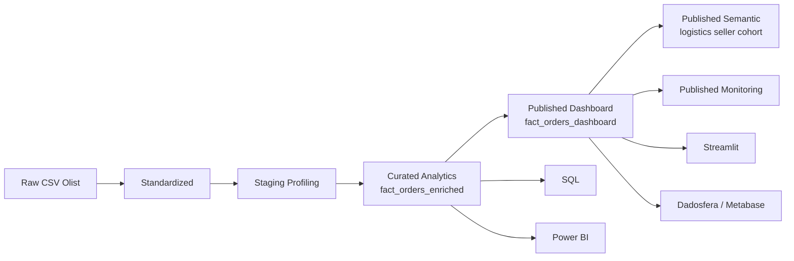

# Projeto Olist | Case Técnico de Dados

[](https://github.com/samuelmaia-analytics/SAMUEL_MAIA_DDF_TECH_032026/actions/workflows/ci.yml)
[](https://github.com/samuelmaia-analytics/SAMUEL_MAIA_DDF_TECH_032026/actions/workflows/lint.yml)
[](https://samuelmaia-032026.streamlit.app/)

Produto analítico sobre o dataset Olist com modelagem em camadas, governança da exposição, publicação comprovada na Dadosfera/Metabase e operação recorrente da camada publicada. A fonte utilizada é o `Brazilian E-Commerce Public Dataset by Olist`, disponibilizado no Kaggle: `https://www.kaggle.com/datasets/olistbr/brazilian-ecommerce`. O projeto não apresenta apenas um dashboard: ele materializa um ativo analítico interno, deriva uma camada publicada segura, monitora freshness e qualidade, e organiza consumo por Streamlit, SQL e Power BI.

## Leitura Rápida

- banca e liderança: [docs/executive_summary.md](docs/executive_summary.md)
- avaliação técnica: [docs/case_answers.md](docs/case_answers.md) e [docs/architecture.md](docs/architecture.md)
- operação e handoff: [docs/operating_model.md](docs/operating_model.md), [docs/release_runbook.md](docs/release_runbook.md), [docs/rollback_runbook.md](docs/rollback_runbook.md)
- publicação e plataforma: [docs/dadosfera_api_sync.md](docs/dadosfera_api_sync.md), [docs/dadosfera_native_pipeline_runbook.md](docs/dadosfera_native_pipeline_runbook.md)

## O Que Este Repositório Entrega

- `fact_orders_enriched` como ativo analítico interno com granularidade de item de pedido
- `fact_orders_dashboard` como camada publicada minimizada e pseudonimizada
- marts semânticos publicados para logística, seller e cohort
- monitoramento recorrente de freshness e qualidade da camada publicada
- operação agendada com artefatos de execução e observabilidade de falha
- catálogo e publicação externa comprovados na Dadosfera/Metabase
- consumo analítico por Streamlit, SQL versionado e exportações para Power BI

## Snapshot

| Item | Valor |
| --- | --- |
| Ativo principal | `fact_orders_enriched` |
| Granularidade | `1 linha por item de pedido` |
| Volume final | `112.650` registros |
| Camada publicada | `fact_orders_dashboard` |
| Colunas publicadas | `34` |
| Consumo | Streamlit + Dadosfera/Metabase + Power BI |
| Status | implementado, evidenciado, automatizado e testado |

## Diferenciais Reais

- separação explícita entre camada interna e camada publicada
- pseudonimização de chaves antes do consumo executivo
- contratos, qualidade e catálogo ligados ao mesmo ativo analítico
- credencial não interativa por token para sync e operação por API
- workflow agendado para build, publicação, expansão semântica e monitoramento
- documentação operacional suficiente para release, rollback e defesa técnica

## Entregáveis Públicos

- App Streamlit: [samuelmaia-032026.streamlit.app](https://samuelmaia-032026.streamlit.app/)
- Vídeo de apresentação: [YouTube](https://youtu.be/SqJ0UF1Em9k)
- Coleção na Dadosfera: [Samuel Maia - 03_2026](https://metabase-treinamentos.dadosfera.ai/collection/1101-samuel-maia-03-2026)
- Modelo principal na Dadosfera: [fact-orders-dashboard](https://metabase-treinamentos.dadosfera.ai/model/2719-fact-orders-dashboard)
- Dashboard na Dadosfera: [Dashboard Executivo de Vendas](https://metabase-treinamentos.dadosfera.ai/dashboard/294-dashboard-executivo-de-vendas)
- Tabela pública na Dadosfera: [PUBLIC.SAMUELMAIA-03_2026](https://app.dadosfera.ai/pt-BR/catalog/data-assets/2d044685-b897-4cfb-8010-b8c19c1e669d)

## Estado Operacional Atual

Hoje o repositório já possui:

- pipeline local reprodutível em [src/run_case_pipeline.py](/C:/Users/samue/PycharmProjects/SAMUEL_MAIA_DDF_TECH_032026/src/run_case_pipeline.py)
- publicação segura da camada `published/dashboard` em [src/publish_dashboard.py](/C:/Users/samue/PycharmProjects/SAMUEL_MAIA_DDF_TECH_032026/src/publish_dashboard.py)
- monitoramento recorrente em [src/published_monitoring.py](/C:/Users/samue/PycharmProjects/SAMUEL_MAIA_DDF_TECH_032026/src/published_monitoring.py)
- camada semântica expandida em [src/semantic_layer.py](/C:/Users/samue/PycharmProjects/SAMUEL_MAIA_DDF_TECH_032026/src/semantic_layer.py)
- sync de catálogo por API em [src/dadosfera_catalog_sync.py](/C:/Users/samue/PycharmProjects/SAMUEL_MAIA_DDF_TECH_032026/src/dadosfera_catalog_sync.py)
- operador de pipeline nativo por API em [src/dadosfera_pipeline_ops.py](/C:/Users/samue/PycharmProjects/SAMUEL_MAIA_DDF_TECH_032026/src/dadosfera_pipeline_ops.py)
- job agendado em [operate-published-layer.yml](/C:/Users/samue/PycharmProjects/SAMUEL_MAIA_DDF_TECH_032026/.github/workflows/operate-published-layer.yml)
- promoção automática de `main` para `streamlit-prod`

## Limites Reais

O projeto é rigoroso sobre o que está comprovado e o que ainda depende da plataforma:

- a transformação principal ainda roda em Python local
- a publicação e o catálogo na Dadosfera estão comprovados
- a automação por API está implementada para sync e operação
- a execução nativa completa do pipeline dentro do tenant ainda não está evidenciada

Essa distinção é deliberada. O repositório evita vender operação nativa como concluída sem link real, run real e output real na plataforma.

## Arquitetura



- `raw`: origem preservada
- `standardized`: padronização para reuso técnico
- `staging`: profiling e artefatos intermediários
- `curated`: camada analítica interna
- `published`: camada oficial de exposição controlada

## Como Executar

### 1. Preparar ambiente

```bash
python -m venv .venv
.venv\Scripts\activate
pip install -r requirements.txt
```

### 2. Gerar ativos principais

```bash
python src/run_case_pipeline.py
```

### 3. Rodar apenas a operação da camada publicada

```bash
python src/run_case_pipeline.py --steps build publish semantic monitor
```

### 4. Validar qualidade de engenharia

```bash
python -m pytest tests
ruff check .
```

### 5. Subir a aplicação

```bash
streamlit run streamlit_app/app.py
```

## Credenciais da Plataforma

A automação da Dadosfera aceita credencial não interativa por:

- `DADOSFERA_ACCESS_TOKEN`
- `DADOSFERA_API_TOKEN`

O fallback por `DADOSFERA_USERNAME` + `DADOSFERA_PASSWORD` continua suportado. Se a conta usar MFA/TOTP, o workflow entra em modo seguro e não tenta autenticação automatizada por usuário e senha.

## Evidências-Chave

- publicação do ativo principal na Dadosfera/Metabase
- dashboard Streamlit público consumindo a camada publicada
- SQLs versionadas com resultados exportados
- sync de catálogo via API do Maestro
- operação recorrente da camada publicada com relatório operacional
- CI, lint e deploy versionados em GitHub Actions

## Mapa do Repositório

| Caminho | Papel |
| --- | --- |
| `src/` | pipeline, qualidade, publicação, catálogo e utilitários |
| `streamlit_app/` | aplicação analítica publicada |
| `sql/` | análises exploratórias e consultas executivas |
| `contracts/` | contratos de schema por camada |
| `docs/` | narrativa técnica, runbooks, governança e evidências |
| `powerbi/` | evidências e exportações para consumo complementar |
| `presentation/` | deck, roteiro e material de defesa |
| `data/` | camadas do lake e artefatos gerados |

## Documentação Recomendada

1. [docs/executive_summary.md](docs/executive_summary.md)
2. [docs/case_answers.md](docs/case_answers.md)
3. [docs/operating_model.md](docs/operating_model.md)
4. [docs/05_dashboard.md](docs/05_dashboard.md)
5. [docs/08_pipelines.md](docs/08_pipelines.md)
6. [docs/dadosfera_evidencias.md](docs/dadosfera_evidencias.md)
7. [docs/release_runbook.md](docs/release_runbook.md)
8. [docs/10_apresentacao_final.md](docs/10_apresentacao_final.md)

## Evolução Natural

- preencher parâmetros reais do pipeline nativo no tenant alvo
- integrar alertas externos ao monitoramento recorrente
- ampliar os marts semânticos com recortes adicionais por produto e retenção

## Referências

- [docs/privacy_governance.md](docs/privacy_governance.md)
- [docs/data_classification.md](docs/data_classification.md)
- [docs/governance_policy.md](docs/governance_policy.md)
- [docs/engineering_governance.md](docs/engineering_governance.md)
- [docs/operating_model.md](docs/operating_model.md)
- [docs/dadosfera_api_sync.md](docs/dadosfera_api_sync.md)
- [docs/dadosfera_native_pipeline_runbook.md](docs/dadosfera_native_pipeline_runbook.md)
