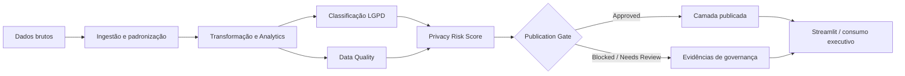

# Governed Analytics Platform

[](https://github.com/samuelmaia-analytics/Governed-Analytics-Platform/actions/workflows/ci.yml)
[](https://github.com/samuelmaia-analytics/Governed-Analytics-Platform/actions/workflows/lint.yml)
[](https://www.python.org/)
[](https://codecov.io/gh/samuelmaia-analytics/Governed-Analytics-Platform)
[](https://governed-analytics-platform.streamlit.app/)
[](LICENSE)

**Idioma:** `Português` · [English documentation](docs/README.en.md)

> Dados de e-commerce podem chegar ao consumo analítico sem controle suficiente de qualidade, rastreabilidade ou critério claro de publicação. Para enfrentar esse problema, construí uma plataforma de Analytics Engineering em Python, SQL e dbt com Data Quality, Data Contracts, Data Lineage, Privacy Risk Score e um Publication Gate que aprova, revisa ou bloqueia a publicação. O resultado é um fluxo em que mudanças e dados inadequados podem ser detectados antes de chegar ao consumo executivo, reduzindo o risco de decisões apoiadas em informação inconsistente.

**[→ Abrir demonstração ao vivo](https://governed-analytics-platform.streamlit.app/)**

---

## Método CAR

**Contexto:** dados brutos e transformações sem critérios explícitos de qualidade e publicação aumentam o risco de inconsistências chegarem ao dashboard e à tomada de decisão.

**Ação:** desenvolvi um pipeline modular com Python, SQL, dbt, DuckDB e PostgreSQL, estruturado em Bronze, Silver, Gold e Quarantine, com Data Contracts em YAML, Data Quality Gates, classificação de privacidade, Data Lineage, FastAPI, Streamlit, CI/CD e automações com n8n.

**Resultado:** a publicação passa por três estados explícitos — `Approved`, `Needs Review` e `Blocked` — e a arquitetura mantém evidências de qualidade e governança antes do consumo. A suíte do projeto ultrapassou 900 testes automatizados durante sua evolução, ajudando a impedir que mudanças silenciosas alterem regras críticas sem detecção.

---

## Demonstração visual


**Fluxo demonstrado:** ingestão → transformação → qualidade → governança → publicação → consumo analítico.

---

## O que este projeto resolve

O Governed Analytics Platform foi criado para demonstrar como uma solução de dados pode ir além de dashboards e incorporar controles de qualidade, privacidade, rastreabilidade e publicação.

A aplicação utiliza dados públicos do e-commerce Olist e mantém uma separação clara entre dados internos de processamento e a camada governada disponibilizada para consumo executivo.

### Principais entregas

- Pipeline modular em Python e SQL para ingestão, transformação e construção de ativos analíticos.
- Modelagem analítica com dbt e camadas Bronze, Silver, Gold e Quarantine.
- Data Quality com validações automatizadas e evidências de execução.
- Data Contracts em YAML para schema, regras e políticas de publicação.
- Classificação inspirada na LGPD e cálculo explicável de Privacy Risk Score.
- Publication Gate com decisões `Approved`, `Needs Review` e `Blocked`.
- Data Lineage, logs operacionais, monitoramento e evidências de governança.
- Aplicação executiva em Streamlit e endpoints em FastAPI.
- Testes, linting e CI/CD com GitHub Actions.
- Exemplos de orquestração com n8n, mantendo a lógica de negócio versionada em código.

### Escopo mensurável

As métricas abaixo descrevem componentes realmente implementados e versionados no repositório, sem estimar ganhos financeiros ou percentuais de produtividade não medidos:

- **4 camadas de dados:** Bronze, Silver, Gold e Quarantine.
- **3 estados de publicação:** `Approved`, `Needs Review` e `Blocked`.
- **7 workflows no GitHub Actions:** CI, deploy do Streamlit, lint, operação da camada publicada, policy check, segurança e sincronização de catálogo.
- **1 aplicação executiva em Streamlit** com integração a endpoints FastAPI.
- Controles versionados de **Data Quality, Data Contracts, Data Lineage, Privacy Risk Score e Publication Gate**.

---

## Arquitetura


```mermaid
flowchart LR
    A[Dados brutos] --> B[Ingestão e padronização]
    B --> C[Transformação e Analytics]
    C --> D[Classificação LGPD]
    C --> E[Data Quality]
    D --> F[Privacy Risk Score]
    E --> F
    F --> G{Publication Gate}
    G -->|Approved| H[Camada publicada]
    G -->|Blocked / Needs Review| I[Evidências de governança]
    H --> J[Streamlit / consumo executivo]
    I --> J
```

### Impacto demonstrado

- Reduz o risco de exposição ao separar processamento interno da camada publicada.
- Aumenta a confiança nos dados com critérios explícitos de qualidade e publicação.
- Facilita auditoria e revisão técnica com contratos, lineage, logs e evidências reproduzíveis.
- Torna o estado de publicação compreensível também para usuários não técnicos.

---

## Stack principal

| Área | Tecnologias |
|---|---|
| Processamento e análise | Python · pandas · DuckDB · SQL |
| Analytics Engineering | dbt · modelagem analítica · ETL/ELT |
| Qualidade e governança | pytest · Data Contracts (YAML) · Ruff · mypy |
| Visualização e entrega | Streamlit · Power BI · FastAPI |
| Automação e CI/CD | GitHub Actions · Codecov · n8n |
| Cloud / integração | Snowflake opcional · arquitetura AWS de referência |

---

## Implementado x simulado

### Implementado

- Pipeline modular e execução reproduzível.
- Classificação de colunas por heurísticas e regras de contrato.
- Privacy Risk Score e lógica de decisão de publicação.
- Regras de Data Quality e artefatos de evidência.
- Views executivas em Streamlit com justificativa de publicação.
- Testes, linting, mypy e workflows de CI.
- Endpoints FastAPI para governança e integração com Snowflake.
- Integração Snowflake com graceful degradation quando não há credenciais.

### Simulado / demonstrativo

- Metadados de controlador, operador e DPO com entidades fictícias.
- Mini RIPD para demonstração.
- Base legal e retenção representadas para simulação de governança.
- Arquitetura AWS apresentada como referência, não como infraestrutura produtiva de cliente real.

> Projeto de portfólio inspirado em práticas de produção. Utiliza dados públicos, sintéticos ou demonstrativos e não representa certificação jurídica de conformidade com a LGPD.

---

## Visão da aplicação

| Executive Overview | Governance Control Center |
|---|---|
|  |  |

| LGPD & Privacy Risk | Data Quality |
|---|---|
|  |  |

---

## Como revisar este projeto em 5 minutos

1. Assista ao GIF no início deste README.
2. Abra a **[demonstração ao vivo](https://governed-analytics-platform.streamlit.app/)**.
3. Visite **Governance Control Center**, **Data Quality** e **LGPD & Privacy Risk**.
4. Consulte a arquitetura e a documentação técnica em `docs/`.
5. Revise `Implementado x simulado` para distinguir funcionalidades reais de componentes demonstrativos.

---

## Executar localmente

### Windows PowerShell

```powershell
python -m venv .venv
.venv\Scripts\Activate.ps1
make install
copy .env.example .env
make test
make app
```

### Linux / macOS

```bash
python -m venv .venv
source .venv/bin/activate
make install
cp .env.example .env
make test
make app
```

---

## Documentação e links

- **Aplicação:** https://governed-analytics-platform.streamlit.app/
- **Repositório:** https://github.com/samuelmaia-analytics/Governed-Analytics-Platform
- **Documentação técnica:** [`docs/`](docs/)
- **Documentação em inglês:** [`docs/README.en.md`](docs/README.en.md)
- **Data Contracts:** [`contracts/`](contracts/)
- **Workflows n8n:** [`workflows/n8n/`](workflows/n8n/)

---

## Autor

**Samuel Maia** — Analista de Dados | Analytics Engineer

[LinkedIn](https://www.linkedin.com/in/samuelmaia-analytics/) · [GitHub](https://github.com/samuelmaia-analytics)
