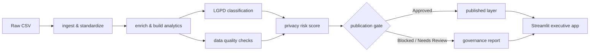

# Governed Analytics Platform

[](https://github.com/samuelmaia-analytics/Governed-Analytics-Platform/actions/workflows/ci.yml)
[](https://github.com/samuelmaia-analytics/Governed-Analytics-Platform/actions/workflows/lint.yml)
[](https://www.python.org/)
[](https://codecov.io/gh/samuelmaia-analytics/Governed-Analytics-Platform)
[](https://governed-analytics-platform.streamlit.app/)

**Language:** `English` | [Português](README.pt-BR.md)

> End-to-end governed analytics pipeline: raw data → LGPD classification → quality gates → publication layer → Streamlit executive app.

**[→ Live demo](https://governed-analytics-platform.streamlit.app/)**

---

## What this project does

Transforms raw Olist e-commerce CSVs into a privacy-aware published analytical layer with explicit publication controls. The app consumes only the governed published layer — not the raw internal data — enforcing a clear boundary between internal analytics and executive consumption.

## Architecture


```mermaid
flowchart LR
    A[Raw CSV] --> B[ingest & standardize]
    B --> C[enrich & build analytics]
    C --> D[LGPD classification]
    C --> E[data quality checks]
    D --> F[privacy risk score]
    E --> F
    F --> G{publication gate}
    G -->|Approved| H[published layer]
    G -->|Blocked / Needs Review| I[governance report]
    H --> J[Streamlit executive app]
    I --> J
```

## Business impact

- Reduces exposure risk by separating internal analytics from published executive consumption.
- Improves trust with explicit publication status (`Approved`, `Needs Review`, `Blocked`).
- Accelerates technical review with reproducible governance evidence.

## Implemented vs Simulated

### Implemented
- Modular Python pipeline with reproducible execution.
- Column classification by heuristics plus YAML contract rules.
- Explainable privacy risk score and publication decision logic.
- Rule-based quality checks and governance evidence artifacts.
- Streamlit executive views including publication rationale.
- Tests, linting, mypy checks, and CI workflows.
- FastAPI endpoints for governance and Snowflake data consumption.
- Snowflake integration with graceful degradation when credentials are absent.

### Simulated
- Processing inventory metadata (controller/operator/DPO) with fictional entities.
- Mini RIPD document for demonstration.
- Legal basis and retention model represented for governance simulation.
- Full enterprise IAM and centralized audit platform integration.

> This is a production-inspired portfolio project. It uses sample, synthetic, or public data only and implements LGPD-inspired controls, not legal certification.

## Technical stack

| Layer | Tools |
|---|---|
| Language | Python 3.11+ |
| Data processing | Pandas · DuckDB · SQL |
| Analytical modeling | dbt |
| Quality & governance | pytest · data contracts (YAML) · Ruff · mypy |
| Delivery | Streamlit · Power BI · FastAPI |
| CI/CD | GitHub Actions · Codecov |
| Cloud | Snowflake (optional) |

## How to run locally

**Linux / macOS**
```bash
python -m venv .venv
source .venv/bin/activate
make install
cp .env.example .env
make test
make app
```

**Windows PowerShell**
```powershell
python -m venv .venv
.venv\Scripts\Activate.ps1
make install
copy .env.example .env
make test
make app
```

## How to review this project in 5 minutes

1. Read **Implemented vs Simulated** above.
2. Open `docs/architecture/architecture.md` for the full technical design.
3. Run `make test` to see quality gates in action.
4. Open the Streamlit app → **Governance Control Center**.
5. Read `docs/executive/recruiter_summary.md` for business context.

## Streamlit app pages

| Page | What it shows |
|---|---|
| Executive Overview | Key metrics, trend deltas, data freshness, LGPD-suppressed columns |
| Data Catalog | Searchable column inventory with LGPD classification filter |
| LGPD & Privacy Risk | Risk score, classification breakdown, privacy transformation preview |
| Data Quality | Quality checks, null profile, severity distribution |
| EDA | Statistical overview, narrative insights, and statistical tests |
| Revenue Analytics | Monthly revenue trend, category Pareto, cohort ticket, top sellers |
| Seller Performance | Seller ranking, volume-tier distribution, delivery SLA metrics |
| Cohort Retention | Cohort retention heatmap and average ticket heatmap |
| GenAI Insights | Product-text feature extraction outputs and category inventory |
| Governance Report | Rendered governance markdown reports with raw view |
| Governance Control Center | Publication gate, rationale, snapshot history trends |
| Snowflake Explorer | Browse Snowflake tables and run read-only queries |

## FastAPI endpoints

| Method | Path | Description |
|---|---|---|
| `GET` | `/health` | Health check |
| `GET` | `/api/v1/governance/status` | Publication gate status and quality scores |
| `GET` | `/api/v1/snowflake/health` | Snowflake connection status |
| `GET` | `/api/v1/snowflake/tables` | List tables in the configured schema |
| `POST` | `/api/v1/snowflake/query` | Execute a read-only SELECT query |

```bash
uvicorn src.api:app --reload --port 8000
# Swagger UI: http://localhost:8000/docs
```

## Snowflake configuration

Add to `.env` to enable Snowflake integration (app degrades gracefully without it):

```env
SNOWFLAKE_ACCOUNT=your-account
SNOWFLAKE_USER=your-user
SNOWFLAKE_PASSWORD=your-password
SNOWFLAKE_WAREHOUSE=your-warehouse
SNOWFLAKE_DATABASE=your-database
SNOWFLAKE_SCHEMA=your-schema
SNOWFLAKE_ROLE=PUBLIC
```

## Project structure

| Path | Purpose |
|---|---|
| `app/` | Streamlit executive interface |
| `src/` | Pipeline and governance logic |
| `contracts/` | Data quality and governance contracts |
| `dbt/` | Analytical layer models |
| `docs/` | Technical and executive documentation |
| `tests/` | Automated tests |
| `.github/workflows/` | CI/CD pipelines |
| `powerbi/` | Power BI export artifacts |

## Screenshots

| Executive Overview | Governance Control Center |
|---|---|
|  |  |

| LGPD & Privacy Risk | Data Quality |
|---|---|
|  |  |

## Links

- Live app: <https://governed-analytics-platform.streamlit.app/>
- Technical docs: [docs/README.en.md](docs/README.en.md)
- Repository: <https://github.com/samuelmaia-analytics/Governed-Analytics-Platform>

## Author

Samuel Maia — Data Analyst & Analytics Engineer based in Fortaleza, Brazil.

- Target roles: Data Analyst, BI Analyst, Junior Analytics Engineer, Data Quality Analyst.
- Focus: governed analytics products, KPI design, dashboards, data quality, and LGPD-aware publication controls.
- LinkedIn: <https://linkedin.com/in/samuelmaia-analytics>
