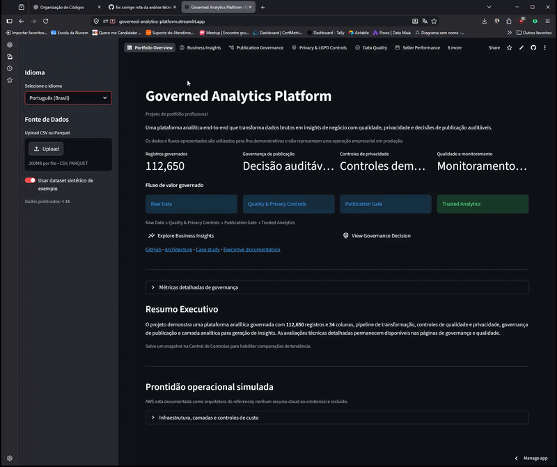
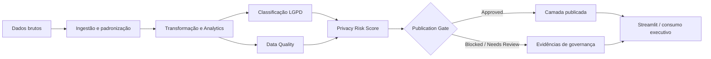

# Governed Analytics Platform

[](https://github.com/samuelmaia-analytics/Governed-Analytics-Platform/actions/workflows/ci.yml)
[](https://github.com/samuelmaia-analytics/Governed-Analytics-Platform/actions/workflows/lint.yml)
[](https://www.python.org/)
[](https://codecov.io/gh/samuelmaia-analytics/Governed-Analytics-Platform)
[](https://governed-analytics-platform.streamlit.app/)
[](app/main.py)
[](LICENSE)

**Idioma:** `Português` · [English documentation](docs/README.en.md)

> Plataforma de Analytics Engineering para analytics governado, com qualidade, privacidade, publicação controlada e rastreabilidade, transformando dados brutos em uma camada analítica confiável para consumo executivo.

**[→ Abrir demonstração ao vivo](https://governed-analytics-platform.streamlit.app/)**

---

## Demonstração visual



**Fluxo demonstrado:** dados → transformação → qualidade → privacidade → decisão de publicação → evidências → consumo analítico.

---

## O que este projeto resolve

O Governed Analytics Platform demonstra um produto analítico governado de ponta a ponta: os dados públicos do e-commerce Olist passam por transformação, qualidade, privacidade, decisão de publicação e geração de evidências antes do consumo analítico.

A solução mantém uma separação clara entre dados internos de processamento e a camada governada disponibilizada para análises executivas e técnicas.

### Principais entregas

- Pipeline modular em Python e SQL, modelagem com dbt e camadas Bronze, Silver, Gold e Quarantine.
- Analytics executivo e análise de negócio com Portfolio Overview, Business Insights, Seller Performance e Customer Retention.
- Governança de publicação, rastreabilidade e evidências com Publication Governance, Governance Evidence e Governance Lab.
- Privacy & LGPD Controls com classificação inspirada na LGPD e Privacy Risk Score explicável.
- Data Quality e Data Contracts em YAML com validações automatizadas e evidências de execução.
- Data Catalog e Technical Analysis para descoberta, perfil e exploração dos ativos analíticos.
- Templates versionados de orquestração n8n para demonstrar arquitetura, tratamento de falhas e integração externa.
- Experimento de IA Generativa com atributos estruturados previamente materializados e exibidos sem inferência ao vivo.
- Integração Snowflake opcional, configurada por ambiente e acionada somente pelos controles da página.
- Aplicação em Streamlit, endpoints FastAPI, testes, linting e CI/CD com GitHub Actions.

---

## Arquitetura


```mermaid
flowchart LR
    A[Dados brutos] --> B[Ingestão e padronização]
    B --> C[Transformação e Analytics]
    C --> D[Classificação LGPD]
    C --> E[Data Quality]
    D --> F[Privacy Risk Score]
    E --> F
    F --> G{Publication Gate}
    G -->|Approved| H[Camada publicada]
    G -->|Blocked / Needs Review| I[Evidências de governança]
    H --> J[Streamlit / consumo executivo]
    I --> J
```

### Impacto demonstrado

- Reduz o risco de exposição ao separar processamento interno da camada publicada.
- Aumenta a confiança nos dados com critérios explícitos de qualidade e publicação.
- Facilita auditoria e revisão técnica com contratos, lineage, logs e evidências reproduzíveis.
- Torna o estado de publicação compreensível também para usuários não técnicos.

---

## Stack principal

| Área | Tecnologias |
|---|---|
| Processamento e análise | Python · pandas · DuckDB · SQL |
| Analytics Engineering | dbt · modelagem dimensional · ETL/ELT |
| Qualidade e governança | pytest · Data Contracts (YAML) · Ruff · mypy |
| Visualização e entrega | Streamlit · Power BI · FastAPI |
| Automação e CI/CD | GitHub Actions · Codecov · n8n |
| Cloud / integração | Snowflake opcional · arquitetura AWS de referência |
| IA aplicada | GenAI experimental · resultados persistidos |

---

## Implementado x simulado

### Implementado

- Pipeline modular, camadas analíticas e execução reproduzível.
- Classificação de colunas por heurísticas e regras de contrato.
- Privacy Risk Score, Publication Gate e justificativas de decisão.
- Data Quality, contratos e artefatos de evidência e rastreabilidade.
- Aplicação Streamlit com analytics executivo, análises de negócio e páginas de governança.
- Endpoints FastAPI, testes, linting, mypy e workflows de CI.
- Integração Snowflake opcional: configuração por ambiente, nenhuma conexão automática e operações somente sob ação do usuário, com graceful degradation quando a configuração está incompleta.
- Experimento GenAI baseado em resultado persistido; modo e modelo são metadados do artefato, sem inferência ao vivo na página.
- Templates n8n versionados para inspeção da arquitetura de orquestração e tratamento de falhas, sem execução automática pelo Streamlit.

### Simulado / demonstrativo

- Metadados de controlador, operador e DPO com entidades fictícias.
- Mini RIPD, base legal e retenção para demonstração de governança, sem substituir avaliação jurídica.
- Templates n8n demonstrativos, que exigem importação, configuração e ativação externas para se tornarem operacionais.
- Interface GenAI que apresenta atributos materializados anteriormente, sem RAG, embeddings ou avaliação de modelo em tempo real.
- Arquitetura AWS apresentada como referência, não como infraestrutura produtiva implantada.

> Projeto de portfólio inspirado em práticas de produção. Utiliza dados públicos, sintéticos ou demonstrativos e não representa certificação jurídica de conformidade com a LGPD.

---

## Visão da aplicação

Os screenshots abaixo são registros visuais da evolução da aplicação. Eles foram preservados como histórico e podem anteceder os polimentos mais recentes da interface.

| Portfolio Overview — registro anterior | Governance Lab — registro anterior |
|---|---|
|  |  |

| Privacy & LGPD Controls — registro anterior | Data Quality |
|---|---|
|  |  |

---

## Como revisar este projeto em 5 minutos

1. Assista ao GIF e abra a **[demonstração ao vivo](https://governed-analytics-platform.streamlit.app/)**.
2. Comece em **Portfolio Overview** para entender o produto analítico e seu contexto.
3. Visite **Business Insights**, **Publication Governance**, **Privacy & LGPD Controls** e **Data Quality**.
4. Para aprofundamento técnico, explore **Governance Evidence**, **Governance Lab**, **Automation & Orchestration**, **GenAI Experiment** e **Snowflake Integration**.
5. Consulte `docs/`, `contracts/` e `workflows/n8n/` para arquitetura, regras e artefatos versionados.

---

## Executar localmente

### Windows PowerShell

```powershell
python -m venv .venv
.venv\Scripts\Activate.ps1
make install
copy .env.example .env
make test
make app
```

### Linux / macOS

```bash
python -m venv .venv
source .venv/bin/activate
make install
cp .env.example .env
make test
make app
```

---

## Documentação e links

- **Aplicação:** https://governed-analytics-platform.streamlit.app/
- **Repositório:** https://github.com/samuelmaia-analytics/Governed-Analytics-Platform
- **Documentação técnica:** [`docs/`](docs/)
- **Documentação em inglês:** [`docs/README.en.md`](docs/README.en.md)
- **Data Contracts:** [`contracts/`](contracts/)
- **Workflows n8n:** [`workflows/n8n/`](workflows/n8n/)
- **Experimento GenAI:** [`docs/genai_bonus.md`](docs/genai_bonus.md)

---

## Autor

**Samuel Maia** — Analista de Dados | Analytics Engineer

[LinkedIn](https://www.linkedin.com/in/samuelmaia-analytics/) · [GitHub](https://github.com/samuelmaia-analytics)
