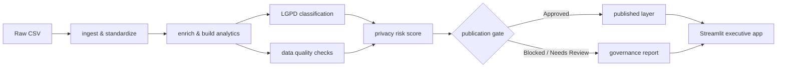
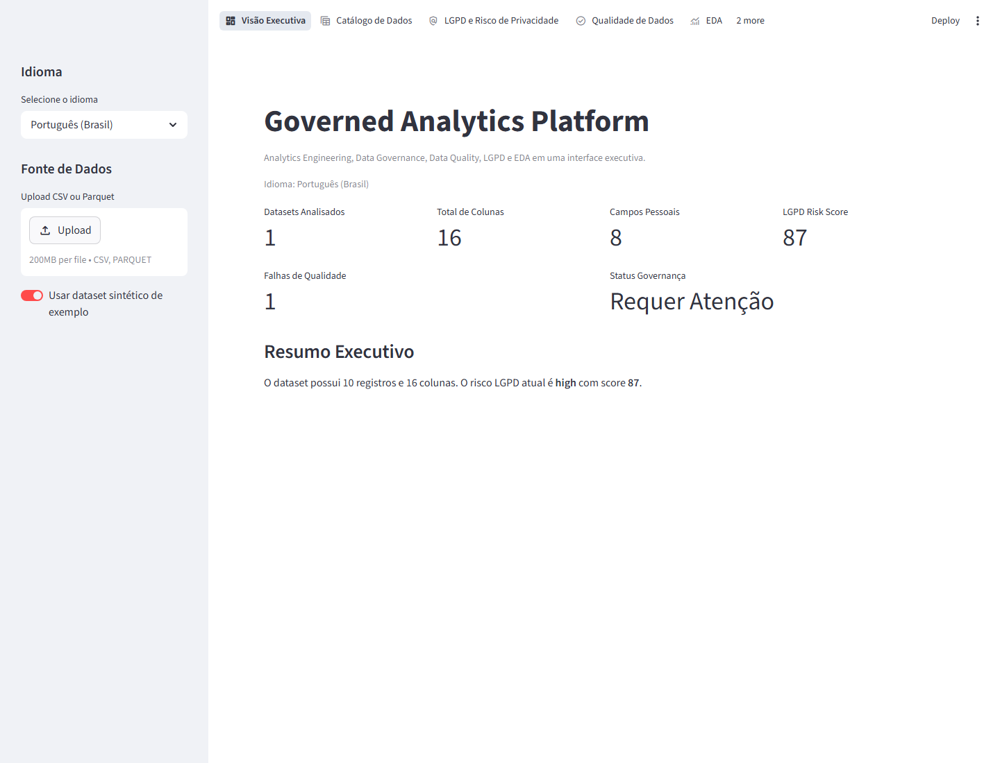
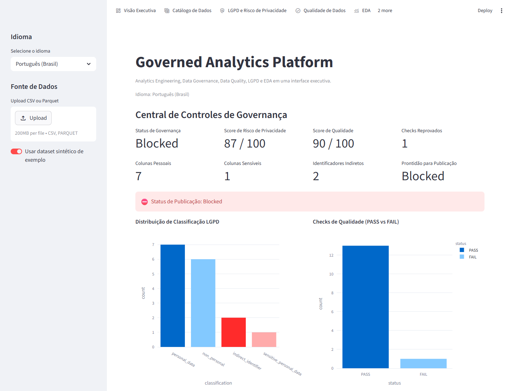
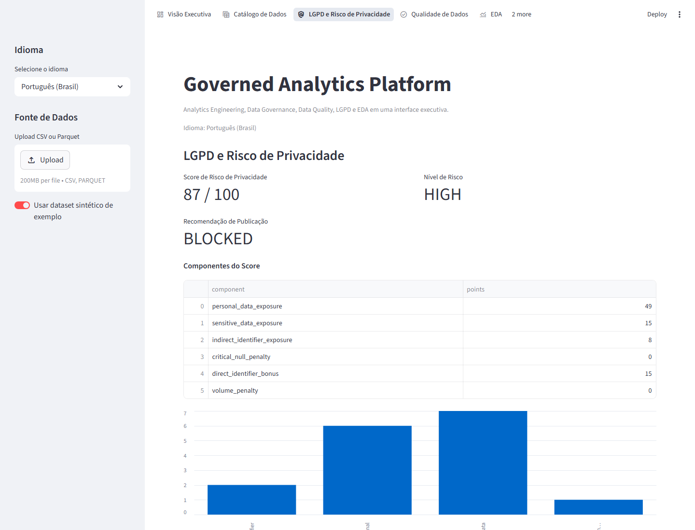
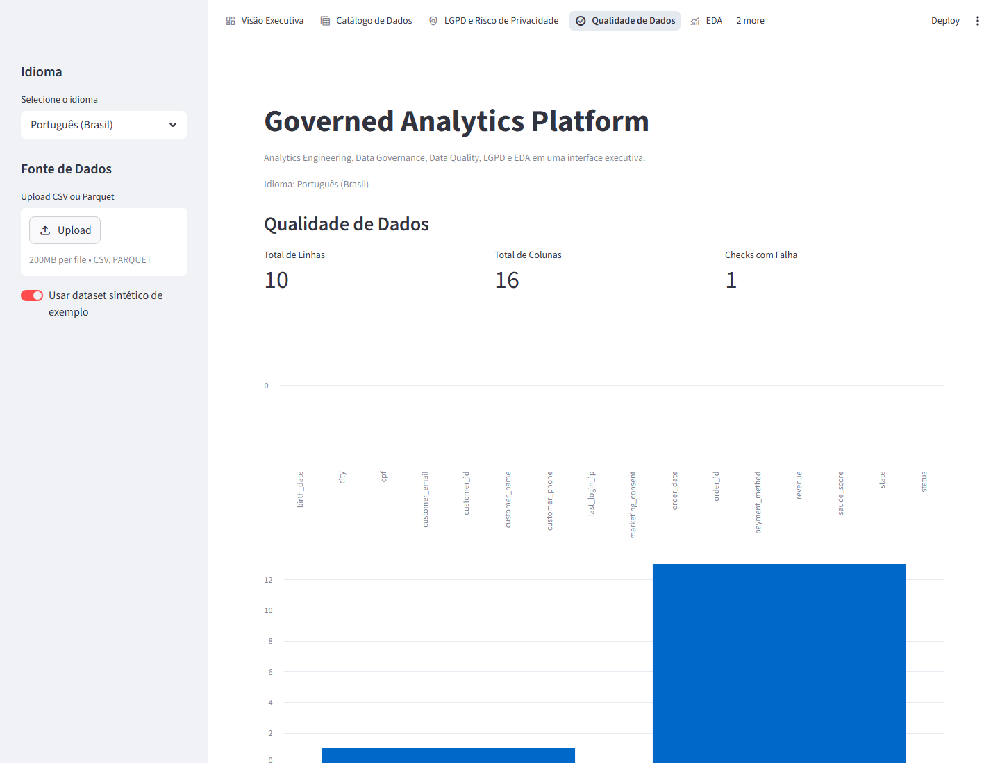

# Governed Analytics Platform

[](https://github.com/samuelmaia-analytics/Governed-Analytics-Platform/actions/workflows/ci.yml)
[](https://github.com/samuelmaia-analytics/Governed-Analytics-Platform/actions/workflows/lint.yml)
[](https://www.python.org/)
[](https://codecov.io/gh/samuelmaia-analytics/Governed-Analytics-Platform)
[](https://governed-analytics-platform.streamlit.app/)

**Language:** `English` | [Português](README.pt-BR.md)

> End-to-end governed analytics pipeline: raw data → LGPD classification → quality gates → publication layer → Streamlit executive app.

**[→ Live demo](https://governed-analytics-platform.streamlit.app/)**

---

## What this project does

Transforms raw Olist e-commerce CSVs into a privacy-aware published analytical layer with explicit publication controls. The app consumes only the governed published layer — not the raw internal data — enforcing a clear boundary between internal analytics and executive consumption.

## Architecture


```mermaid
flowchart LR
    A[Raw CSV] --> B[ingest & standardize]
    B --> C[enrich & build analytics]
    C --> D[LGPD classification]
    C --> E[data quality checks]
    D --> F[privacy risk score]
    E --> F
    F --> G{publication gate}
    G -->|Approved| H[published layer]
    G -->|Blocked / Needs Review| I[governance report]
    H --> J[Streamlit executive app]
    I --> J
```

## Business impact

- Reduces exposure risk by separating internal analytics from published executive consumption.
- Improves trust with explicit publication status (`Approved`, `Needs Review`, `Blocked`).
- Accelerates technical review with reproducible governance evidence.

## Governed Data Lake Layers

The local Data Lake includes explicit Bronze, Silver, Gold, and Quarantine
folders under `data/`. Bronze preserves raw inputs, Silver represents cleaned and
standardized data, Gold represents governed data ready for consumption, and
Quarantine isolates records or files blocked by quality, LGPD, contract, or
publication controls. Details are documented in
`docs/data_lake_layers.md`.

## Operational Logs and Observability

The repository includes controlled CSV log examples under `logs/` for pipeline
execution, data quality, LGPD classification, publication gate decisions, and
operational errors. These files demonstrate how a governed analytics platform can
support auditability, troubleshooting, and interview review without storing real
sensitive data. Details are documented in `docs/operational_logs.md`.

## Publication Gate

The project includes a CLI publication gate that records dataset publication
decisions in `data/gold/publication_decisions.csv`. It evaluates quality score,
LGPD risk score, and critical issues to classify a dataset as `Approved`,
`Needs Review`, or `Blocked`. Usage and rules are documented in
`docs/publication_gate.md`.

## Implemented vs Simulated

### Implemented
- Modular Python pipeline with reproducible execution.
- Column classification by heuristics plus YAML contract rules.
- Explainable privacy risk score and publication decision logic.
- Rule-based quality checks and governance evidence artifacts.
- Streamlit executive views including publication rationale.
- Tests, linting, mypy checks, and CI workflows.
- FastAPI endpoints for governance and Snowflake data consumption.
- Snowflake integration with graceful degradation when credentials are absent.

### Simulated
- Processing inventory metadata (controller/operator/DPO) with fictional entities.
- Mini RIPD document for demonstration.
- Legal basis and retention model represented for governance simulation.
- Full enterprise IAM and centralized audit platform integration.

> This is a production-inspired portfolio project. It uses sample, synthetic, or public data only and implements LGPD-inspired controls, not legal certification.

## Technical stack

| Layer | Tools |
|---|---|
| Language | Python 3.11+ |
| Data processing | Pandas · DuckDB · SQL |
| Analytical modeling | dbt |
| Quality & governance | pytest · data contracts (YAML) · Ruff · mypy |
| Delivery | Streamlit · Power BI · FastAPI |
| CI/CD & orchestration | GitHub Actions · Codecov · n8n |
| Cloud | Snowflake (optional) |

## How to run locally

**Linux / macOS**
```bash
python -m venv .venv
source .venv/bin/activate
make install
cp .env.example .env
make test
make app
```

**Windows PowerShell**
```powershell
python -m venv .venv
.venv\Scripts\Activate.ps1
make install
copy .env.example .env
make test
make app
```

## How to review this project in 5 minutes

1. Read **Implemented vs Simulated** above.
2. Open `docs/architecture/architecture.md` for the full technical design.
3. Run `make test` to see quality gates in action.
4. Open the Streamlit app → **Governance Control Center**.
5. Read `docs/executive/recruiter_summary.md` for business context.

## Streamlit app pages

The repository now includes a root-level Streamlit entrypoint focused on
automation visibility:

```bash
streamlit run app.py
```

For Streamlit Cloud, use **Main file path: `app/main.py`** when the public deploy
should present the full analytical dashboard. The modular app now also includes
the **n8n Automation** page for workflow visibility.

Use **Main file path: `app.py`** only when the public deploy should present the
smaller governance/n8n evidence interface.

This interface is designed for executive and technical review after the n8n
automation layer was added. It does not execute n8n directly. Instead, it reads
existing artifacts from `data/`, `logs/`, `contracts/`, `docs/`, and
`workflows/n8n/` and shows clear fallback messages when a file has not been
generated yet.

For portfolio deployment, some runtime artifacts are intentionally not committed
(`logs/*` and generated curated quality outputs). When those files are absent,
the app uses versioned governance evidence such as
`data/published/monitoring/publication_decision.json`,
`data/published/monitoring/published_layer_monitoring.csv`, and
`docs/reports/schema_contract_report.md`. The UI labels the source so the
dashboard does not present fallback evidence as a fresh pipeline execution.

Root multipage dashboard:

| Page | What it shows |
|---|---|
| Overview | Project summary, key governance metrics, last execution status, technologies, and architecture |
| Data Quality | Quality report checks, success/warning/error indicators, and residual issue visibility |
| LGPD Risk | LGPD classification inventory, privacy risk score, score components, and recommendations |
| Data Contracts | Schema contract results with expected-vs-actual field comparison, business rule results, and versioned contract files |
| Pipeline Logs | Execution history from `logs/pipeline_execution_logs.csv`, latest status, and status charts |
| n8n Automation | Workflow flow, available JSON templates, node inventory, and importability evidence |
| Governance Docs | Markdown documentation browser, highlighting `docs/n8n_automation.md` |

The root `app.py` uses explicit Streamlit navigation, so the sidebar lists only
the seven user-facing pages above. Shared helpers live in `streamlit_shared.py`,
outside `pages/`, and are not exposed as a page.

The existing modular Streamlit application under `app/main.py` remains available
and keeps the broader analytical pages:

| Page | What it shows |
|---|---|
| Executive Overview | Key metrics, trend deltas, data freshness, LGPD-suppressed columns |
| Data Catalog | Searchable column inventory with LGPD classification filter |
| LGPD & Privacy Risk | Risk score, classification breakdown, privacy transformation preview |
| Data Quality | Quality checks, null profile, severity distribution |
| EDA | Statistical overview, narrative insights, and statistical tests |
| Revenue Analytics | Monthly revenue trend, category Pareto, cohort ticket, top sellers |
| Seller Performance | Seller ranking, volume-tier distribution, delivery SLA metrics |
| Cohort Retention | Cohort retention heatmap and average ticket heatmap |
| GenAI Insights | Product-text feature extraction outputs and category inventory |
| Governance Report | Rendered governance markdown reports with raw view |
| Governance Control Center | Publication gate, rationale, snapshot history trends |
| n8n Automation | Versioned n8n workflow templates, artifact status, automation purpose, and documentation status |
| Snowflake Explorer | Browse Snowflake tables and run read-only queries |

## FastAPI endpoints

| Method | Path | Description |
|---|---|---|
| `GET` | `/health` | Health check |
| `GET` | `/api/v1/governance/status` | Publication gate status and quality scores |
| `GET` | `/api/v1/snowflake/health` | Snowflake connection status |
| `GET` | `/api/v1/snowflake/tables` | List tables in the configured schema |
| `POST` | `/api/v1/snowflake/query` | Execute a read-only SELECT query |

```bash
uvicorn src.api:app --reload --port 8000
# Swagger UI: http://localhost:8000/docs
```

## n8n Workflow Automation

n8n was added to demonstrate how a governed analytics project can be orchestrated by an external automation tool without moving business logic out of the codebase. The Python modules, SQL assets, dbt models, contracts, and Streamlit app remain the source of truth; n8n only coordinates when those components run.

In this project, n8n is responsible for scheduling, execution metadata, command orchestration, error routing, and optional alerts. It calls lightweight Python wrappers in `scripts/`, and those wrappers call the implemented logic in `src/`. This keeps the automation layer visible for portfolio review while preserving reproducibility through code.

Importable workflow templates are available in `workflows/n8n/`:

```text
workflows/n8n/governed_analytics_pipeline.json
workflows/n8n/governed_analytics_error_handler.json
```

To import them, open n8n, choose **Import from File**, import both JSON files, then review command paths, schedule cadence, and placeholder alert credentials before activation. The alert nodes intentionally use placeholders only; real credentials must be configured inside n8n and never committed.

The same automation can be executed manually from the repository root:

```bash
python scripts/run_data_quality.py --config config/pipeline_config.yml
python scripts/run_lgpd_classification.py --config config/pipeline_config.yml
python scripts/run_privacy_risk_score.py --config config/pipeline_config.yml
python scripts/generate_governance_docs.py --config config/pipeline_config.yml
python scripts/register_pipeline_log.py --status success --message "manual run" --source manual
```

n8n calls these scripts through `Execute Command` nodes. The main workflow checks the input dataset, runs quality, LGPD classification, privacy risk scoring, documentation generation, registers the execution log, and sends a success alert. The error workflow starts from an `Error Trigger`, extracts failure metadata, registers an error log, and sends an error alert.

Logs are configured in `config/pipeline_config.yml` and written to `logs/pipeline_execution_logs.csv`. Runtime logs and generated n8n outputs are ignored by Git; only `logs/.gitkeep` is versioned. Alerts are disabled by default in configuration and represented as placeholders in the workflow templates.

Current limitations: the workflows assume n8n can execute shell commands from the repository root, local credentials are not bundled, and alert delivery requires manual credential setup in n8n. The data quality wrapper also expects the analytical dataset to exist when validating the full curated layer.

Next steps include adding environment-specific n8n variables, replacing placeholder alerts with a configured channel, adding webhook-triggered execution, and capturing screenshots of imported n8n workflows as portfolio evidence. Full operational details are documented in [docs/n8n_automation.md](docs/n8n_automation.md).

## Snowflake configuration

Add to `.env` to enable Snowflake integration (app degrades gracefully without it):

```env
SNOWFLAKE_ACCOUNT=your-account
SNOWFLAKE_USER=your-user
SNOWFLAKE_PASSWORD=your-password
SNOWFLAKE_WAREHOUSE=your-warehouse
SNOWFLAKE_DATABASE=your-database
SNOWFLAKE_SCHEMA=your-schema
SNOWFLAKE_ROLE=PUBLIC
```

## Project structure

| Path | Purpose |
|---|---|
| `app/` | Streamlit executive interface |
| `src/` | Pipeline and governance logic |
| `contracts/` | Data quality and governance contracts |
| `dbt/` | Analytical layer models |
| `docs/` | Technical and executive documentation |
| `tests/` | Automated tests |
| `.github/workflows/` | CI/CD pipelines |
| `workflows/n8n/` | Optional n8n orchestration workflows |
| `config/` | Pipeline orchestration configuration |
| `powerbi/` | Power BI export artifacts |

## Screenshots

Current screenshots already versioned in `assets/screenshots/`:

| Executive Overview | Governance Control Center |
|---|---|
|  |  |

| LGPD & Privacy Risk | Data Quality |
|---|---|
|  |  |

Recommended next screenshots for the n8n automation update:

| Suggested capture | Purpose |
|---|---|
| `streamlit_overview_n8n.png` | `app/main.py` overview and n8n Automation page with artifact availability and workflow count |
| `streamlit_pipeline_logs.png` | Pipeline log history from `logs/pipeline_execution_logs.csv` |
| `streamlit_n8n_automation.png` | n8n workflow inventory and node-level visibility |
| `streamlit_governance_docs.png` | Documentation browser highlighting `docs/n8n_automation.md` |
| `n8n_pipeline_workflow_imported.png` | Imported n8n orchestration workflow in the n8n UI |
| `n8n_error_handler_imported.png` | Imported n8n error handler workflow in the n8n UI |

These images are intentionally listed as capture targets until screenshots are
generated and saved under `assets/screenshots/`.

## Links

- Live app: <https://governed-analytics-platform.streamlit.app/>
- Technical docs: [docs/README.en.md](docs/README.en.md)
- Repository: <https://github.com/samuelmaia-analytics/Governed-Analytics-Platform>

## Author

Samuel Maia — Data Analyst & Analytics Engineer based in Fortaleza, Brazil.

- Target roles: Data Analyst, BI Analyst, Junior Analytics Engineer, Data Quality Analyst.
- Focus: governed analytics products, KPI design, dashboards, data quality, and LGPD-aware publication controls.
- LinkedIn: <https://linkedin.com/in/samuelmaia-analytics>
