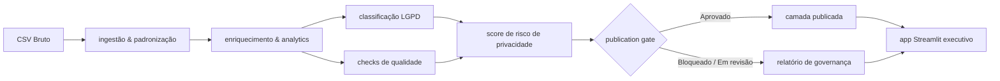

# Governed Analytics Platform

[](https://github.com/samuelmaia-analytics/Governed-Analytics-Platform/actions/workflows/ci.yml)
[](https://github.com/samuelmaia-analytics/Governed-Analytics-Platform/actions/workflows/lint.yml)
[](https://www.python.org/)
[](https://codecov.io/gh/samuelmaia-analytics/Governed-Analytics-Platform)
[](https://governed-analytics-platform.streamlit.app/)

**Idioma:** [English](README.md) | `Português`

Plataforma analítica governada para portfólio.
Foco em Analytics Engineering com controles de governança, qualidade e privacidade.

## Resumo Executivo

Este repositório demonstra um fluxo completo:

1. ingestão e transformação de dados;
2. classificação de privacidade inspirada em LGPD;
3. avaliação de risco explicável;
4. validação de qualidade com contratos declarativos;
5. publicação controlada para consumo executivo via Streamlit.

## Impacto de Negócio

- Reduz risco de exposição indevida ao separar camada interna e camada publicada.
- Aumenta confiança executiva com decisão explícita de publicação (`Approved`, `Needs Review`, `Blocked`).
- Melhora velocidade de revisão técnica com evidências automatizadas de qualidade e privacidade.
- Cria narrativa defensável para auditoria com contratos, score de risco e relatórios versionados.

## Problema de Negócio

Em muitos times, dashboards são publicados sem critérios claros de qualidade e privacidade.
Isso aumenta risco operacional, risco regulatório e perda de confiança.

## Solução

Abordagem de produto analítico governado:

- pipeline modular em Python;
- separação explícita entre camada interna e camada publicada;
- classificação e risco de privacidade;
- regras de qualidade em contrato YAML;
- documentação operacional e executiva versionada.

## Arquitetura

Fluxo principal:



Fronteira chave: o app consome a camada publicada (`data/published/dashboard`), não a camada curada interna completa.

## Implementado vs Simulado

### Implementado

- Pipeline Python modular com etapas reproduzíveis.
- Classificação LGPD por heurística e contrato YAML.
- Score de risco explicável e decisão de publicação.
- Regras de qualidade e checks automatizados.
- App Streamlit com visão executiva de decisão de publicação.
- Testes, lint, type-check e CI.

### Simulado

- Inventário de tratamento com controlador/operador/encarregado fictícios.
- Mini RIPD em Markdown para demonstração técnica.
- Base legal e retenção em linguagem de portfólio.
- Controles corporativos avançados (IAM completo e trilha centralizada de auditoria).

## Limites de Prontidão para Produção

- Projeto de portfólio com inspiração de produção.
- Uso de dados sintéticos, públicos ou de demonstração.
- Controles inspirados em LGPD, sem certificação jurídica.
- Sem IAM corporativo completo, trilha centralizada de auditoria, workflow formal de DPO ou acordo real de processamento de dados.
- Uma implantação real exigiria aprovação jurídica, segurança e infraestrutura.

## O que este Projeto Demonstra

- Mentalidade de Analytics Engineering com governança por design.
- Fronteiras claras entre dados internos e publicados.
- Execução local reproduzível com quality gates.
- Comunicação executiva de risco, qualidade e prontidão para publicação.

## App Streamlit Executivo

Páginas principais:

| Página | O que exibe |
| --- | --- |
| Visão Executiva | Métricas com deltas de tendência, freshness dos dados, colunas suprimidas por LGPD |
| Catálogo de Dados | Inventário de colunas com busca e filtro por classificação LGPD |
| LGPD e Risco de Privacidade | Score de risco, distribuição de classificações, prévia de transformações |
| Qualidade de Dados | Checks de qualidade, perfil de nulos, distribuição por severidade |
| EDA | Visão geral estatística com insights narrativos e testes estatísticos |
| Revenue Analytics | Evolução mensal da receita, Pareto por categoria, cohort e top sellers |
| Seller Performance | Ranking de sellers, distribuição por tier e métricas de SLA |
| Cohort Retention | Heatmap de retenção por cohort e heatmap de ticket médio |
| GenAI Insights | Saída de extração de features de texto de produto |
| Relatório de Governança | Relatórios markdown renderizados com visão raw |
| Central de Controles | Publication gate, racional de decisão, tendências históricas de governança |
| Snowflake Explorer | Navegação por tabelas Snowflake e execução de consultas somente leitura |

## Endpoints FastAPI

Governança e dados Snowflake disponíveis via REST API:

| Método | Caminho | Descrição |
| --- | --- | --- |
| `GET` | `/health` | Health check |
| `GET` | `/api/v1/governance/status` | Status do publication gate e scores de qualidade |
| `GET` | `/api/v1/snowflake/health` | Status da conexão Snowflake |
| `GET` | `/api/v1/snowflake/tables` | Lista tabelas do schema configurado |
| `POST` | `/api/v1/snowflake/query` | Executa uma consulta SELECT somente leitura |

Execução local:

```bash
uvicorn src.api:app --reload --port 8000
```

## Configuração Snowflake

Adicione ao seu `.env` para habilitar a integração Snowflake:

```env
SNOWFLAKE_ACCOUNT=sua-conta
SNOWFLAKE_USER=seu-usuario
SNOWFLAKE_PASSWORD=sua-senha
SNOWFLAKE_WAREHOUSE=seu-warehouse
SNOWFLAKE_DATABASE=seu-banco
SNOWFLAKE_SCHEMA=seu-schema
SNOWFLAKE_ROLE=PUBLIC
```

O app Streamlit e a API operam normalmente mesmo sem essas variáveis configuradas.

## Estrutura Principal

| Caminho | Propósito |
| --- | --- |
| `app/` | Interface executiva Streamlit |
| `src/` | Lógica de pipeline e governança |
| `contracts/` | Contratos de qualidade e governança |
| `docs/` | Documentação técnica e executiva |
| `tests/` | Testes automatizados |
| `.github/workflows/` | CI/CD |
| `powerbi/` | Artefatos de exportação BI |

## Como Rodar Localmente

### Linux / macOS

```bash
python -m venv .venv
source .venv/bin/activate
make install
cp .env.example .env
make test
make app
```

### Windows PowerShell

```powershell
python -m venv .venv
.venv\Scripts\Activate.ps1
make install
copy .env.example .env
make test
make app
```

## Como Revisar este Projeto em 5 Minutos

1. Leia até **Implementado vs Simulado**.
2. Abra `docs/architecture/architecture.md` e `docs/governance/privacy_governance.md`.
3. Rode `make test`.
4. Abra o app Streamlit e inspecione a **Central de Controles**.
5. Revise `docs/architecture/semantic_layer.md` e `docs/executive/recruiter_summary.md`.

## Notas para Revisão Técnica

- Decisões de governança são explicáveis e testadas (publication gate, risk scoring, quality checks).
- Contratos e artefatos de monitoramento são versionados e reproduzíveis.
- A interface Streamlit consome outputs publicados/governados para uso executivo.
- Veja: `docs/executive/executive_summary.md` e `docs/architecture/architecture.md`.

## Perfis com Fit para este Projeto

Artefato forte para discussão em entrevistas de:

- Analytics Engineer
- Data Engineer
- Data Governance / Data Platform
- Senior Data Analyst com escopo de ownership

## Links

- Streamlit app: <https://governed-analytics-platform.streamlit.app/>
- Repositório: <https://github.com/samuelmaia-analytics/Governed-Analytics-Platform>
- Índice técnico: [docs/README.md](docs/README.md)
