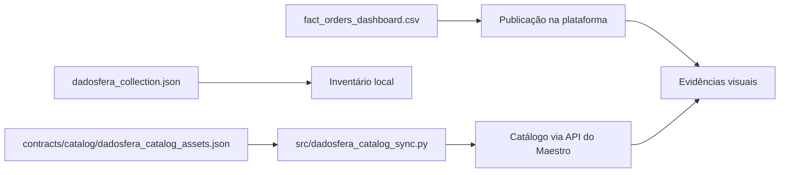

# 03 Catalogação

## Acesso Rápido

- Repositório: `https://github.com/samuelmaia-analytics/SAMUEL_MAIA_DDF_TECH_032026`
- Dashboard Streamlit: `https://samuelmaia-032026.streamlit.app/`
- Coleção na Dadosfera: `https://metabase-treinamentos.dadosfera.ai/collection/1101-samuel-maia-03-2026`
- Dashboard na Dadosfera: `https://metabase-treinamentos.dadosfera.ai/dashboard/294-dashboard-executivo-de-vendas`
- Ativo principal na Dadosfera: `https://metabase-treinamentos.dadosfera.ai/model/2719-fact-orders-dashboard`
- Tabela pública na Dadosfera: `https://app.dadosfera.ai/pt-BR/catalog/data-assets/2d044685-b897-4cfb-8010-b8c19c1e669d`

Este documento resume a estratégia de catalogação, governança mínima e evidências de publicação do ativo principal.

Para a visão consolidada dos ativos publicados no Metabase, com links confirmados e evidências por item, consultar [docs/dadosfera_evidencias.md](./dadosfera_evidencias.md).

## O que já existe no projeto

- manifesto local da coleção:
  - `data/curated/catalog/dadosfera_collection.json`
- inventário de ativos:
  - `data/curated/catalog/collection_assets_inventory.csv`
- inventário de classificação:
  - `data/curated/catalog/data_classification_inventory.csv`
- ativo publicado recomendado para plataforma:
  - `data/published/dashboard/fact_orders_dashboard.csv`
- manifesto de ativos para sync por API:
  - `contracts/catalog/dadosfera_catalog_assets.json`
- cliente de sync por API:
  - `src/dadosfera_catalog_sync.py`

## Objetivo

Demonstrar:

- organização dos ativos
- preparo para publicação
- governança mínima sobre dados e documentação

## Valor para a avaliação

Esta etapa mostra que o projeto não termina na transformação dos dados. O ativo foi organizado para descoberta, entendimento e reuso, com separação clara entre base analítica interna e camada publicada.

## Fluxo de catalogação

Leitura arquitetural:

- a catalogação não ficou restrita a documentação estática
- o projeto possui manifesto local, inventário versionado e sync complementar por API
- isso reduz dependência de manutenção manual para ativos públicos recorrentes

## Referências principais

- coleção local: [docs/collection_catalog.md](./collection_catalog.md)
- classificação de dados: [docs/data_classification.md](./data_classification.md)
- política de governança: [docs/governance_policy.md](./governance_policy.md)
- contexto de plataforma: [docs/about_dadosfera.md](./about_dadosfera.md)
- sync por API: [docs/dadosfera_api_sync.md](./dadosfera_api_sync.md)

## Evidências visuais da plataforma

As evidências visuais continuam organizadas em `images/dadosfera/`, com consolidação narrativa e links em [docs/dadosfera_evidencias.md](./dadosfera_evidencias.md).

- importação do ativo publicado: [images/dadosfera/01_importacao_dataset.png](../images/dadosfera/01_importacao_dataset.png)
- documentação e metadados do ativo: [images/dadosfera/02_catalogo_metadados.png](../images/dadosfera/02_catalogo_metadados.png)
- ativo publicado dentro da coleção do case: [images/dadosfera/03_colecao_case.png](../images/dadosfera/03_colecao_case.png)
- prova de volume acima de 100k registros: [images/dadosfera/04_volume_100k.png](../images/dadosfera/04_volume_100k.png)

## Status atual

- catalogação local: feita
- publicação real em plataforma: feita com evidência visual de importação, catálogo, coleção e volume do ativo publicado
- sincronização complementar por API: implementada no repositório

## Ativo recomendado para upload na Dadosfera

Para execução manual na plataforma, o ativo mais adequado do projeto é:

- `data/published/dashboard/fact_orders_dashboard.csv`

Motivo:

- já representa a camada publicada do case
- evita expor a base analítica interna completa
- está alinhado ao dashboard e aos principais indicadores executivos
- é o formato mais simples para upload manual e compartilhamento tabular

