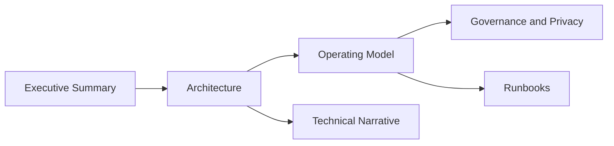

# Documentação do Projeto

Este diretório concentra a documentação principal do projeto. A navegação abaixo foi reorganizada para leitura rápida, revisão técnica e manutenção operacional.

## Como Ler Esta Pasta

- `executive_summary.md` responde o que foi entregue e por que isso importa
- `architecture.md` explica a estrutura da solução e a separação entre camadas
- `operating_model.md` conecta pipeline, publicação, governança e consumo
- `technical_narrative.md` consolida a defesa técnica do projeto
- `platform_publication.md` registra a automação de publicação em ambiente de plataforma
- `privacy_governance.md` registra a fronteira de exposição e os checks LGPD/governança aplicados na camada publicada
- runbooks e relatórios sustentam a operação e a auditabilidade

## Comece Por Objetivo

- leitura executiva: [executive_summary.md](executive_summary.md)
- defesa técnica: [technical_narrative.md](technical_narrative.md)
- operação e governança: [operating_model.md](operating_model.md)
- apresentação final: [10_apresentacao_final.md](10_apresentacao_final.md)

## Ordem recomendada

1. [executive_summary.md](executive_summary.md)
2. [architecture.md](architecture.md)
3. [05_dashboard.md](05_dashboard.md)
4. [operating_model.md](operating_model.md)
5. [privacy_governance.md](privacy_governance.md)
6. [engineering_governance.md](engineering_governance.md)
7. [schema_contract_report.md](schema_contract_report.md)
8. [10_apresentacao_final.md](10_apresentacao_final.md)

## Guias centrais

- [executive_summary.md](executive_summary.md): visão executiva única para revisão rápida
- [technical_narrative.md](technical_narrative.md): narrativa técnica principal do projeto
- [architecture.md](architecture.md): arquitetura implementada
- [operating_model.md](operating_model.md): visão única de pipeline, governança, publicação e consumo
- [collection_catalog.md](collection_catalog.md): coleção local e inventário catalogável
- [platform_publication.md](platform_publication.md): sync de catálogo e publicação idempotente de pipeline em ambiente de plataforma
- [privacy_governance.md](privacy_governance.md): decisões de minimização e publicação
- `contracts/governance/privacy_governance.json`: contrato versionado de privacidade e LGPD aplicado na etapa `publish`
- [governance_policy.md](governance_policy.md): governança, retenção e responsabilidades
- [engineering_governance.md](engineering_governance.md): guardrails de CI, ownership e contribuição
- [branch_protection_recommendation.md](branch_protection_recommendation.md): configuração recomendada no GitHub para merge e deploy

## Trilhas por Perfil

- visão executiva: [executive_summary.md](executive_summary.md), [05_dashboard.md](05_dashboard.md), [architecture.md](architecture.md)
- avaliador técnico: [technical_narrative.md](technical_narrative.md), [02_carga_e_modelagem.md](02_carga_e_modelagem.md), [architecture.md](architecture.md), [schema_contract_report.md](schema_contract_report.md)
- operação e governança: [operating_model.md](operating_model.md), [release_runbook.md](release_runbook.md), [rollback_runbook.md](rollback_runbook.md), [engineering_governance.md](engineering_governance.md)

## Papéis dos Documentos

| Documento | Papel |
| --- | --- |
| `executive_summary.md` | síntese executiva do projeto |
| `technical_narrative.md` | defesa técnica consolidada |
| `architecture.md` | visão estrutural das camadas e fluxos |
| `operating_model.md` | leitura ponta a ponta de operação e publicação |
| `platform_publication.md` | automação de publicação em ambiente de plataforma |
| `privacy_governance.md` | fronteira de exposição e minimização |
| `collection_catalog.md` | visão catalogável dos ativos |

## Relatórios gerados pelo pipeline

- [raw_data_inventory.md](raw_data_inventory.md)
- [eda_summary.md](eda_summary.md)
- [fact_orders_enriched.md](fact_orders_enriched.md)
- [data_quality_report.md](data_quality_report.md)
- [schema_contract_report.md](schema_contract_report.md)
- [data_classification.md](data_classification.md)
- [published_layer_monitoring.md](published_layer_monitoring.md)
- [privacy_governance.md](privacy_governance.md)
- [semantic_layer.md](semantic_layer.md)
- [operational_job_report.md](operational_job_report.md)
- [platform_publication.md](platform_publication.md)

## Operação e evidências

- [streamlit_capture_runbook.md](streamlit_capture_runbook.md)
- [release_runbook.md](release_runbook.md)
- [rollback_runbook.md](rollback_runbook.md)
- [final_pre_delivery_audit.md](final_pre_delivery_audit.md)
- [publication_checklist.md](publication_checklist.md)

## Complementos

- [bi_bonus.md](bi_bonus.md)
- [genai_bonus.md](genai_bonus.md)

## Arquivos históricos

Os documentos numerados `00` a `10` e materiais auxiliares históricos foram preservados como trilha de evolução do projeto. Eles não são a rota principal de leitura.

## Critério de Navegação

Se o objetivo for entender rapidamente o valor entregue, comece pelos guias centrais e pelas trilhas por perfil. A documentação cronológica foi mantida como histórico, não como ponto de entrada.
