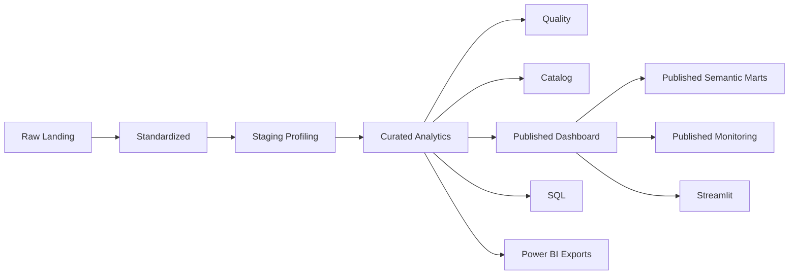
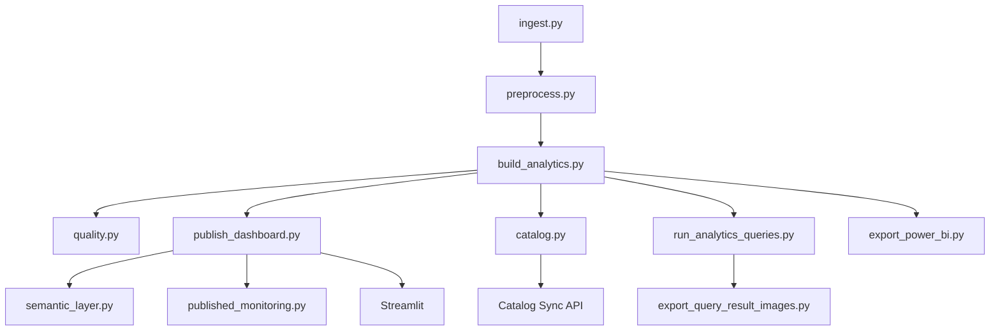

# Arquitetura

## Acesso Rápido

- Repositório: `https://github.com/samuelmaia-analytics/olist-governed-analytics-platform`
- Dashboard Streamlit: `https://olist-governed-analytics-platform.streamlit.app/`

## Tese Arquitetural

O projeto separa explicitamente o que é base interna de engenharia do que pode ser exposto como produto analítico. Essa decisão reduz acoplamento, melhora governança e torna consumo, monitoramento e evolução mais previsíveis.

## Visão geral

Este projeto foi estruturado como uma arquitetura simples de Data Lake em camadas, com separação clara entre:

- dado bruto de origem
- dado padronizado para reuso técnico
- artefatos intermediários de trabalho
- camada analítica interna
- camada publicada para consumo controlado

A intenção foi manter o projeto simples o suficiente para ser reproduzível, mas maduro o bastante para demonstrar rastreabilidade, governança e clareza de uso por camada.

## Princípios de Arquitetura

- a camada analítica central não é exposta diretamente ao consumo executivo
- publicação é etapa explícita do pipeline
- consumo, monitoramento e semântica reutilizam a mesma base publicada
- documentação e catálogo fazem parte da solução, não do acabamento

## Diagrama de arquitetura



Leitura arquitetural:

- `curated/analytics` é o núcleo técnico do projeto
- `published/dashboard` existe para desacoplar engenharia de consumo
- qualidade, catálogo e SQL orbitam o mesmo ativo central
- publicação e consumo acontecem sobre a camada publicada, não sobre a base interna

## Estrutura principal das camadas

```text
data/
  raw/
    landing/
      olist/
  standardized/
    olist/
  staging/
    profiling/
  curated/
    analytics/
    catalog/
    genai/
    ops/
    quality/
    query_results/
  published/
    dashboard/
    monitoring/
    semantic/
  external/
    genai/
  screenshots/
    query_results/
```

## Leitura rápida da arquitetura

| Camada | Objetivo principal | Exemplo no projeto |
| --- | --- | --- |
| `raw/landing` | preservar a fonte original | CSVs do Olist |
| `standardized` | padronizar estrutura e tipagem | tabelas promovidas por `src/preprocess.py` |
| `staging` | guardar profiling e apoio técnico | nulos, duplicatas e chaves candidatas |
| `curated/analytics` | manter a base analítica interna | `fact_orders_enriched` |
| `curated/catalog` | materializar catálogo e inventário | manifesto JSON e inventário tabular |
| `curated/ops` | registrar execução operacional | relatórios e resultados do runner |
| `curated/quality` | registrar checks e contratos | relatórios e resultados de qualidade |
| `curated/query_results` | persistir resultados SQL | saídas das queries em DuckDB |
| `curated/genai` | guardar artefatos da extensão de GenAI | features extraídas de texto |
| `published/dashboard` | expor camada minimizada para consumo | `fact_orders_dashboard` |
| `published/semantic` | expor marts agregados para recortes operacionais e executivos | `logistics_slice`, `seller_slice`, `cohort_slice`, `category_slice`, `state_performance_slice` |
| `published/monitoring` | persistir monitoramento recorrente | checks de freshness e qualidade |
| `external/genai` | entrada auxiliar externa ao fluxo principal | amostra textual para GenAI |

## Camadas e papel no projeto

### 1. Raw / Landing

**Objetivo**

Receber os dados exatamente como chegam da fonte, sem transformação estrutural relevante.

**Caminho**

- `data/raw/landing/olist/`

**Uso no projeto**

- fonte original dos CSVs do dataset Olist
- ponto inicial de validação em `src/ingest.py`

### 2. Standardized

**Objetivo**

Promover os dados de origem para um formato mais consistente para engenharia, com colunas tratadas e persistência técnica para reuso.

**Caminho**

- `data/standardized/olist/`

**Uso no projeto**

- gerado por `src/preprocess.py`
- consumido preferencialmente por `src/build_analytics.py`

### 3. Staging

**Objetivo**

Armazenar artefatos intermediários de profiling e apoio ao desenvolvimento e à validação do pipeline.

**Caminho**

- `data/staging/profiling/`

**Uso no projeto**

- perfis de colunas
- tabelas de nulos
- duplicatas
- chaves candidatas

### 4. Curated

**Objetivo**

Concentrar os ativos já tratados e prontos para consumo técnico, auditoria, qualidade, catálogo e análise.

**Caminhos principais**

- `data/curated/analytics/`
- `data/curated/catalog/`
- `data/curated/genai/`
- `data/curated/quality/`
- `data/curated/query_results/`

**Uso no projeto**

- `fact_orders_enriched` como base analítica interna
- manifesto da coleção e inventário de ativos
- checks de qualidade e contratos simples de schema
- resultados SQL executados sobre a camada analítica
- saídas estruturadas da extensão de GenAI

### 5. Published

**Objetivo**

Separar a camada de exposição do produto analítico da camada analítica interna, aplicando minimização e pseudonimização antes do consumo pelo dashboard.

**Caminho**

- `data/published/dashboard/`
- `data/published/semantic/`
- `data/published/monitoring/`

**Uso no projeto**

- `fact_orders_dashboard.parquet`
- `fact_orders_dashboard.csv`
- marts de logística, seller e cohort
- relatórios recorrentes de freshness e qualidade da camada publicada
- fonte do Streamlit
- ativo usado para consumo executivo e reaproveitamento controlado

## Fluxo do pipeline



Leitura operacional:

- o runner local coordena a transformação principal
- a publicação é um passo explícito, não efeito colateral da modelagem
- o catálogo existe em duas camadas: manifesto local e sync por API

## Impacto da Separação Curated x Published

| Decisão | Efeito técnico | Efeito no produto |
| --- | --- | --- |
| manter `fact_orders_enriched` como ativo interno | preserva flexibilidade analítica | evita expor a base completa |
| publicar `fact_orders_dashboard` como camada dedicada | reduz acoplamento e simplifica consumo | melhora clareza do que o dashboard pode usar |
| derivar marts semânticos da camada publicada | reaproveita a mesma fronteira de exposição | facilita recortes executivos adicionais |
| monitorar a camada publicada | torna a exposição observável | aproxima o ativo de um produto operacional |

## Etapas técnicas da solução

1. `src/ingest.py`
   Valida os arquivos de origem e documenta o inventário da fonte.

2. `src/preprocess.py`
   Padroniza as tabelas e gera os artefatos exploratórios de profiling.

3. `src/build_analytics.py`
   Constrói a `fact_orders_enriched` com granularidade de item de pedido.

4. `src/quality.py`
   Valida volume, nulos críticos, duplicidade e coerência básica da base final.

5. `src/publish_dashboard.py`
   Deriva a camada `published/dashboard` com minimização e pseudonimização.

6. `src/data_classification.py`
   Materializa a classificação de dados com foco em sensibilidade e publicação.

7. `src/semantic_layer.py`
   Materializa marts agregados para logística, seller, cohort, categoria e geografia executiva a partir da camada publicada.

8. `src/published_monitoring.py`
   Monitora freshness, schema e cobertura semântica da camada publicada.

9. `src/schema_contracts.py`
   Aplica contratos simples de schema sobre as camadas principais.

10. `src/catalog.py`
   Materializa o manifesto da coleção e o inventário catalogável dos ativos.

11. `src/run_analytics_queries.py`
   Executa as queries SQL sobre a camada analítica.

12. `src/export_query_result_images.py`
   Converte resultados tabulares em imagens PNG para documentação.

13. `src/export_power_bi.py`
   Gera os exports do modelo complementar para Power BI.

14. `streamlit_app/app.py`
   Consome exclusivamente a camada publicada do dashboard.

15. `src/genai_feature_extraction.py`
   Materializa a extração adicional de features em texto desestruturado.

## Decisões de arquitetura que importam na avaliação

- a camada analítica interna (`fact_orders_enriched`) foi mantida separada da camada publicada
- o dashboard não consome a camada interna completa
- a camada publicada foi definida como fronteira oficial de exposição
- catálogo, qualidade, SQL e dashboard foram tratados como partes da mesma jornada de dados
- automação de catálogo e automação de deploy foram tratadas como extensões naturais da engenharia, não como tarefa manual posterior

## O que está implementado versus o que é evolução

**Implementado**

- arquitetura local em camadas
- camada analítica interna
- camada publicada para dashboard
- camada semântica publicada para logística, seller e cohort
- monitoramento recorrente com artefatos operacionais
- catálogo local materializado
- documentação e evidências versionadas do ativo principal

**Evolução futura**

- pipeline nativo recorrente na plataforma
- alerta externo para falhas de monitoramento e execução
- maior integração com canais externos, se necessário

## Resumo executivo

Na prática, essa arquitetura permitiu organizar o projeto de forma defensável: o dado entra bruto, passa por padronização e validação, vira ativo analítico interno e só depois é publicado em uma camada segura para consumo. Isso melhora rastreabilidade, reduz ambiguidade de uso e mostra uma distinção madura entre construção do ativo e exposição do ativo.
