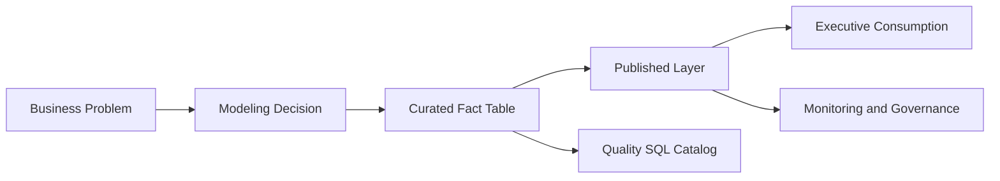

# Narrativa Técnica

## Tese

O valor técnico do projeto não está em ter apenas um dashboard funcional. Está em transformar um dataset transacional fragmentado em um ativo analítico defensável, governado e reaproveitável, com uma camada publicada explícita entre engenharia e consumo.

## Resumo Executivo

Este projeto transforma o dataset Olist em um produto analítico utilizável, com separação clara entre camada interna de engenharia e camada publicada para consumo executivo. O núcleo técnico da entrega é `fact_orders_enriched`, uma tabela fato com granularidade de item de pedido e `112.650` registros, construída para responder perguntas de negócio sem sacrificar rastreabilidade técnica.

A camada derivada `fact_orders_dashboard` reduz risco de exposição, preserva utilidade analítica e serve como fonte oficial do Streamlit e do ativo publicado. Isso dá ao projeto um desenho mais maduro do que uma entrega centrada apenas em visualização.

## Tese da Entrega

O valor desta entrega está em combinar quatro frentes que normalmente aparecem desconectadas em projetos de portfólio:

- modelagem com granularidade defensável
- qualidade e governança explícitas
- consumo real por múltiplos canais
- documentação suficiente para auditoria e defesa técnica

O projeto não depende de narrativa inflada. Ele sustenta avaliação porque conecta decisão de modelagem, produto analítico, evidência operacional e automação mínima de engenharia em um mesmo fluxo.

## Mapa da Defesa Técnica

- o problema de negócio orienta a modelagem
- a modelagem sustenta tanto exploração quanto consumo
- a camada publicada cria a fronteira de exposição
- governança e monitoramento aparecem como parte do fluxo, não como apêndice

## Estado Real da Solução

| Ambiente | Estado | Evidência |
| --- | --- | --- |
| Repositório local | concluído | pipeline, testes, docs, SQL, dashboard e artefatos |
| GitHub | concluído | documentação, workflows e automação versionados |
| Dadosfera/Metabase | concluído para publicação e catálogo | ativo publicado, coleção evidenciada, links reais e sync por API implementado |
| Dadosfera API protegida | parcialmente validada | o tenant aceita `POST /auth/sign-in` com MFA no campo `code`, mas não retorna token nem cookie reutilizável para `catalog` e `pipelines` sem orientação adicional do suporte |
| Dadosfera nativa como motor de pipeline | parcialmente preparada | há operador via API e template versionado, mas não há execução nativa comprovada no tenant |

Leitura correta:

- o produto analítico está entregue
- a publicação externa está comprovada
- a integração programática de catálogo está implementada
- a autenticação MFA do Maestro foi parcialmente validada, mas os endpoints protegidos ainda dependem do fluxo oficial indicado pelo suporte
- o que segue sem comprovação final é pipeline nativo executando dentro da plataforma

## O Que Está Comprovado

| Pilar | Situação | Evidência |
| --- | --- | --- |
| modelagem analítica | comprovada | `fact_orders_enriched`, SQL e dashboard |
| publicação segura | comprovada | `fact_orders_dashboard` e docs de governança |
| consumo executivo | comprovado | Streamlit e Power BI |
| operação recorrente | comprovada localmente | monitoramento, runbooks e workflows |
| integração externa avançada | parcial | evidências e limites documentados |

## Problema de Negócio

O dataset Olist é relacional, fragmentado e operacional. Sozinho, ele não responde bem perguntas de negócio sobre receita, atraso, categoria, pagamento, geografia e experiência do cliente. O problema real não é apenas juntar tabelas; é transformar eventos transacionais em uma camada confiável e reutilizável para análise, sem perder coerência entre dado, consumo e governança.

Foi por isso que a solução foi desenhada como produto analítico, não como notebook exploratório.

## Decisões de Modelagem

A decisão estrutural mais importante foi usar `order_items` como base factual. Isso preserva o nível em que preço, frete, produto, seller e entrega fazem sentido analítico. `orders`, `customers`, `products` e `sellers` entram como enriquecimento dimensional, enquanto `payments` e `reviews` são agregados antes do join para evitar multiplicação artificial de linhas.

Essa escolha sustenta duas qualidades que importam em avaliação senior:

- integridade analítica: a granularidade é estável e defensável
- flexibilidade de consumo: a mesma base atende SQL, qualidade, dashboard e export BI

## Por Que a Modelagem se Sustenta

- a fato nasce no nível em que preço, frete e seller coexistem sem distorção
- joins sensíveis como pagamento e review são agregados antes da composição final
- a granularidade final permite recortes executivos sem perder coerência operacional
- a mesma modelagem sustenta exploração, publicação e consumo

## Arquitetura de Publicação

O projeto separa explicitamente:

- `fact_orders_enriched`: camada interna para engenharia, SQL, qualidade e auditoria
- `fact_orders_dashboard`: camada publicada para consumo executivo

Essa separação não é cosmética. Ela reduz acoplamento, melhora governança e impede que o dashboard dependa de atributos desnecessários ou sensíveis. Na publicada, identificadores são pseudonimizados e campos como cidade, CEP e IDs operacionais deixam de ser expostos quando não agregam valor ao caso de uso.

## O Que a Publicação Resolve

| Risco sem camada publicada | Resposta adotada no projeto |
| --- | --- |
| dashboard acoplado à base interna | criação de `fact_orders_dashboard` |
| exposição de atributos desnecessários | minimização de colunas |
| uso inconsistente entre canais de consumo | camada oficial única para exposição |
| baixa observabilidade do ativo exposto | monitoramento e contratos sobre a publicada |

## Perguntas de Negócio Respondidas

As consultas SQL e o dashboard respondem, de forma consistente, a cinco frentes principais:

- quais categorias concentram receita
- como receita e atraso evoluem no tempo
- onde a receita se concentra geograficamente
- quais categorias sofrem mais pressão logística
- como os meios de pagamento se distribuem

Essas respostas não dependem de lógica escondida em visual. Elas partem de uma fato documentada, queries versionadas e resultados exportados, o que melhora auditabilidade.

## Leitura Executiva dos Resultados

Os resultados mostram uma operação com forte concentração em poucas categorias e poucos estados, crescimento relevante ao longo do tempo e dependência marcante de `credit_card` como meio de pagamento dominante. Também deixam claro que crescimento comercial e pressão operacional coexistem: meses de pico ampliam receita, mas também expõem gargalos de atraso.

Do ponto de vista gerencial, isso sugere três leituras prioritárias:

- concentração de valor pede foco em categorias e geografias de maior peso
- sazonalidade precisa ser lida junto com performance logística
- atraso deve ser tratado como problema econômico e de experiência, não apenas operacional

## Dadosfera, Catálogo e Automação

O projeto já vai além de um manifesto local. Hoje ele possui:

- ativo principal publicado e evidenciado na Dadosfera/Metabase
- coleção publicada com evidências versionadas
- manifesto local da coleção e inventário de ativos
- sincronização programática de ativos públicos via API do Maestro
- monitoramento recorrente de freshness e qualidade da camada publicada
- job agendado com artefatos operacionais e observabilidade de falha
- expansão da camada semântica para recortes de logística, seller e cohort
- preparação operacional para criação e execução de pipelines nativos via API
- automação de promoção do branch de deploy do Streamlit

Essa combinação é importante porque demonstra que a entrega não termina na geração da base. Ela cobre também a etapa em que muitos projetos falham: tornar o ativo encontrável, publicável, monitorável e reutilizável.

## Status Real da API da Dadosfera

Durante o fechamento do projeto, a integração com a API do Maestro foi testada com credenciais reais do tenant. O cenário validado foi o seguinte:

- `POST /auth/sign-in` respondeu `200` quando o MFA foi enviado no campo `code`
- o mesmo fluxo não retornou `accessToken`
- também não retornou cookie de sessão reutilizável
- após o `sign-in`, os endpoints protegidos `GET /catalog`, `GET /permissions` e `GET /platform/pipelines` continuaram respondendo `401`
- a orientação do suporte foi usar `x-api-key` apenas para API key e `Authorization` sem `Bearer` para autenticação por usuário

Leitura correta:

- o tenant aceitou a autenticação inicial
- o contrato completo para operar endpoints protegidos ainda não ficou demonstrado
- o bloqueio remanescente deixou de ser implementação local e passou a ser esclarecimento oficial do suporte sobre o formato final de sessão ou token para `catalog` e `pipelines`

## O Que Não Está Sendo Superestimado

Alguns limites permanecem intencionais e precisam ser mantidos claros:

- não há pipeline nativo comprovadamente executando dentro da Dadosfera
- há preparação operacional para pipeline nativo via API, mas sem evidência de run final no tenant
- a API do Maestro foi testada com credenciais reais, porém o tenant não retornou artefato de sessão reutilizável após o `sign-in`
- a plataforma ainda não substitui o motor local de transformação
- o bônus de GenAI existe como enriquecimento e prova de capacidade, não como eixo central da solução

Essa postura é parte da qualidade da entrega. Um projeto maduro não infla maturidade operacional onde não há evidência.

## Limites Assumidos de Forma Explícita

- o motor principal continua local e versionado
- integrações externas não redefinem o núcleo da solução
- ausência de evidência final em plataforma externa é tratada como limite, não como marketing
- extensões como GenAI e API sync permanecem complementares ao fluxo principal

## Por Que Esta Entrega É Forte

Esta entrega é forte porque demonstra critério. O projeto não tenta parecer uma plataforma completa; ele mostra capacidade real de estruturar dados, modelar uma tabela fato útil, controlar exposição, publicar ativos, documentar decisões e automatizar o suficiente para sair do artesanal.

Em termos de avaliação, isso sinaliza:

- domínio de analytics engineering
- noção de data product
- maturidade de governança acima da média para projetos de portfólio técnico
- capacidade de transformar output analítico em ativo defendível

## Próximos Passos Naturais

- implementar pipeline nativo na Dadosfera, se houver exigência de aprofundamento
- expandir o sync de catálogo para mais tipos de ativos
- transformar a preparação operacional de pipeline via API em execução real com evidência de run e output
- fechar com o suporte o contrato de autenticação para consumo de `catalog` e `pipelines` via API protegida
- incluir marts adicionais por cliente, seller e categoria
- ampliar testes para regressão analítica e componentes de consumo
- ampliar o monitoramento com alerta externo e SLA operacional

## Conclusão

O projeto entrega uma solução de dados ponta a ponta com coerência entre engenharia, governança, consumo e evidência. Ele sai do dado bruto, constrói uma camada analítica defensável, publica uma versão segura para consumo executivo e prova o valor da solução em canais diferentes sem perder consistência.

A síntese correta é simples: o produto analítico está pronto, a publicação está comprovada, a automação relevante já existe, a preparação para pipeline nativo via API foi implementada, e os limites estruturais remanescentes são a ausência de execução nativa comprovada dentro da plataforma e a falta de um artefato de sessão reutilizável exposto pelo tenant para `catalog` e `pipelines`.

