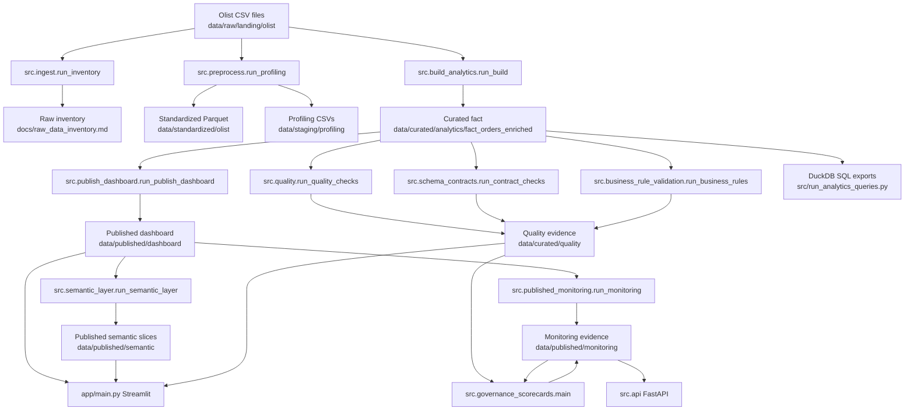

# AWS Serverless Implementation Audit

## 1. Executive Summary

This audit reviewed the current Governed Analytics Platform before any AWS implementation. The repository is a mature local analytics platform with Python pipelines, DuckDB/SQL, dbt-duckdb models, data contracts, LGPD-inspired governance controls, publication readiness logic, Streamlit applications, FastAPI endpoints, n8n workflow templates, and GitHub Actions.

No evidence was found that AWS infrastructure is currently provisioned by this repository. AWS appears as reference architecture, cost guidance, UI documentation, and placeholders for future platform integration. The safest MVP path is to preserve local execution, add a small storage abstraction, write governed Parquet outputs to S3, register a minimal Glue Data Catalog/Athena surface, and keep Python as the source of truth for quality, LGPD, publication gate, logs, and orchestration semantics.

Key risks are accidental duplication of Python and dbt logic, exposure of internal or raw data to query layers, unmanaged cost in Athena/CloudWatch, and repository hygiene around generated artifacts and local configuration files.

## 2. Audit Scope

Scope covered:

- Repository structure, entrypoints, pipeline, data layers, dbt, data quality, governance, publication gate, observability, Streamlit, FastAPI, n8n, CI/CD, dependencies, security, infrastructure references, AWS service mapping, MVP reuse, gaps, risks, and recommended implementation order.
- Evidence is based on files present in the repository, including `src/`, `scripts/`, `app/`, `pages/`, `dbt/`, `contracts/`, `config/`, `data/`, `logs/`, `docs/`, `workflows/n8n/`, `.github/workflows/`, `pyproject.toml`, `requirements.txt`, and `Makefile`.

Out of scope:

- No AWS resources were created.
- No Terraform, CloudFormation, SAM, Serverless Framework, Docker, dependencies, application code, pipelines, tests, dashboards, workflows, public READMEs, or infrastructure files were changed.
- Tests were not executed because this step created documentation only.

## 3. Current Implemented Architecture

Implemented locally:

- Batch ingestion and profiling of Olist CSV files in `src/ingest.py` and `src/preprocess.py`.
- Analytical fact build in `src/build_analytics.py`.
- Published dashboard minimization and pseudonymization in `src/publish_dashboard.py`.
- Semantic published slices in `src/semantic_layer.py`.
- Quality checks, schema contracts, business rules, privacy checks, monitoring, scorecards, lineage, catalog artifacts, and operational reports in `src/`.
- Main Streamlit app in `app/main.py`, auxiliary Streamlit app in `app.py` plus `pages/`.
- FastAPI app in `src/api.py`.
- dbt project in `dbt/` using DuckDB.
- n8n workflow templates in `workflows/n8n/`.
- CI/CD workflows in `.github/workflows/`.

Simulated or demonstrative:

- AWS reference architecture in `config/aws_reference_architecture.yml`, `docs/aws_architecture.md`, `docs/architecture/aws_reference_architecture.md`, and `pages/09_AWS_Architecture.py`.
- Platform publication for Dadosfera in `src/platform_publication.py`, `src/dadosfera_catalog_sync.py`, `src/dadosfera_pipeline_ops.py`, and `contracts/dadosfera/pipelines/fact_orders_dashboard_s3_parquet_pipeline.json`.
- n8n Discord alert nodes use placeholder credential identifiers only.

## 4. Current Mermaid Diagram



## 5. Relevant Repository Structure

```text
.
|-- app/                       Main Streamlit application and modular pages
|-- pages/                     Auxiliary root Streamlit pages
|-- src/                       Python pipeline, governance, API, catalog, monitoring modules
|-- scripts/                   CLI wrappers used manually and by n8n
|-- sql/                       DuckDB SQL queries and analytical exports
|-- dbt/                       dbt-duckdb project
|-- contracts/                 YAML/JSON contracts, policies, business rules, platform manifests
|-- config/                    Pipeline, local lake, AWS reference configuration
|-- data/                      Versioned raw samples, generated lake artifacts, published outputs
|-- logs/                      Versioned sample logs and runtime log directory
|-- workflows/n8n/             Importable n8n workflow templates
|-- .github/workflows/         CI, lint, security, publication, deployment workflows
|-- docs/                      Architecture, governance, reports, operations, reference AWS docs
|-- powerbi/, images/, assets/ Evidence and BI/dashboard artifacts
|-- tests/                     Pytest suite
```

Potentially obsolete or duplicated:

- `app/main.py` and root `app.py` are separate Streamlit surfaces with overlapping governance concepts.
- `scripts/capture_streamlit_screenshots.py` and `tools/capture_streamlit_screenshots.py` create a duplicate module name, which caused `mypy .` to fail in Step 1.
- `src/quality.py` and generic `src/data_quality.py` both implement quality checks for different purposes.
- Python transformations in `src/build_analytics.py` overlap intentionally with dbt models in `dbt/models/`.
- Generated artifacts exist under `data/curated`, `data/staging`, `data/published`, `data/processed`, `data/screenshots`, `powerbi/`, and `docs/reports`.

## 6. Entrypoints

| Purpose | File | Command | Main function | Dependencies | Expected output | Status |
| --- | --- | --- | --- | --- | --- | --- |
| Main pipeline | `src/run_platform_pipeline.py` | `uv run python src/run_platform_pipeline.py` | `main()` | pandas, DuckDB, pyarrow, project modules | curated, published, semantic, quality, monitoring, reports | Active |
| List pipeline steps | `src/run_platform_pipeline.py` | `uv run python src/run_platform_pipeline.py --list-steps` | `list_steps()` | project modules | step list | Active |
| Main Streamlit | `app/main.py` | `uv run streamlit run app/main.py` or `make app` | `main()` | Streamlit, pandas, Plotly, project modules | local app | Active |
| Auxiliary Streamlit | `app.py` | `uv run streamlit run app.py` | `main()` | Streamlit, `pages/`, `streamlit_shared.py` | reference/operations app | Demonstrative but active |
| FastAPI | `src/api.py` | `uv run uvicorn src.api:app --reload` | `app = FastAPI(...)` | FastAPI, pandas, Snowflake connector | health/governance/Snowflake endpoints | Active |
| Tests | `pyproject.toml` | `uv run pytest` | pytest | dev extra | test results | Active |
| Ruff | `pyproject.toml` | `uv run ruff check src app tests` | Ruff | dev extra | lint status | Active |
| mypy | `pyproject.toml`, CI | `uv run mypy <selected files>` | mypy | dev extra | type-check status | Active in CI subset |
| dbt | `dbt/dbt_project.yml` | `cd dbt && dbt build --profiles-dir .` | dbt project | dbt-duckdb | DuckDB models/tests | Functional local target expected |
| Governance docs | `scripts/generate_governance_docs.py` | `python scripts/generate_governance_docs.py --config config/pipeline_config.yml` | `main()` | pandas, YAML, report generator | markdown reports | Active wrapper |
| Publication gate | `scripts/run_publication_gate.py`, `src/publication_gate.py` | `python scripts/run_publication_gate.py` | `main()` / `evaluate_publication_readiness()` | pandas, CSV output | `data/gold/publication_decisions.csv` | Active |
| Quality | `scripts/run_data_quality.py`, `src/quality.py` | `python scripts/run_data_quality.py --config config/pipeline_config.yml` | `main()` | curated fact Parquet | quality CSV/report | Active |
| LGPD classification | `scripts/run_lgpd_classification.py`, `src/lgpd_classifier.py` | `python scripts/run_lgpd_classification.py --config config/pipeline_config.yml` | `main()` | pandas, YAML | classification CSV | Active wrapper |
| Privacy risk | `scripts/run_privacy_risk_score.py`, `src/risk_scoring.py` | `python scripts/run_privacy_risk_score.py --config config/pipeline_config.yml` | `main()` | pandas | JSON score | Active wrapper |
| Monitoring | `src/published_monitoring.py` | `uv run python src/published_monitoring.py --fail-on-alert` | `main()` | published Parquet, requests optional | monitoring CSV/JSON/report, optional webhook | Active |
| n8n wrapper | `scripts/run_governance_pipeline.py` | `python scripts/run_governance_pipeline.py --config config/pipeline_config.yml` | `main()` | pipeline modules | selected governed steps | Active wrapper |

## 7. Pipeline and Layers

Current flow:

1. Source: Olist CSV files under `data/raw/landing/olist/`.
2. Inventory: `src.ingest.run_inventory()` validates expected CSV names and writes `docs/raw_data_inventory.md`.
3. Profiling and standardization: `src.preprocess.run_profiling()` writes Parquet files under `data/standardized/olist/` and profiling CSVs under `data/staging/profiling/`.
4. Curated build: `src.build_analytics.run_build()` joins orders, items, customers, products, sellers, payments, reviews, translations, seller metrics, and cohort attributes into `data/curated/analytics/fact_orders_enriched.parquet` and CSV.
5. Published minimization: `src.publish_dashboard.run_publish_dashboard()` applies publication controls, pseudonymizes/removes sensitive fields, writes `data/published/dashboard/fact_orders_dashboard.parquet` and CSV, and writes privacy evidence.
6. Semantic layer: `src.semantic_layer.run_semantic_layer()` creates logistics, seller, cohort, category, and state slices in CSV and Parquet under `data/published/semantic/`.
7. Quality: `src.quality.run_quality_checks()`, `src.schema_contracts.run_contract_checks()`, and `src.business_rule_validation.run_business_rules()` write evidence under `data/curated/quality/`.
8. Monitoring: `src.published_monitoring.run_monitoring()` writes `data/published/monitoring/published_layer_monitoring.*`.
9. Governance scorecards and decisions: `src.governance_scorecards.main()` and `src.governance_history.save_publication_decision_artifact()` write scorecards and `publication_decision.json`.
10. Consumption: `app/main.py`, `app.py`, `src/api.py`, and SQL/DuckDB exports consume published or local files.

Formats:

- CSV: raw Olist, published dashboard companion, reports/evidence tables, Power BI exports.
- Parquet: standardized Olist tables, curated fact, published dashboard, semantic slices.
- DuckDB: `data/curated/analytics/governance.duckdb` for SQL execution.
- JSON: monitoring summaries, scorecards, catalog, lineage, platform manifests.
- Markdown: reports and documentation.

Controls:

- Error handling is explicit in many modules through `FileNotFoundError`, `ValueError`, `RuntimeError`, and pipeline step exception capture.
- Idempotence is partial: most outputs are overwritten deterministically; history files append.
- Incremental load is not implemented; current processing is full refresh from local files.
- Duplicate handling exists in Python and dbt staging/curated transformations.
- Null handling exists in profiling, quality checks, default fills in published outputs, and monitoring.
- Logs exist as Python logging plus CSV operational logs; CloudWatch integration is not implemented.

## 8. Data Lake Local

| Layer | Purpose | Expected data | Versioned examples | Runtime/generated artifacts | Assessment |
| --- | --- | --- | --- | --- | --- |
| `data/raw/landing/olist` | Source-aligned Bronze input | Olist CSVs | Raw CSVs are tracked | Not expected to change often | Clear raw boundary, but large raw data is versioned |
| `data/bronze` | Named Bronze placeholder | Future Bronze outputs | `.gitkeep` | None found | Mostly empty; config maps Bronze to raw/external instead |
| `data/standardized/olist` | Silver-like standardized Parquet | standardized Olist tables | `.gitkeep` tracked; generated Parquet present locally | Parquet outputs | Proper technical separation, generated data should stay ignored |
| `data/staging/profiling` | profiling evidence | CSV profiles | `.gitkeep` tracked; generated CSVs present locally | profiling tables | Useful audit evidence but can grow |
| `data/silver` | named Silver placeholder | future Silver outputs | `.gitkeep` | None found | Empty placeholder |
| `data/curated/analytics` | internal Gold/curated fact | fact, DuckDB | generated local artifacts | CSV, Parquet, DuckDB | Contains internal detailed data; do not expose directly |
| `data/curated/quality` | quality evidence | checks and results | generated local artifacts | CSV | Good audit trail |
| `data/curated/catalog` | catalog/lineage evidence | CSV/JSON metadata | tracked files | regenerated catalog | Useful, low volume |
| `data/gold` | legacy/simple publication gate | publication decisions CSV | tracked `publication_decisions.csv` | append decisions | Overlaps with `data/published/monitoring` |
| `data/published/dashboard` | governed app dataset | minimized dashboard fact | CSV tracked; Parquet local | CSV/Parquet | Correct consumption boundary |
| `data/published/semantic` | governed semantic slices | aggregated marts | CSV/Parquet tracked | regenerated slices | Good Athena candidates |
| `data/published/monitoring` | publication/health evidence | JSON/CSV monitoring | tracked generated evidence | regenerated monitoring | Useful but may cause frequent diffs |
| `data/quarantine` | rejected records | failed extracts | `.gitkeep` | none found | Concept exists, no active rejected records found |
| `data/external`, `data/samples`, `data/processed`, `data/screenshots` | demos/evidence/BI | samples, BI exports, screenshots | tracked | some generated | Mixed evidence and runtime outputs |

There is some mixing of raw data, generated analytical results, screenshots, BI artifacts, and operational evidence in the repository. The `.gitignore` protects several generated layers, but many generated artifacts are present locally and some are tracked intentionally as portfolio evidence.

## 9. dbt

Location: `dbt/`.

Profile and adapter:

- `dbt/profiles.yml` defines profile `olist_analytics`.
- Target `dev` uses `type: duckdb`, `path: "{{ env_var('DBT_DUCKDB_PATH', ':memory:') }}"`, `threads: 4`, and `parquet` extension.

Project:

- `dbt/dbt_project.yml` defines model paths, test paths, macro paths, targets, and schemas.
- Staging models are views in schema `staging`.
- Intermediate models are views in schema `intermediate`.
- Marts are tables in schema `marts`.

Implemented:

- Sources in `dbt/models/staging/_sources.yml` use DuckDB `read_csv_auto()` against `data/raw/landing/olist`.
- Staging: customers, orders, order_items, payments, products, reviews, sellers, category translation.
- Intermediate: payments aggregate, reviews aggregate, seller metrics, customer cohort.
- Marts: `fact_orders_enriched` and `fact_orders_dashboard`.
- Tests: not-null, unique, accepted values across staging/intermediate/marts YAML.
- Tags: marts include `curated/internal` and `published/dashboard`.

Not found:

- Snapshots, seeds, macros, exposures, source freshness checks, incremental models, model contracts, Athena target, Glue Catalog configuration.

Reusable for Athena:

- SQL modeling structure, source/staging/intermediate/mart separation, tests, and published/internal tagging.

Needs adaptation:

- Source definitions must change from `read_csv_auto()` local CSV paths to Athena/Glue tables.
- DuckDB-specific functions such as `qualify`, `datediff`, `mode() within group`, `strftime`, and `md5` should be validated against Athena SQL.
- Profiles need a separate Athena target without removing the DuckDB target.

Main risk:

- Python and dbt contain overlapping transformation logic. The MVP should choose one implementation as authoritative for each output or validate parity explicitly.

## 10. Data Quality

Quality implementations:

- Generic dataset checks: `src/data_quality.py` and `src/data_quality_rules.py`.
- Curated fact checks: `src/quality.py`.
- Schema contracts: `src/schema_contracts.py` and `contracts/*/*.contract.json`.
- Business rules: `src/business_rule_validation.py` and `contracts/governance/business_rules/fact_orders_enriched.v1.json`.
- Published monitoring: `src/published_monitoring.py`.
- dbt tests: `dbt/models/**/_*.yml`.
- Reports: `docs/reports/data_quality_report.md`, `docs/reports/schema_contract_report.md`, `docs/reports/published_layer_monitoring.md`.

| Rule | Location | Layer | Severity | Failure action | Evidence | Status |
| --- | --- | --- | --- | --- | --- | --- |
| Expected schema | `src/quality.py` | Curated | high | FAIL evidence | `data/curated/quality/fact_orders_enriched_quality_checks.csv` | Implemented |
| Critical nulls | `src/quality.py` | Curated | high | FAIL evidence | same | Implemented |
| Granularity duplicates | `src/quality.py` | Curated | high | FAIL evidence | same | Implemented |
| Negative price/freight | `src/quality.py`, `src/data_quality.py`, dbt staging | Curated/Staging | high/medium | FAIL evidence or filtered in model | CSV/dbt results | Implemented |
| Temporal coherence | `src/quality.py` | Curated | medium/high | FAIL/WARN evidence | quality report | Implemented |
| Missing review/category/undelivered pct | `src/quality.py` | Curated | medium | FAIL evidence | quality CSV | Implemented |
| Dimension join coverage | `src/quality.py` | Curated | medium | FAIL evidence | quality CSV | Implemented |
| Payment reconciliation | `src/quality.py` | Curated | medium | FAIL evidence | quality CSV | Implemented |
| Minimum record volume | `src/quality.py`, `src/published_monitoring.py` | Curated/Published | high | FAIL evidence | quality/monitoring CSV | Implemented |
| YAML rules | `contracts/data_quality_rules.yml`, `src/data_quality_rules.py` | Generic/sample | low-high | FAIL check result | in-memory/wrapper outputs | Implemented |
| Schema contracts | `contracts/*/*.contract.json`, `src/schema_contracts.py` | Standardized/Curated/Published | implied high | FAIL evidence | `schema_contract_results.csv` | Implemented |
| Business rules | `contracts/governance/business_rules/fact_orders_enriched.v1.json` | Curated | high/medium | high FAIL exits | `business_rule_results.csv` | Implemented |
| Published freshness/schema/nulls/semantic coverage | `src/published_monitoring.py` | Published | high/medium | FAIL, optional exit/webhook | monitoring CSV/JSON/report | Implemented |
| dbt not_null/unique/accepted_values | `dbt/models/**/*.yml` | dbt models | dbt default | dbt test failure | dbt artifacts when run | Implemented |

Quarantine is configured conceptually but this audit found no active quarantine writer for rejected rows.

## 11. Governance and LGPD

Implemented:

- Column classification by contract, name, and sampled regex in `src/lgpd_classifier.py`.
- Classification override contract in `contracts/governance/lgpd_classification_rules.yml`.
- Privacy risk scoring in `src/risk_scoring.py`.
- Privacy transformations in `src/privacy_transformations.py`.
- Published minimization, pseudonymization, privacy policy alignment, and leakage checks in `src/publish_dashboard.py`.
- Publication readiness policy in `src/publication_gate.py`.
- Governance history and decision artifact in `src/governance_history.py`.
- Governance scorecards in `src/governance_scorecards.py`.
- Catalog and lineage artifacts in `src/catalog.py` and `src/lineage.py`.

Simulated:

- Legal basis, retention, access model, and operating model documentation in `docs/governance/` and `contracts/governance/privacy_governance.json`.
- Risk and impact artifacts are portfolio-grade governance evidence, not legal certification.

Documental/proposed:

- Enterprise IAM, centralized audit, formal legal process, Lake Formation, Macie, and AWS governance controls are documented but not implemented.

The repository should not present the current governance as legal certification. It is an engineering control framework and audit evidence for a public sample dataset.

## 12. Publication Gate

Primary implementation:

- `src/publication_gate.py` defines `evaluate_publication_readiness()`.
- `scripts/run_publication_gate.py` provides a CLI that appends decisions to `data/gold/publication_decisions.csv`.
- `src/governance_history.py` writes `data/published/monitoring/publication_decision.json`.
- `app/pages/governance_control_center.py` has additional UI-oriented evaluation and rationale rendering.

Criteria:

- Blocked when critical rule failures exist, sensitive data lacks protection, or schema contract failed.
- Needs Review when data quality score is below 80, privacy risk score is at least 60, or freshness is warning/stale.
- Privacy risk score at least 80 raises severity.
- Approved when all controls are acceptable.

Inputs:

- data quality score;
- privacy risk score;
- critical rule failures;
- freshness status;
- schema contract status;
- sensitive data protection flag.

Outputs:

- decision: `Approved`, `Needs Review`, or `Blocked`;
- severity: `Low`, `Medium`, `High`, or `Critical`;
- reasons and required actions;
- persisted decisions in CSV/JSON depending on entrypoint.

AWS reuse:

- Keep the pure function in `src/publication_gate.py`.
- Lambda or scheduled jobs should call the same function after reading quality, catalog, privacy, and freshness evidence from S3/Athena/CloudWatch-compatible artifacts.
- Do not reimplement policy in Terraform, n8n, or dashboard code.

## 13. Observability

Implemented:

- Python logging formatter in `src/observability.py`.
- Runtime pipeline report in `src/run_platform_pipeline.py`.
- Operational log wrapper in `scripts/register_pipeline_log.py`.
- CSV logs in `logs/pipeline_execution_logs.csv`, `logs/data_quality_logs.csv`, `logs/lgpd_classification_logs.csv`, `logs/publication_gate_logs.csv`, and `logs/error_logs.csv`.
- Published layer monitoring in `src/published_monitoring.py`.
- Governance observability checks in `src/governance_observability.py`.
- Governance scorecards in `src/governance_scorecards.py`.
- Operational docs/runbooks in `docs/operations/` and `docs/runbook.md`.

Differentiation:

- `logs/*.csv` are versioned examples/evidence.
- `logs/pytest_*` directories are runtime artifacts and should remain ignored or cleaned outside this step.
- `data/published/monitoring/*` contains generated but reviewable monitoring evidence.
- External alert dispatch exists only as optional webhook call in `src/published_monitoring.py`.

CloudWatch candidates:

- JSON/text logs emitted via `src.observability.configure_logging()`.
- Pipeline step execution metadata from `src/run_platform_pipeline.py`.
- Published monitoring checks from `src/published_monitoring.py`.
- Governance scorecards and decision status from `src/governance_scorecards.py` and `src/governance_history.py`.

## 14. Streamlit

Main app:

- `app/main.py` uses modular pages in `app/pages/`.
- `app/context.py` loads uploaded CSV/Parquet, `data/published/dashboard/fact_orders_dashboard.csv`, or `data/samples/sample_governance_dataset.csv`.
- It recomputes classification, generic quality, risk score, and markdown reports through cached context.

Auxiliary app:

- Root `app.py` uses `pages/01_Overview.py` through `pages/09_AWS_Architecture.py`.
- It is useful for operational/reference pages, but overlaps with `app/main.py`.

Data sources:

- Published dashboard CSV for main app context.
- Published semantic CSV slices for revenue, seller, and cohort pages.
- Monitoring and quality CSV/JSON artifacts for governance/operations pages.
- Snowflake explorer uses environment-based credentials and read-only query guard.

Best initial Athena candidates:

1. `app/pages/revenue_analytics.py`, because it already consumes published semantic slices.
2. `app/pages/seller_performance.py`, because it consumes `seller_slice.csv`.
3. `app/pages/cohort_retention.py`, because it consumes `cohort_slice.csv`.

Pages that should remain local initially:

- Governance report/documentation pages, n8n template views, AWS reference page, EDA over uploaded data, and local diagnostic pages.

Risks:

- `app/context.py` can fall back to sample data and uploaded files; this should remain local-mode behavior.
- Any Athena migration must avoid querying raw, standardized, staging, or curated internal data directly from Streamlit.

## 15. FastAPI

Implemented endpoints in `src/api.py`:

- `GET /health`
- `GET /api/v1/governance/status`
- `GET /api/v1/snowflake/health`
- `GET /api/v1/snowflake/tables`
- `POST /api/v1/snowflake/query`

Reusable:

- Health check is directly reusable.
- Governance status can read the same publication decision and monitoring artifacts from local files now and S3 later.
- Read-only query guard `_is_write_query()` in `src/snowflake_connector.py` is reusable as a pattern for Athena query endpoints, but it is not sufficient as the only SQL security control.
- n8n can call `/health` and governance status after deployment.

Gaps:

- No authentication/authorization around API endpoints.
- Snowflake credentials are environment-based; no AWS Secrets Manager or IAM integration exists.
- Query endpoint validates write intent but should also restrict database/schema/table scope for production.

## 16. n8n

Workflow files:

- `workflows/n8n/governed_analytics_pipeline.json`
- `workflows/n8n/governed_analytics_error_handler.json`
- Documentation in `workflows/n8n/README.md` and `docs/n8n_automation.md`

Current responsibility:

- Schedule trigger every 24 hours in the template.
- Check sample input.
- Execute wrapper scripts for quality, LGPD classification, privacy risk, governance docs, and logging.
- Send success/error alerts through placeholder Discord nodes.

Placeholders and credentials:

- Workflow JSON contains placeholder credential IDs and channel IDs, not real secrets.
- Docs explicitly say real credentials must be configured inside n8n only.

AWS guidance:

- Use EventBridge as the AWS scheduler for MVP.
- Keep n8n optional for integration/alert routing.
- Keep Python modules and CLI scripts as the source of truth.
- Avoid duplicating EventBridge scheduling rules and n8n schedules for the same production workload.

## 17. CI/CD

| Workflow | Trigger | Jobs | Python | Checks | Secrets | Risks |
| --- | --- | --- | --- | --- | --- | --- |
| `.github/workflows/ci.yml` | push to develop/release/main/master, PR | `test` | 3.11 | Ruff, selected mypy, pipeline smoke, governance validation, publication gate smoke, pytest coverage, Codecov | Codecov OIDC | Duplicated coverage runs increase time |
| `.github/workflows/lint.yml` | push/PR | `ruff` | 3.11 | Ruff | none | overlaps CI Ruff |
| `.github/workflows/security.yml` | push main, PR, manual | `security-checks` | 3.11 | pip-audit, Gitleaks | `GITHUB_TOKEN` | both checks continue-on-error |
| `.github/workflows/policy-check.yml` | push/PR/manual | `governance-policy` | 3.11 | governance and workflow policy validation | none | overlaps CI governance checks |
| `.github/workflows/operate-published-layer.yml` | manual, weekday schedule | `published-ops` | 3.11 | build/publish/semantic, monitoring, scorecards, optional platform publication | Dadosfera and webhook secrets | may create generated artifacts in CI, optional external platform actions |
| `.github/workflows/sync-dadosfera-catalog.yml` | manual, push paths | `sync` | 3.11 | catalog sync | Dadosfera secrets | depends on external credentials |
| `.github/workflows/deploy-streamlit.yml` | successful CI on main/master, manual | resolve/promote | 3.11 | release guardrails, tests, branch push | contents write | force-push deployment branch |

Missing for AWS MVP:

- Terraform validate/format/plan.
- dbt build/test in CI.
- AWS credential leak checks beyond Gitleaks continue-on-error.
- AWS mocks for S3/Athena/Lambda.
- Policy checks for avoiding expensive services.

## 18. Security

Findings:

| Severity | File/area | Risk type | Evidence | Recommended action |
| --- | --- | --- | --- | --- |
| High | `.claude/settings.local.json` | Local tool configuration is tracked | file appears in `git ls-files` and contains local command/path permissions | Remove from version control and ignore local tool config in a separate cleanup step |
| Medium | `.env.example` | Secret placeholders | contains empty variables for platform tokens, webhook, SMTP, Snowflake | Keep placeholders empty; never commit `.env` |
| Medium | `.github/workflows/*.yml` | External secrets used in CI | secrets for platform sync and webhook alerts | Ensure environments restrict access and forks cannot exfiltrate secrets |
| Medium | `src/published_monitoring.py` | Optional webhook token | Authorization header can be sent if configured | Use secret manager/env vars only; redact logs |
| Medium | `src/snowflake_connector.py`, `src/api.py` | Query surface with credentials | read-only query endpoint exists | Add auth, scope allowlist, and audit logging before production |
| Low | `data/raw/landing/olist` | Public dataset with quasi-identifiers and free text reviews | raw Olist data is versioned | Keep raw layer internal; do not expose directly to Streamlit/Athena public workgroups |
| Informational | `.gitignore` | Local config ignore | `AGENTS.md`, `AGENTS.local.md`, `.codex/`, `.env*`, caches, generated layers | Good baseline; consider broader ignore rules for other local tool dirs |

No real `.env` file was found in the repository root during this audit. No live AWS credentials were found. Placeholder values in workflow templates and examples were not reproduced here.

## 19. Current Infrastructure

Executable infrastructure:

- GitHub Actions workflows are executable CI/CD automation.
- `.devcontainer/devcontainer.json` exists as development environment configuration.
- n8n JSON files are importable workflow templates.

Not found:

- Terraform files.
- CloudFormation templates.
- SAM templates.
- Serverless Framework configuration.
- Dockerfile or docker-compose files.
- AWS CLI deployment scripts.

Documental infrastructure:

- `config/aws_reference_architecture.yml`
- `docs/aws_architecture.md`
- `docs/architecture/aws_reference_architecture.md`
- `docs/aws_cost_estimation.md`
- `docs/finops_checklist.md`
- `pages/09_AWS_Architecture.py`

## 20. AWS Implemented Versus Proposed

| Service | Mentioned | Code existing | Config existing | Deployed evidence | Simulated | Proposed only | Needed MVP | Avoid MVP | Justification |
| --- | --- | --- | --- | --- | --- | --- | --- | --- | --- |
| S3 | Yes | Placeholder Dadosfera pipeline | Reference config | No | Yes | Yes | Yes | No | Storage target for Bronze/Silver/Gold/Published |
| Lambda | Limited target only | No | No | No | No | Yes | Yes | No | Low-cost controller for small orchestration tasks |
| Glue | Yes | No AWS code | Reference config | No | Yes | Yes | Partial | No | Catalog needed; Glue ETL can wait if Python/Lambda is enough |
| Glue Data Catalog | Yes | No AWS code | Reference config | No | Yes | Yes | Yes | No | Required for Athena tables |
| Athena | Yes | No AWS code | Reference config | No | Yes | Yes | Yes | No | Query surface for published Parquet |
| Lake Formation | Yes | No | Reference docs | No | No | Yes | No | Yes | Too much scope for low-cost MVP |
| Kinesis | Yes | No | Docs/UI only | No | No | Yes | No | Yes | Streaming not needed for batch Olist MVP |
| Redshift | Yes | No | Docs/UI only | No | No | Yes | No | Yes | Avoid always-on or costly warehouse for MVP |
| Macie | Yes | No | Docs/UI only | No | No | Yes | No | Yes | Useful later, not necessary for MVP |
| CloudWatch | Yes | Local logging only | Reference config | No | Yes | Yes | Yes | No | Logs/metrics target for Lambda/pipeline |
| SNS | Yes | No AWS code | Docs only | No | Alert concept | Yes | Yes | No | Simple low-cost failure notification |
| EventBridge | Yes | No AWS code | Reference config | No | Yes | Yes | Yes | No | Scheduler replacement for production n8n cadence |
| Step Functions | Yes | No | Docs/UI only | No | No | Yes | No | Yes initially | More orchestration than needed for first MVP |
| App Runner | Yes | No | Docs/UI only | No | No | Yes | No | Yes initially | API/app hosting can remain local or later phase |
| CloudFront | Yes | No | Docs/UI only | No | No | Yes | No | Yes | Not needed for data platform MVP |
| Route 53 | Yes | No | Docs/UI only | No | No | Yes | No | Yes | No custom domain needed |
| IAM | Yes | No policies | Docs only | No | No | Yes | Yes | No | Least privilege roles required |
| KMS | Yes | No key config | Docs only | No | No | Yes | Optional | No | Start with SSE-S3; add KMS if required |
| Budgets | Yes | No | Reference cost docs | No | No | Yes | Yes | No | Required cost guardrail |
| Cost Explorer | Yes | No | Docs only | No | No | Yes | No | No | Review process, not deployment resource |

## 21. Reusable Components

| Area | Path | Responsibility | Minimal change | Risk | Dependencies |
| --- | --- | --- | --- | --- | --- |
| Ingestion | `src/ingest.py` | validate Olist sources and inventory | parameterize storage input | medium | pandas |
| Transformation | `src/build_analytics.py` | build curated fact | read/write through storage abstraction | high | pandas, pyarrow |
| Quality | `src/quality.py`, `src/data_quality.py`, `src/data_quality_rules.py` | checks and evidence | accept S3/local paths | medium | pandas |
| LGPD | `src/lgpd_classifier.py`, `src/risk_scoring.py`, `src/privacy_transformations.py` | classify, score, transform | none or storage I/O only | low | pandas, YAML |
| Publication gate | `src/publication_gate.py` | pure decision logic | none | low | stdlib |
| Published monitoring | `src/published_monitoring.py` | freshness/schema/null/semantic checks | S3 object metadata and CloudWatch emitters | medium | pandas, requests |
| Storage paths | `src/config.py` | local path constants | add mode-aware config | medium | pathlib/env |
| Streamlit | `app/pages/revenue_analytics.py`, `app/pages/seller_performance.py`, `app/pages/cohort_retention.py` | read published slices | optional Athena reader | medium | Streamlit, pandas |
| FastAPI | `src/api.py` | health/governance/query endpoints | add Athena read-only service | medium | FastAPI |
| dbt | `dbt/` | SQL modeling | add Athena target and SQL compatibility changes | high | dbt-duckdb now; Athena adapter later |
| n8n | `workflows/n8n/`, `scripts/` | optional orchestration wrappers | keep optional, disable duplicate schedule | low | shell/Python |

## 22. MVP Gaps

Required gaps only:

- Secure AWS configuration through environment variables and IAM roles.
- Storage abstraction with local and S3 implementations.
- S3 bucket layout for raw, standardized/silver, curated/gold, published, quarantine, logs, and Athena query results.
- Incremental ingestion manifest and idempotent object writes.
- Glue Catalog database/table definitions for published and selected silver/gold Parquet.
- Athena workgroup with scan limits and output location.
- dbt Athena target while preserving DuckDB target.
- Small controller Lambda or scheduled runner boundary.
- EventBridge schedule set to at most daily.
- CloudWatch logs and essential metrics.
- SNS alerts for failures and budget thresholds.
- Terraform for reproducible create/destroy.
- AWS Budgets.
- CI validation without real credentials.
- Deployment documentation.

## 23. Risks and Mitigations

| Risk | Probability | Impact | Mitigation |
| --- | --- | --- | --- |
| Breaking local execution | Medium | High | Keep local mode as default and test both local/S3 paths |
| Duplicating Python pipeline | High | High | Reuse modules; add storage adapters instead of parallel AWS scripts |
| Duplicating SQL between Python and dbt | High | Medium | Define source of truth per output and add parity tests |
| Too many AWS services | Medium | High | Limit MVP to S3, Glue Catalog, Athena, Lambda, EventBridge, CloudWatch, SNS, Budgets |
| Unexpected Athena cost | Medium | High | Use Parquet, partitions, workgroup scan limits, published-only access |
| Lambda processing large files | Medium | Medium | Use Lambda as controller; keep heavy local/batch path or future Glue |
| Excess CloudWatch logs | Medium | Medium | Set retention and log only structured summaries |
| Publishing sensitive/internal columns | Medium | High | Enforce publication gate and Athena access only over published/gold tables |
| Inconsistent documentation claims | Medium | Medium | Mark implemented/proposed clearly in all docs |
| Local credentials dependency | Medium | High | Use IAM roles in AWS and `.env` only for local optional integrations |
| Non-reproducible deployment | Medium | High | Use Terraform plan/apply/destroy workflow and no manual console drift |

## 24. Recommended Order

1. Storage abstraction
   - Objective: add local/S3 storage interfaces.
   - Reuse: `src/config.py`, pipeline modules.
   - Likely files: `src/storage/*`, `tests/storage/*`.
   - Acceptance: local mode unchanged.
   - Main risk: path regressions.
   - Depends on: none.

2. AWS config and guardrails
   - Objective: typed env/config without secrets in code.
   - Reuse: `src/settings.py`.
   - Likely files: `src/cloud/aws_config.py`, tests.
   - Acceptance: config validates missing/invalid values.
   - Main risk: leaking env values in logs.
   - Depends on: phase 1.

3. S3 mirror for governed outputs
   - Objective: write selected outputs to S3.
   - Reuse: `src/publish_dashboard.py`, `src/semantic_layer.py`.
   - Likely files: storage adapters and tests.
   - Acceptance: published artifacts written locally and optionally to S3.
   - Main risk: non-idempotent uploads.
   - Depends on: phase 2.

4. Manifest and idempotent ingestion
   - Objective: record object versions/hashes and avoid duplicate processing.
   - Reuse: `src/ingest.py`.
   - Likely files: `src/ingestion_manifest.py`, tests.
   - Acceptance: rerun does not duplicate outputs.
   - Main risk: stale manifests.
   - Depends on: phase 3.

5. Terraform baseline
   - Objective: create/destroy low-cost AWS resources.
   - Reuse: config docs.
   - Likely files: `infra/terraform/*.tf`.
   - Acceptance: `terraform validate` and plan for S3/IAM/Budget.
   - Main risk: broad IAM.
   - Depends on: phase 2.

6. Glue Catalog and Athena
   - Objective: register published Parquet tables.
   - Reuse: contracts and semantic slices.
   - Likely files: Terraform and `scripts/create_athena_tables.py`.
   - Acceptance: Athena can query published tables.
   - Main risk: wrong schema/partition definitions.
   - Depends on: phase 5.

7. dbt Athena target
   - Objective: run dbt against Athena while keeping DuckDB.
   - Reuse: `dbt/`.
   - Likely files: `dbt/profiles.yml`, model SQL where required.
   - Acceptance: DuckDB target still works; Athena target builds selected models.
   - Main risk: SQL dialect drift.
   - Depends on: phase 6.

8. Lambda/EventBridge controller
   - Objective: schedule controlled daily execution.
   - Reuse: pipeline CLI and publication gate.
   - Likely files: `src/cloud/lambda_handler.py`, Terraform.
   - Acceptance: scheduled dry-run/small run emits logs.
   - Main risk: Lambda time/file-size limits.
   - Depends on: phase 6.

9. CloudWatch/SNS/Budgets
   - Objective: alerts and cost controls.
   - Reuse: monitoring results.
   - Likely files: Terraform, monitoring adapter.
   - Acceptance: failure path produces alert; budget exists.
   - Main risk: noisy alerts.
   - Depends on: phase 8.

10. Streamlit/Athena read-only pilot
   - Objective: make three pages query Athena published tables.
   - Reuse: selected app pages.
   - Likely files: `src/query/athena_client.py`, selected `app/pages`.
   - Acceptance: pages use Gold/Published only and local fallback remains.
   - Main risk: slow or costly queries.
   - Depends on: phase 6.

## 25. Files Likely to Create

- `src/cloud/aws_config.py`
- `src/cloud/lambda_handler.py`
- `src/storage/base_storage.py`
- `src/storage/local_storage.py`
- `src/storage/s3_storage.py`
- `src/storage/manifest.py`
- `src/query/athena_client.py`
- `scripts/create_athena_tables.py`
- `scripts/run_athena_query.py`
- `infra/terraform/main.tf`
- `infra/terraform/variables.tf`
- `infra/terraform/outputs.tf`
- `infra/terraform/providers.tf`
- `infra/terraform/s3.tf`
- `infra/terraform/iam.tf`
- `infra/terraform/glue_athena.tf`
- `infra/terraform/lambda_eventbridge.tf`
- `infra/terraform/observability.tf`
- `infra/terraform/budgets.tf`
- `tests/cloud/test_aws_config.py`
- `tests/storage/test_local_storage.py`
- `tests/storage/test_s3_storage.py`
- `tests/query/test_athena_client.py`
- `docs/aws/deployment.md`
- `docs/aws/cost_controls.md`

## 26. Files Likely to Change

| Path | Reason | Minimal change | Regression risk |
| --- | --- | --- | --- |
| `src/config.py` | central path/config handling | add execution/storage mode without changing defaults | Medium |
| `src/settings.py` | env settings | add AWS settings and validation | Medium |
| `src/ingest.py` | source reading and manifest | make input storage-aware | Medium |
| `src/preprocess.py` | standardized outputs | storage-aware writes | Medium |
| `src/build_analytics.py` | curated fact I/O | storage-aware read/write | High |
| `src/publish_dashboard.py` | published writes | write local and optional S3 | High |
| `src/semantic_layer.py` | published semantic writes | write local and optional S3 | Medium |
| `src/published_monitoring.py` | freshness and alerts | S3 metadata, CloudWatch/SNS hooks | Medium |
| `src/run_platform_pipeline.py` | orchestration | pass/configure execution mode | Medium |
| `src/api.py` | read-only endpoints | add Athena/governance status options | Medium |
| `app/pages/revenue_analytics.py` | Athena pilot | optional Athena reader for published semantic data | Medium |
| `app/pages/seller_performance.py` | Athena pilot | optional Athena reader for seller slice | Medium |
| `app/pages/cohort_retention.py` | Athena pilot | optional Athena reader for cohort slice | Medium |
| `dbt/profiles.yml` | Athena target | add target, preserve DuckDB | High |
| `dbt/models/**/*.sql` | SQL compatibility | only dialect fixes required for Athena target | High |
| `.github/workflows/ci.yml` | AWS validation | add Terraform/dbt/security checks later | Medium |
| `.gitignore` | generated/local hygiene | ignore new local AWS state and caches | Low |

## 27. Initially Protected Files

Do not alter initially:

- `README.md`, `README.pt-BR.md`, `README.en.md` until implementation facts are stable.
- `data/raw/landing/olist/*`.
- `docs/governance/*` unless governance behavior changes.
- `workflows/n8n/*.json` until AWS scheduling strategy is decided.
- Existing `tests/test_*` unrelated to touched modules.
- `powerbi/*`, `images/*`, `assets/screenshots/*`.
- Root auxiliary Streamlit `pages/09_AWS_Architecture.py` until the new AWS implementation has evidence.
- Generated monitoring and report artifacts unless a pipeline run intentionally regenerates them.

## 28. Success Criteria

- Local mode continues to run with existing commands.
- Existing tests continue passing.
- Sample data can be copied to S3 through controlled, idempotent logic.
- Silver and Gold/Published outputs use Parquet for AWS query paths.
- Ingestion manifest prevents duplicate processing on rerun.
- Glue Catalog tables exist for selected governed datasets.
- Athena can query only Gold/Published MVP tables.
- dbt works with DuckDB locally and with Athena for selected models.
- Publication gate remains active and is called before publication.
- CloudWatch receives structured logs and key metrics.
- EventBridge runs at most daily.
- Streamlit Athena pilot reads only Gold or Published datasets.
- Monthly projected cost remains low and documented.
- Terraform can create and destroy all MVP resources.

## 29. Conclusion

The repository is ready for a cautious AWS serverless MVP, but the implementation should be incremental and conservative. The strongest assets to reuse are the Python pipeline modules, publication gate, quality and privacy controls, published semantic layer, dbt model organization, and existing CI discipline. The first AWS implementation should not add expensive services, should not bypass local execution, and should not expose raw or curated internal data directly to dashboards or query endpoints.
