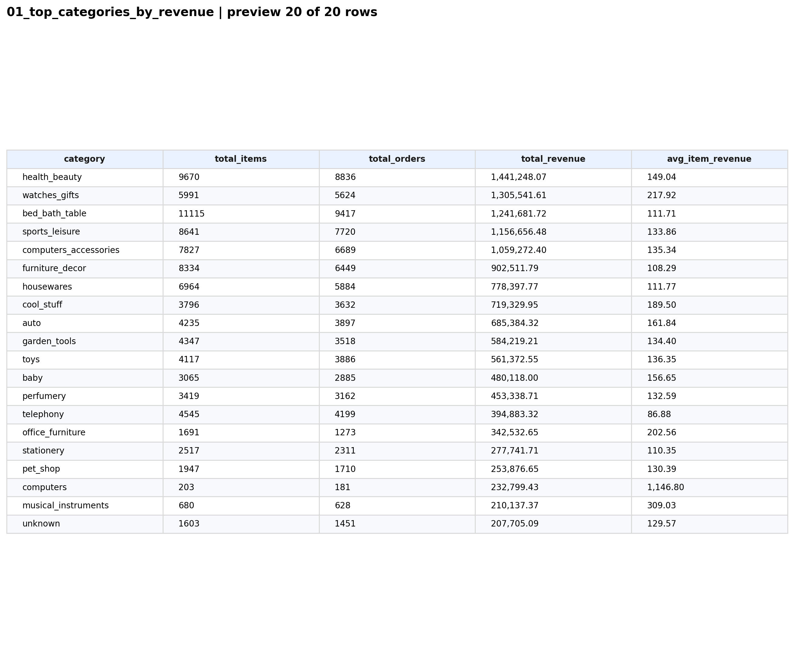
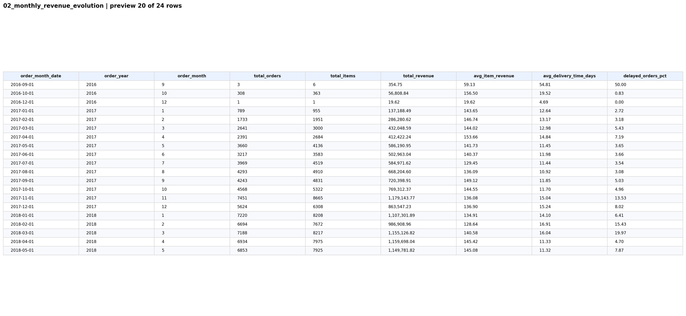
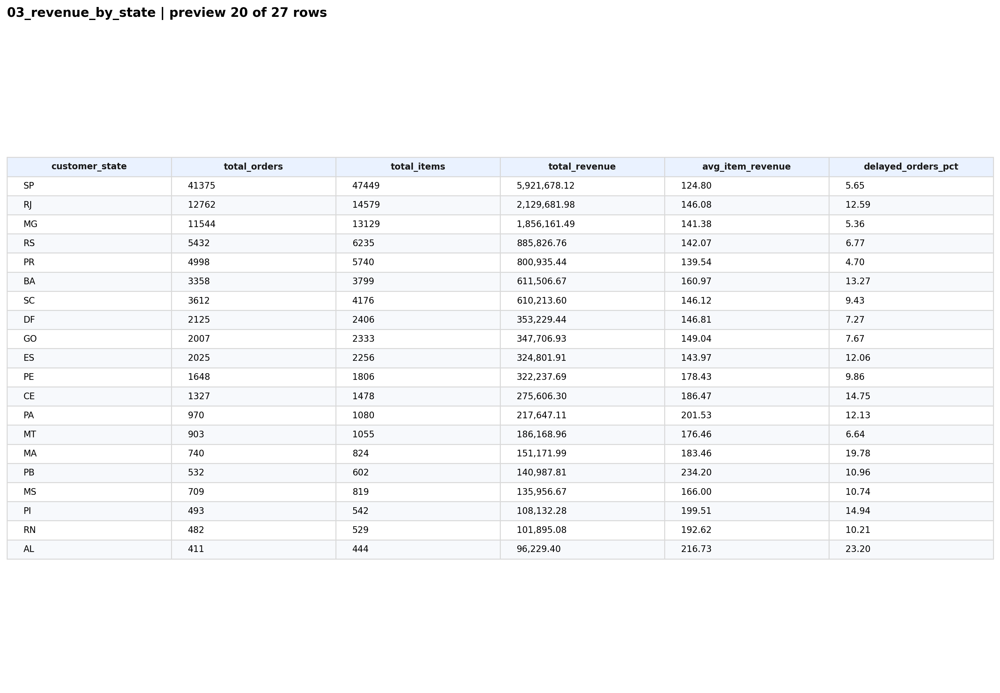
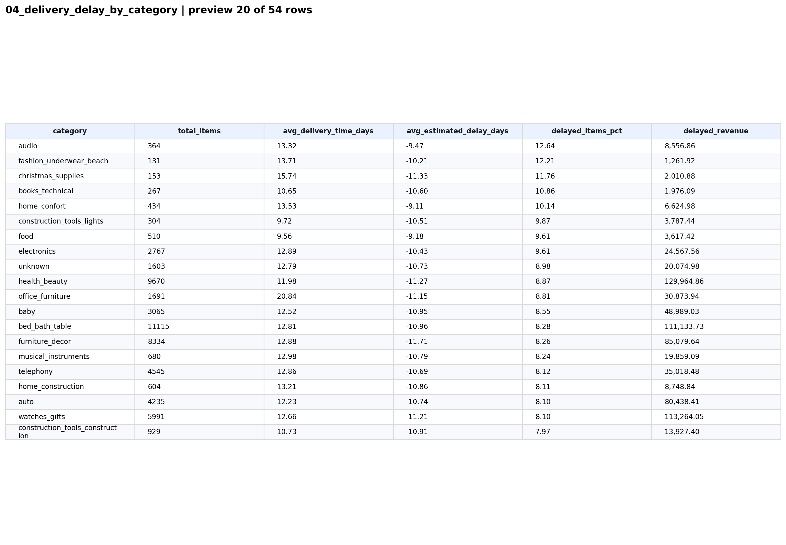
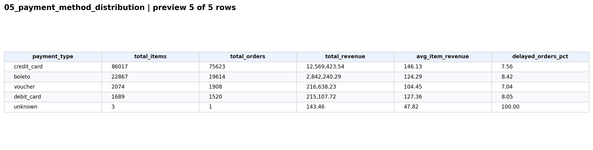

# Respostas do Case

## Resumo Executivo

Este projeto foi desenvolvido para transformar o dataset Olist em uma base analítica estruturada, confiável e pronta para responder perguntas de negócio com clareza. A entrega contempla ingestão, profiling, modelagem analítica, validação de qualidade, consultas SQL e geração de insumos visuais para documentação e dashboard.

O resultado central do trabalho é a tabela `fact_orders_enriched`, desenhada para consolidar informações de pedidos, itens, clientes, produtos, sellers, pagamentos e reviews em uma camada única de análise.

## Objetivo do Projeto

O objetivo do projeto é construir uma solução de dados ponta a ponta que permita:

- organizar os dados brutos em uma estrutura de projeto profissional
- entender a qualidade e o comportamento inicial das tabelas de origem
- modelar uma tabela analítica principal para responder às perguntas do case
- gerar consultas SQL reproduzíveis sobre a base final
- documentar os resultados de forma clara para consumo técnico e executivo

Em termos práticos, trata-se de converter dados transacionais dispersos em uma camada analítica que apoie diagnóstico, tomada de decisão e comunicação de insights.

## Descrição do Dataset Olist

O dataset Olist representa operações de e-commerce no Brasil e inclui diferentes visões do negócio:

- pedidos
- itens de pedido
- produtos
- clientes
- vendedores
- pagamentos
- reviews
- tradução de categorias

Essa composição torna a base adequada para análises de receita, experiência do cliente, eficiência logística, sazonalidade e distribuição geográfica.

## Justificativa da Escolha

O dataset foi escolhido por ser especialmente aderente a um case técnico de dados, pelos seguintes motivos:

- possui estrutura relacional realista, com necessidade de joins entre várias tabelas
- oferece volume suficiente para demonstrar modelagem analítica em escala relevante
- combina dimensões temporais, financeiras, operacionais e geográficas
- permite discutir tanto qualidade e engenharia de dados quanto interpretação de negócio

Essa escolha viabiliza uma entrega equilibrada entre rigor técnico e valor analítico.

## Visão Geral da Modelagem

A modelagem foi orientada por um princípio simples: preservar a granularidade do evento comercial mais importante para análise, que é o item vendido dentro de cada pedido.

Decisões principais de modelagem:

- `order_items` foi adotada como tabela base da camada factual
- `orders`, `customers`, `products` e `sellers` foram incorporadas como enriquecimento dimensional
- `payments` e `reviews` foram agregadas por `order_id` antes do join para evitar multiplicação artificial de linhas
- colunas foram padronizadas para `snake_case`
- atributos derivados foram criados para facilitar análise temporal e logística

Essa abordagem permite manter o detalhe operacional do item e, ao mesmo tempo, disponibilizar contexto suficiente para análises de receita, atraso, categoria, localidade e comportamento de compra.

## Explicação da Tabela `fact_orders_enriched`

A tabela `fact_orders_enriched` é a camada analítica principal do projeto.

Principais características:

- granularidade: `1 linha por item de pedido`
- volume final: `112.650` registros
- formato de persistência: `csv` e `parquet`
- uso principal: base de consulta SQL, documentação do case e consumo por dashboard

Principais grupos de atributos:

- identificadores de pedido, item, cliente, produto e seller
- informações de status e datas do pedido
- valores de item, frete e pagamento
- reviews agregadas
- atributos de categoria e localidade
- colunas derivadas para calendário e performance logística

Colunas derivadas de maior relevância:

- `order_year`
- `order_month`
- `order_date`
- `delivery_time_days`
- `estimated_delay_days`
- `is_delayed`
- `total_item_value`

Regras aplicadas na construção:

- remoção de inconsistências óbvias, como valores monetários negativos e entregas anteriores à compra
- preservação da granularidade por item
- enriquecimento sem duplicação indevida de registros
- preservação de anomalias residuais da fonte quando o ajuste arbitrário poderia comprometer a rastreabilidade analítica

Essa tabela foi desenhada para ser a interface principal entre os dados operacionais e as perguntas de negócio do case.

## Perguntas Respondidas com SQL

As consultas foram escritas em SQL compatível com DuckDB sobre a tabela `fact_orders_enriched`.

### 1. Top categorias por receita

Objetivo: identificar quais categorias concentram a maior parcela do faturamento.

Arquivo SQL:
- `sql/analytics/01_top_categories_by_revenue.sql`

Print do resultado:

Leitura executiva:
- `health_beauty`, `watches_gifts` e `bed_bath_table` aparecem como líderes de receita
- algumas categorias combinam alto volume com ticket médio estável
- categorias como `computers` mostram ticket médio muito elevado, apesar do baixo volume

### 2. Evolução temporal mensal

Objetivo: analisar como pedidos, receita e atraso evoluem ao longo do tempo.

Arquivo SQL:
- `sql/analytics/02_monthly_revenue_evolution.sql`

Print do resultado:

Leitura executiva:
- há aceleração relevante do negócio ao longo de 2017 e 2018
- `nov/2017` é um ponto de destaque tanto em receita quanto em pressão operacional
- os meses de pico ajudam a identificar períodos em que crescimento e qualidade de entrega precisam ser analisados em conjunto

### 3. Receita por estado

Objetivo: entender como a receita se distribui geograficamente.

Arquivo SQL:
- `sql/analytics/03_revenue_by_state.sql`

Print do resultado:

Leitura executiva:
- `SP` concentra a maior parte da receita e do volume transacional
- `RJ` e `MG` aparecem logo em seguida, reforçando a concentração no Sudeste
- estados com menor volume podem apresentar pior performance relativa de atraso, o que sugere assimetria operacional

### 4. Atraso de entrega por categoria

Objetivo: identificar categorias com maior incidência de atraso e potencial impacto na experiência do cliente.

Arquivo SQL:
- `sql/analytics/04_delivery_delay_by_category.sql`

Print do resultado:

Leitura executiva:
- o atraso não afeta todas as categorias da mesma forma
- categorias pequenas podem liderar em percentual de atraso
- categorias grandes concentram maior impacto financeiro absoluto quando atrasam

### 5. Distribuição por meio de pagamento

Objetivo: avaliar os meios de pagamento mais relevantes em volume e receita.

Arquivo SQL:
- `sql/analytics/05_payment_method_distribution.sql`

Print do resultado:

Leitura executiva:
- `credit_card` domina amplamente a operação
- `boleto` aparece como segunda modalidade mais relevante
- os demais meios possuem participação menor, mas seguem importantes para segmentações específicas

## Interpretação Executiva Consolidada

O conjunto das análises aponta para uma operação com três características marcantes:

- concentração comercial em poucas categorias e poucos estados
- crescimento relevante ao longo do tempo, acompanhado de gargalos operacionais em determinados períodos
- forte dependência do cartão de crédito como principal meio de pagamento

Do ponto de vista de negócio, isso sugere algumas leituras prioritárias:

- a operação pode ganhar eficiência atacando categorias e geografias de maior peso
- meses de pico devem ser tratados como janelas críticas de planejamento logístico
- atrasos precisam ser analisados não apenas por volume, mas por impacto financeiro e reputacional
- a experiência de pagamento por cartão merece atenção central em qualquer estratégia de conversão

Do ponto de vista técnico, a camada analítica também preserva transparência sobre a qualidade da fonte: pedidos sem entrega permanecem com métricas logísticas nulas quando apropriado, e pequenas anomalias residuais de origem são tratadas como alerta documentado, não como dado artificialmente corrigido.

## Próximos Passos

Como evolução natural do trabalho, os próximos passos recomendados são:

- construir dashboards interativos no Streamlit sobre a `fact_orders_enriched`
- desenvolver marts adicionais por cliente, seller e categoria
- incluir métricas de cohort, recorrência, ticket por pedido e lifetime value
- aprofundar as validações de qualidade com regras relacionais entre entidades
- adicionar visualizações gráficas complementares além das tabelas em PNG
- automatizar a execução do pipeline de ponta a ponta

## Como Esta Entrega Atende ao Case

Esta entrega atende ao case porque demonstra, de forma integrada, as capacidades centrais esperadas em um projeto técnico de dados:

- organização profissional do repositório
- tratamento estruturado dos dados brutos
- modelagem analítica com critério de granularidade
- validação da qualidade da base final
- consultas SQL orientadas a perguntas de negócio
- documentação clara e rastreável dos resultados
- preparo da base para consumo visual e executivo

Em resumo, o projeto mostra a capacidade de sair de dados transacionais brutos e chegar a uma camada analítica robusta, com rastreabilidade técnica e leitura executiva, respondendo ao case de maneira completa e coerente.
