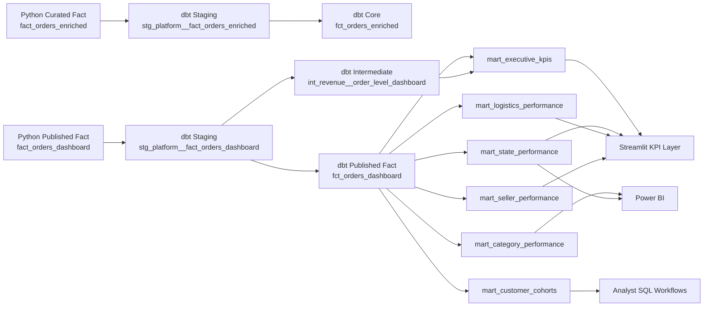

# dbt Lineage

## Objetivo

Este documento resume como o dbt foi posicionado no projeto e como o lineage deve ser lido por avaliadores técnicos.

## Tese

O dbt nao reconstrói o pipeline operacional. Ele documenta, testa e organiza a camada semântica em cima dos ativos confiáveis produzidos pelo Python.

## Fluxo semântico atual



## Leitura correta do lineage

- `fact_orders_enriched` continua sendo um ativo Python-owned
- `fact_orders_dashboard` continua sendo a fronteira oficial de exposição
- o dbt entra depois dessa fronteira para reforçar semântica, testes, documentação e lineage
- marts publicados existem para estabilizar definições de negócio para Streamlit, Power BI e SQL

## Marts semânticos implementados

| Mart | Grain | Uso principal |
| --- | --- | --- |
| `mart_executive_kpis` | 1 linha por KPI | cards executivos e scorecards |
| `mart_category_performance` | ano, mês, categoria, meio de pagamento | receita, ticket e atraso por categoria |
| `mart_state_performance` | ano, mês, UF cliente | leitura geográfica executiva |
| `mart_logistics_performance` | ano, mês, UF cliente, UF seller | leitura logística publicada |
| `mart_seller_performance` | seller pseudonimizado | scorecard de seller |
| `mart_customer_cohorts` | cohort, idade do cohort | retenção e recorrência |

## Como gerar a visualização local

```bash
cd dbt
copy profiles.yml.example profiles.yml
dbt docs generate --profiles-dir .
dbt docs serve --profiles-dir .
```

O grafo esperado deve mostrar duas entradas principais de staging vindas dos artefatos Python e, a partir delas, a expansão para fatos e marts publicados.
