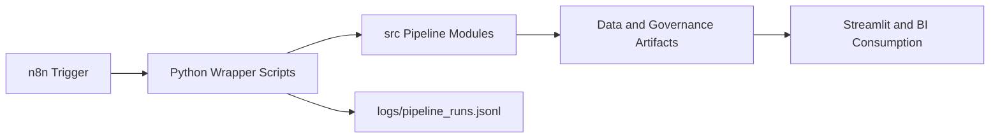

# n8n Automation

This document explains how n8n fits into the Governed Analytics Platform without changing the existing Python, SQL, dbt, Streamlit, or GitHub Actions responsibilities.

## Purpose

n8n is used as an orchestration layer. It schedules and triggers existing project commands, records execution logs, and can be connected to notification channels. It does not implement data transformations or governance rules.

## Architecture



## Added structure

| Path | Purpose |
| --- | --- |
| `workflows/n8n/` | Importable n8n workflow JSON files and workflow documentation. |
| `scripts/run_governance_pipeline.py` | Wrapper for the existing governed analytics pipeline runner. |
| `scripts/run_data_quality.py` | Wrapper for existing quality checks over `fact_orders_enriched`. |
| `scripts/run_lgpd_classification.py` | Wrapper for the implemented LGPD column classifier. |
| `scripts/run_privacy_risk_score.py` | Wrapper for the implemented privacy risk score calculation. |
| `scripts/generate_governance_docs.py` | Wrapper for implemented governance report generation. |
| `scripts/register_pipeline_log.py` | Appends JSONL execution logs for n8n runs. |
| `config/pipeline_config.yml` | Central configuration for n8n-facing scripts. |
| `logs/.gitkeep` | Keeps the log directory in version control. |

## Running locally

From the repository root:

```bash
python scripts/run_governance_pipeline.py --config config/pipeline_config.yml
python scripts/run_data_quality.py --config config/pipeline_config.yml
python scripts/run_lgpd_classification.py --config config/pipeline_config.yml
python scripts/run_privacy_risk_score.py --config config/pipeline_config.yml
python scripts/generate_governance_docs.py --config config/pipeline_config.yml
```

If using `uv`:

```bash
uv run python scripts/run_governance_pipeline.py --config config/pipeline_config.yml
```

## Operational notes

- Keep pipeline logic in `src/`.
- Keep n8n workflows focused on orchestration, scheduling, and notification.
- Use `config/pipeline_config.yml` to adjust default steps and artifact paths.
- Review generated artifacts before committing data or documentation changes.
- Do not store n8n credentials or secrets in workflow JSON files.

## Error handling

The `governed_analytics_error_handler.json` workflow records failed n8n executions by calling:

```bash
python scripts/register_pipeline_log.py --pipeline-name governed_analytics_pipeline --status failed --source n8n_error_handler --config config/pipeline_config.yml
```

Execution records are appended to `logs/pipeline_runs.jsonl`, which is intentionally treated as a runtime artifact. Only `logs/.gitkeep` is versioned.
