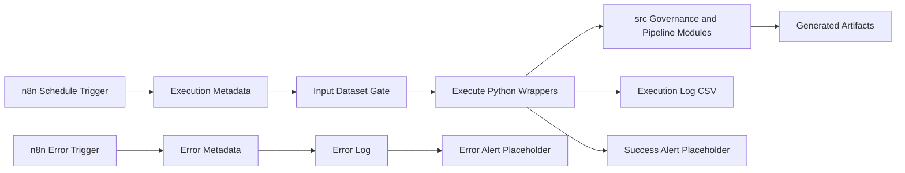

# n8n Automation

This document explains the n8n automation layer for the Governed Analytics Platform. The goal is to show orchestration maturity without replacing the implemented Python, SQL, dbt, contracts, or Streamlit application logic.

## Automation Architecture



n8n is intentionally limited to orchestration:

- it schedules or triggers the run;
- it checks that the expected input dataset exists;
- it invokes existing scripts through `Execute Command` nodes;
- it records run status in a local log file;
- it exposes success and error alert placeholders.

The transformations, quality rules, LGPD classification, privacy risk score, reports, and publication controls remain implemented in the repository code.

## Workflows

| Workflow | File | Purpose |
| --- | --- | --- |
| Governed Analytics Pipeline Orchestration | `workflows/n8n/governed_analytics_pipeline.json` | Main workflow for scheduled governed analytics automation. |
| Governed Analytics Error Handler | `workflows/n8n/governed_analytics_error_handler.json` | Error workflow for logging failed executions and sending an alert placeholder. |

### Main Workflow

The main workflow contains:

1. `Schedule Trigger`
2. `Set Execution Metadata`
3. `Check Input Dataset`
4. `Input Dataset Exists?`
5. `Run Data Quality Checks`
6. `Run LGPD Classification`
7. `Run Privacy Risk Scoring`
8. `Generate Governance Docs`
9. `Register Execution Log`
10. `Send Success Alert`

The `IF` node prevents the remaining workflow from running when the expected dataset is unavailable. The success alert node is a Discord placeholder and must be configured inside n8n before use.

### Error Workflow

The error workflow contains:

1. `Error Trigger`
2. `Extract Error Metadata`
3. `Register Error Log`
4. `Send Error Alert`

It should be configured as the error workflow for the main orchestration. The alert node also uses placeholders only.

## Importing into n8n

1. Open n8n.
2. Go to **Workflows**.
3. Select **Import from File**.
4. Import `workflows/n8n/governed_analytics_pipeline.json`.
5. Import `workflows/n8n/governed_analytics_error_handler.json`.
6. Set the error workflow of the main workflow to `Governed Analytics Error Handler`.
7. Review command paths and schedule cadence.
8. Replace alert placeholders with real n8n credentials only inside n8n.

Do not commit exported workflows after adding real credential IDs, tokens, webhook URLs, or channel secrets.

## Execution Commands

Run individual steps from the repository root:

```bash
python scripts/run_data_quality.py --config config/pipeline_config.yml
python scripts/run_lgpd_classification.py --config config/pipeline_config.yml
python scripts/run_privacy_risk_score.py --config config/pipeline_config.yml
python scripts/generate_governance_docs.py --config config/pipeline_config.yml
python scripts/register_pipeline_log.py --status success --message "manual run" --source manual
```

If the project environment is managed with `uv`, prefix commands with `uv run`:

```bash
uv run python scripts/run_lgpd_classification.py --config config/pipeline_config.yml
```

n8n calls the same commands through `Execute Command` nodes, which keeps local execution and orchestration execution aligned.

## Configuration

The automation configuration lives in `config/pipeline_config.yml`.

Key sections:

| Section | Purpose |
| --- | --- |
| `project` | Project name and local environment label. |
| `paths` | Input data, logs, and documentation directories. |
| `pipeline` | Feature toggles for automation steps. |
| `alerts` | Alert enablement and placeholder channel. |
| `logging` | Log format and log file path. |

Environment placeholders are documented in `.env.example`. The real `.env` file is ignored by Git.

## Log Structure

Execution logs are written to:

```text
logs/pipeline_execution_logs.csv
```

Current CSV columns:

| Column | Description |
| --- | --- |
| `timestamp_utc` | UTC timestamp for the logged event. |
| `pipeline_name` | Logical pipeline identifier. |
| `status` | `success`, `failed`, or `warning`. |
| `message` | Short execution message. |
| `source` | Caller such as `n8n`, `manual`, or `n8n_error_handler`. |

Runtime log files are ignored by Git. `logs/.gitkeep` exists only to preserve the directory structure.

## Portfolio Evidence

Recommended evidence to capture:

- n8n canvas screenshot showing the main workflow.
- n8n canvas screenshot showing the error handler.
- Execution history screenshot with a successful run.
- Example `logs/pipeline_execution_logs.csv` row with no secrets.
- Generated governance documentation in `docs/`.
- Terminal output from manual script execution.
- Streamlit screen showing governance or quality results after the pipeline artifacts are refreshed.

Keep screenshots focused on orchestration, logs, and governed outputs. Avoid exposing credentials, private webhook URLs, or local secrets.

## Interview Demo

A concise interview walkthrough:

1. Explain the core architecture: Python/SQL/dbt perform processing, n8n orchestrates.
2. Open `workflows/n8n/governed_analytics_pipeline.json` and describe each node.
3. Show `config/pipeline_config.yml` as the central automation config.
4. Run one script manually, for example LGPD classification.
5. Show the generated runtime log entry.
6. Open the Streamlit app and connect the automation to governance visibility.
7. Explain the error handler and alert placeholders.

The key message is that n8n improves operability without hiding the implementation in a low-code workflow.

## Limitations

- The workflow assumes n8n can run shell commands from the repository root.
- Alert nodes are placeholders and require configuration inside n8n.
- No real secrets are stored in workflow JSON files.
- The full data quality wrapper expects the curated analytical dataset to exist.
- This is a portfolio-grade local orchestration layer, not a managed enterprise scheduler.

## Next Steps

- Add webhook-triggered runs for external orchestration.
- Parameterize environment-specific paths in n8n variables.
- Configure a real alert channel outside version control.
- Capture imported workflow screenshots for portfolio documentation.
- Add optional run summaries generated from the CSV log.
