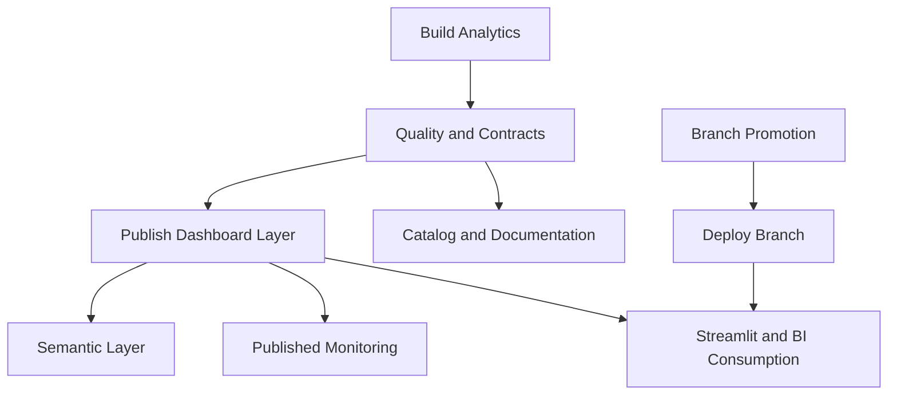

# Operating Model

Este documento consolida o modelo operacional do projeto em uma única visão: pipeline, qualidade, governança, publicação e consumo.

## Tese Operacional

O projeto opera com uma separação deliberada entre construir o ativo analítico, publicar a camada de exposição e promover o app por ambiente. Isso reduz ambiguidade operacional e torna mais claro o que é dado interno, o que é ativo publicado e o que está efetivamente em produção.

## Princípio operacional

O projeto opera com separação explícita entre branch de desenvolvimento e branch de deploy, entre camada interna e camada publicada, e entre automação comprovada e backlog futuro. Isso evita ambiguidade sobre o que está em produção, o que está em promoção e o que ainda é evolução planejada.

## Mapa Operacional

- `build` e `publish` definem a fronteira entre engenharia e exposição
- `quality`, `contracts` e `catalog` sustentam confiança e auditabilidade
- promoção de branch e deploy são fluxos separados da geração dos dados
- o app publicado só deve consumir a camada já minimizada
- a etapa `publish` falha se a camada exposta violar o contrato LGPD/governança

## Fluxo operacional

1. Ingestão e inventário da origem
2. Padronização e profiling
3. Construção da camada analítica `fact_orders_enriched`
4. Qualidade, contratos e catálogo
5. Publicação da camada `fact_orders_dashboard`
6. Expansão semântica e monitoramento recorrente da camada publicada
7. Consumo por Streamlit, SQL, Power BI e evidências

## Leitura do Fluxo

| Etapa | Objetivo operacional | Saída principal |
| --- | --- | --- |
| ingestão e padronização | garantir base reprodutível | tabelas raw e standardized |
| build analítico | consolidar o ativo central | `fact_orders_enriched` |
| qualidade e contratos | validar integridade e schema | relatórios e resultados de checks |
| publicação | delimitar e validar a camada exposta | `fact_orders_dashboard` + evidência LGPD/governança |
| semântica e monitoramento | ampliar reuso e observabilidade | marts e checks da camada publicada |
| consumo | materializar valor analítico | Streamlit, Power BI e SQL |

## Fluxo de branches e deploy

- `develop`: branch fonte do ambiente `dev`
- `release`: branch fonte do ambiente `stage`
- `main`: branch fonte do ambiente `prod` e branch de referência do repositório
- `streamlit-dev`, `streamlit-stage`, `streamlit-prod`: branches dedicadas de deploy do Streamlit Cloud
- promoção de deploy: ocorre via `.github/workflows/deploy-streamlit.yml`, com resolução explícita do plano de promoção por ambiente
- fallback operacional: em incidente de publicação, o ambiente afetado pode permanecer no branch de deploy anterior até normalização do fluxo

Leitura correta:

- merge em uma branch fonte não é o deploy final por si só
- o deploy efetivo depende da promoção bem-sucedida para `streamlit-dev`, `streamlit-stage` ou `streamlit-prod`
- a validação final inclui comportamento do app publicado no ambiente alvo, não apenas CI verde

## Separação Entre Operação de Dados e Operação de App

| Domínio | O que controla | Artefatos centrais |
| --- | --- | --- |
| operação de dados | build, publish, qualidade, monitoramento | `src/run_platform_pipeline.py`, `src/publish_dashboard.py`, `src/published_monitoring.py` |
| operação de app | promoção e deploy por ambiente | workflows de deploy e branches `streamlit-*` |
| governança operacional | policy checks, contratos e runbooks | `contracts/governance/`, `docs/release_runbook.md`, `docs/rollback_runbook.md` |

## Guardrails de release

- os workflows de teste e lint executam em `develop`, `release` e `main`
- na proteção real de `main`, os checks obrigatórios são `test` e `ruff`
- `Policy Check` valida o contrato versionado de governança e os gatilhos reais dos workflows
- `CI` valida também `python src/governance_validation.py`
- `publish` valida `contracts/governance/privacy_governance.json` antes de salvar a camada publicada
- `ruff` e `pytest` são reaplicados no workflow de promoção
- o branch de deploy é atualizado com `git push origin HEAD:<deployment_branch> --force`
- mudanças que afetam a camada publicada exigem revalidação de artefatos, contratos e qualidade
- rollback deve ocorrer com commit explícito, sem reescrita de histórico

## Papéis operacionais por artefato

- `src/run_platform_pipeline.py`: geração ponta a ponta dos ativos analíticos
- `src/publish_dashboard.py`: construção da camada publicada minimizada
- `contracts/governance/privacy_governance.json`: contrato versionado de exposição LGPD/governança
- `src/semantic_layer.py`: marts publicados para logística, seller e cohort
- `src/published_monitoring.py`: freshness e qualidade recorrente da camada publicada
- `src/platform_publication.py`: orquestra sync de catálogo e publicação idempotente de pipeline em ambiente de plataforma
- `.github/workflows/operate-published-layer.yml`: job agendado com artefatos operacionais e falha observável
- `.github/workflows/deploy-streamlit.yml`: promoção controlada de `develop`, `release` ou `main` para o branch de deploy do ambiente correspondente
- `.github/workflows/policy-check.yml`: valida aderência entre workflows e contrato de governança
- `contracts/governance/release_governance.json`: contrato canônico de branches, ambientes e workflows
- `src/governance_validation.py`: validação do contrato de release
- `src/workflow_policy_validation.py`: validação dos workflows contra o contrato
- `docs/release_runbook.md`: checklist mínimo antes e depois de release
- `docs/rollback_runbook.md`: resposta operacional para regressão de app ou artefato publicado

## Guardrails

- qualidade automatizada em `src/quality.py`
- contratos de schema em `src/schema_contracts.py`
- catálogo local versionado em `src/catalog.py`
- publicação minimizada em `src/publish_dashboard.py`
- contrato LGPD/governança aplicado automaticamente na camada publicada
- CI, lint e deploy versionados em `.github/workflows/`
- integrações externas permanecem opcionais e desacopladas do fluxo principal
- alertas externos podem ser disparados via webhook quando o monitoramento detecta falhas

## Critérios de Maturidade Operacional

- a camada publicada precisa continuar coerente com contratos e checks
- o fluxo de promoção deve refletir claramente o ambiente alvo
- documentação operacional deve permanecer compatível com os workflows reais
- incidentes precisam ser recuperáveis sem reescrita de histórico

## Responsabilidade por camada

- `raw/landing`: reprodutibilidade da fonte
- `standardized`: padronização para reuso técnico
- `staging/profiling`: análise exploratória e diagnósticos
- `curated/analytics`: camada interna de engenharia
- `published/dashboard`: camada oficial de exposição controlada

## Responsabilidade por ambiente

- ambiente local: geração, inspeção, testes e reprodutibilidade do projeto
- GitHub Actions: validação contínua, policy checks e promoção da branch de deploy por ambiente
- Streamlit Cloud: consumo executivo publicado

## Critério de operação saudável

Uma operação saudável deste projeto exige, ao mesmo tempo:

- docs centrais alinhadas ao fluxo real
- camada `published/dashboard` consistente com contratos e quality checks
- camada `published/semantic` materializada e coerente com o dashboard
- monitoramento de freshness da camada publicada sem alertas abertos
- branches `develop`, `release` e `main` íntegras conforme o estágio de promoção
- branch de deploy do ambiente alvo atualizada pelo fluxo de promoção
- app publicado carregando a versão esperada da camada minimizada no ambiente alvo

## Decisões de escopo

- o núcleo do projeto está nas camadas de analytics engineering e dashboard
- artefatos complementares não mudam a operação principal
- integrações externas dependem de credencial e ambiente, então a automação local é a prova principal
