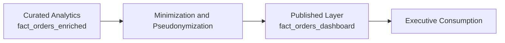

# Privacidade, LGPD e Governança

Este documento registra as decisões de privacidade por design e governança aplicadas ao projeto.

## Tese de Exposição

O projeto não trata publicação como cópia da base analítica. A camada exposta é derivada, minimizada e pseudonimizada para que consumo executivo e governança convivam sem depender de controles externos para tudo.

## Camadas de Exposição

- `data/raw/landing/`: dados brutos recebidos sem transformação.
- `data/standardized/`: dados padronizados para reuso técnico.
- `data/curated/analytics/`: tabela analítica interna com granularidade por item, usada para processamento, SQL e qualidade.
- `data/published/dashboard/`: camada publicada e minimizada para consumo do Streamlit.

## Fronteira de Exposição

- `curated` continua como camada interna de engenharia
- a passagem para `published` é o ponto de aplicação das decisões de exposição
- o consumo executivo acontece depois da minimização, não antes

## Medidas Aplicadas na Camada Publicada

- pseudonimização não reversível de `order_id` e `customer_unique_id` antes do consumo pelo dashboard.
- pseudonimização não reversível de `seller_id` em `seller_key` para permitir recortes por seller sem expor o identificador bruto.
- remoção de identificadores desnecessários para apresentação, como `customer_id`, `seller_id` e `product_id`.
- remoção de quase-identificadores mais sensíveis na camada publicada, como cidade e prefixo de CEP.
- manutenção apenas de atributos necessários para responder às perguntas do projeto: tempo, categoria, UF, pagamento, valor, atraso, seller, logística e cohort.
- preservação da camada analítica interna para engenharia e auditoria, separada da camada publicada.

## Princípios Aplicados

| Princípio | Implementação no projeto |
| --- | --- |
| minimização | remoção de colunas sem valor para leitura executiva |
| pseudonimização | substituição de identificadores por chaves derivadas |
| separação de camadas | consumo do app restrito à publicada |
| auditabilidade | documentação explícita da fronteira de exposição |

## Colunas Removidas da Camada Publicada

| Coluna removida | Motivo principal |
| --- | --- |
| `customer_id` | Minimização e redução de risco de reidentificação sem perda do objetivo analítico do dashboard. |
| `product_id` | Minimização e redução de risco de reidentificação sem perda do objetivo analítico do dashboard. |
| `seller_id` | Minimização e redução de risco de reidentificação sem perda do objetivo analítico do dashboard. |
| `customer_zip_code_prefix` | Minimização e redução de risco de reidentificação sem perda do objetivo analítico do dashboard. |
| `customer_city` | Minimização e redução de risco de reidentificação sem perda do objetivo analítico do dashboard. |
| `seller_zip_code_prefix` | Minimização e redução de risco de reidentificação sem perda do objetivo analítico do dashboard. |
| `seller_city` | Minimização e redução de risco de reidentificação sem perda do objetivo analítico do dashboard. |
| `latest_review_creation_date` | Minimização e redução de risco de reidentificação sem perda do objetivo analítico do dashboard. |
| `latest_review_answer_timestamp` | Minimização e redução de risco de reidentificação sem perda do objetivo analítico do dashboard. |
| `shipping_limit_date` | Minimização e redução de risco de reidentificação sem perda do objetivo analítico do dashboard. |
| `order_delivered_carrier_date` | Minimização e redução de risco de reidentificação sem perda do objetivo analítico do dashboard. |
| `order_approved_at` | Minimização e redução de risco de reidentificação sem perda do objetivo analítico do dashboard. |
| `payment_count` | Minimização e redução de risco de reidentificação sem perda do objetivo analítico do dashboard. |
| `total_payment_value` | Minimização e redução de risco de reidentificação sem perda do objetivo analítico do dashboard. |
| `max_payment_installments` | Minimização e redução de risco de reidentificação sem perda do objetivo analítico do dashboard. |
| `review_count` | Minimização e redução de risco de reidentificação sem perda do objetivo analítico do dashboard. |
| `review_score_max` | Minimização e redução de risco de reidentificação sem perda do objetivo analítico do dashboard. |
| `review_score_min` | Minimização e redução de risco de reidentificação sem perda do objetivo analítico do dashboard. |
| `has_review_comment` | Minimização e redução de risco de reidentificação sem perda do objetivo analítico do dashboard. |

## Resultado da Publicação Segura

- Arquivo publicado para o app: `data/published/dashboard/fact_orders_dashboard.parquet`
- Arquivo publicado para upload manual: `data/published/dashboard/fact_orders_dashboard.csv`
- Registros publicados: **112,650**
- Colunas publicadas: **34**

## O Que Esta Abordagem Evita

- exposição desnecessária de identificadores operacionais
- dependência do dashboard na tabela interna completa
- divergência entre o que é explorado internamente e o que é publicado
- uso informal de atributos detalhados sem justificativa de negócio

## Política de Uso

- o dashboard deve consumir exclusivamente a camada `published/dashboard`.
- a camada `curated/analytics` permanece interna ao pipeline e não deve ser tratada como camada de exposição.
- tabelas detalhadas do app devem exibir apenas chaves pseudonimizadas e dimensões agregadas necessárias ao projeto.
- uploads manuais em plataforma devem usar preferencialmente o CSV da camada publicada.

## Limitações e Escopo

- o dataset Olist é público e anonimizado, mas o projeto adota privacidade por design para refletir prática corporativa.
- esta camada não substitui controles organizacionais de acesso, mas reduz exposição desnecessária no produto analítico publicado.
