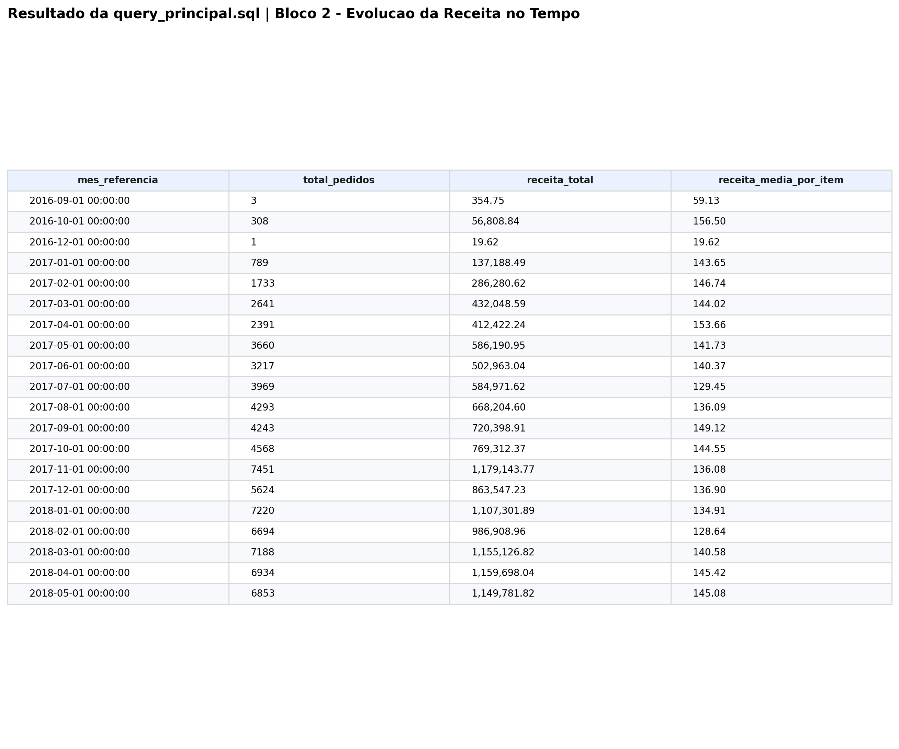
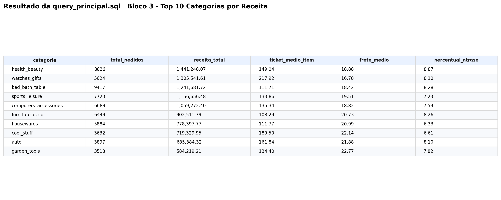

# Evidência da Query Principal


## Acesso Rápido

- Repositório: `https://github.com/samuelmaia-analytics/Governed-Analytics-Platform`
- App Streamlit: `https://governed-analytics-platform.streamlit.app/`
- Dashboard Power BI: `https://app.powerbi.com/links/Xto6lIUiRF?ctid=b1b9d429-7862-4440-a25b-6ca19f868f47&pbi_source=linkShare`

## Objetivo da query

Este documento registra a query principal utilizada para sustentar os indicadores e recortes analíticos do dashboard Power BI do projeto.

Ela foi estruturada para cobrir, de forma rastreável e defensável:

- Receita Total
- Total de Pedidos
- Ticket Médio
- Review Médio
- % Pedidos em Atraso
- Evolução da Receita no Tempo
- Top 10 Categorias por Receita
- Distribuição dos Pedidos por Status
- Estados com Maior Percentual de Atraso
- Top 10 Categorias por Frete Médio
- Detalhamento por Categoria

## Breve explicação da lógica

A SQL parte da tabela analítica `fact_orders_enriched`, que já consolida o domínio de pedidos, itens, clientes, sellers, pagamentos, reviews e variáveis derivadas de operação.

Em vez de uma única consulta monolítica, o arquivo foi organizado em blocos independentes. Isso melhora:

- legibilidade
- manutenção
- auditoria do racional analítico
- reutilização por visual ou por KPI

## Bloco da SQL usada

Arquivo de referência:

- [query_principal.sql](../sql/query_principal.sql)

```sql
-- Referência completa em sql/query_principal.sql
-- O arquivo contem os blocos de:
-- 1. KPIs Executivos
-- 2. Evolucao da Receita no Tempo
-- 3. Top 10 Categorias por Receita
-- 4. Distribuicao dos Pedidos por Status
-- 5. Estados com Maior Percentual de Atraso
-- 6. Top 10 Categorias por Frete Medio
-- 7. Detalhamento por Categoria
```

## Resultados e prints gerados

Os blocos da `query_principal.sql` foram executados sobre a tabela analítica `fact_orders_enriched`, com exportação do resultado tabular em CSV e geração de print em PNG para evidência.

## Evidência principal do resultado


## Evidências visuais complementares

### Evolução da Receita no Tempo



### Top 10 Categorias por Receita



- Bloco 1. KPIs Executivos
  CSV: [query_principal_01_kpis_executivos.csv](./query_principal_01_kpis_executivos.csv)
  PNG: [query_principal_01_kpis_executivos.png](./query_principal_01_kpis_executivos.png)
- Bloco 2. Evolução da Receita no Tempo
  CSV: [query_principal_02_evolucao_receita_tempo.csv](./query_principal_02_evolucao_receita_tempo.csv)
  PNG: [query_principal_02_evolucao_receita_tempo.png](./query_principal_02_evolucao_receita_tempo.png)
- Bloco 3. Top 10 Categorias por Receita
  CSV: [query_principal_03_top10_categorias_receita.csv](./query_principal_03_top10_categorias_receita.csv)
  PNG: [query_principal_03_top10_categorias_receita.png](./query_principal_03_top10_categorias_receita.png)
- Bloco 4. Distribuição dos Pedidos por Status
  CSV: [query_principal_04_distribuicao_pedidos_status.csv](./query_principal_04_distribuicao_pedidos_status.csv)
  PNG: [query_principal_04_distribuicao_pedidos_status.png](./query_principal_04_distribuicao_pedidos_status.png)
- Bloco 5. Estados com Maior Percentual de Atraso
  CSV: [query_principal_05_estados_maior_percentual_atraso.csv](./query_principal_05_estados_maior_percentual_atraso.csv)
  PNG: [query_principal_05_estados_maior_percentual_atraso.png](./query_principal_05_estados_maior_percentual_atraso.png)
- Bloco 6. Top 10 Categorias por Frete Médio
  CSV: [query_principal_06_top10_categorias_frete_medio.csv](./query_principal_06_top10_categorias_frete_medio.csv)
  PNG: [query_principal_06_top10_categorias_frete_medio.png](./query_principal_06_top10_categorias_frete_medio.png)
- Bloco 7. Detalhamento por Categoria
  CSV: [query_principal_07_detalhamento_categoria.csv](./query_principal_07_detalhamento_categoria.csv)
  PNG: [query_principal_07_detalhamento_categoria.png](./query_principal_07_detalhamento_categoria.png)

## Breve leitura analítica dos resultados

Leitura executiva sugerida:

- os KPIs sintetizam a dimensão econômica, operacional e de experiência do cliente
- a visão temporal permite identificar sazonalidade e ritmo de geração de receita
- a leitura por categoria mostra concentração de valor e espaço para otimização de portfólio
- a análise por status ajuda a separar receita entregue de fricções operacionais
- a leitura por estado adiciona contexto geográfico para atraso e performance comercial

## Status

Documento pronto.
Os resultados e prints dos 7 blocos já foram gerados e vinculados neste documento.

