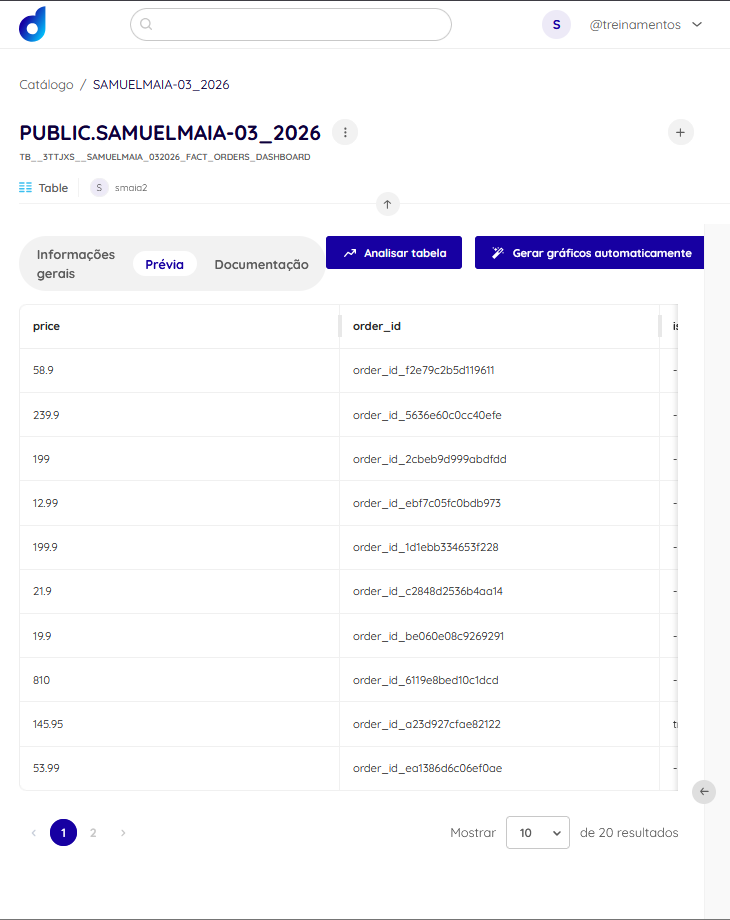

# Apresentação do Case

## Slide 1 — Abertura e objetivo do case
- Este case parte do dataset Olist e foi estruturado como uma prova de conceito de ciclo de vida dos dados.
- O foco foi sair de dados transacionais brutos e chegar a um ativo analítico confiável, documentado e pronto para consumo.
- A entrega combina engenharia de dados, catalogação, SQL, dashboard e evidência real na Dadosfera.
- A lógica central do projeto é simples: reduzir a distância entre dado bruto e valor de negócio.

**Notas do apresentador:**
Eu começaria dizendo que a proposta não foi só montar um dashboard. A ideia foi mostrar uma jornada completa: ingestão, organização, modelagem, publicação e consumo. Eu tratei o case como um mini produto de dados, com preocupação técnica, mas também com clareza para negócio.

**Tempo estimado:** 35 segundos

---

## Slide 2 — Dataset escolhido e problema de negócio
- Eu escolhi o Brazilian E-Commerce Public Dataset by Olist por ser um dataset relacional, com volume relevante e boa variedade de sinais de negócio.
- Ele permite analisar receita, pedidos, categorias, experiência do cliente, atraso logístico e comportamento geográfico.
- O principal problema aqui é transformar múltiplas tabelas transacionais em uma base analítica que responda perguntas de negócio com clareza.
- Isso é importante porque o dado bruto, sozinho, não sustenta leitura executiva nem decisão.

**Notas do apresentador:**
Aqui eu explicaria que o Olist é uma base muito boa para esse tipo de desafio porque obriga a integrar domínios diferentes, lidar com volume e pensar em modelagem de verdade. O problema de negócio que eu quis resolver foi dar visibilidade sobre receita, operação e experiência de compra em uma estrutura rastreável e reutilizável.

**Tempo estimado:** 35 segundos

---

## Slide 3 — Volume de dados e arquitetura em camadas
- A tabela analítica principal do projeto é a `fact_orders_enriched`, com `112.650` registros.
- A solução foi organizada em camadas inspiradas em Data Lake: `raw`, `standardized`, `staging`, `curated` e `published`.
- Essa separação ajuda a manter rastreabilidade, qualidade e clareza de uso por camada.
- Para o dashboard, eu não uso a camada interna completa; eu publico uma camada segura, específica para consumo analítico.

[INSERIR PRINT REAL AQUI: arquitetura em camadas do projeto ou árvore de pastas com as zonas raw, standardized, staging, curated e published]

**Notas do apresentador:**
Aqui eu falaria de forma bem objetiva: eu preservei uma camada analítica interna para engenharia e auditoria, e criei uma camada publicada para consumo no app. Isso reforça governança e deixa a solução mais madura, porque separa o dado de trabalho do dado de exposição.

**Tempo estimado:** 40 segundos

---

## Slide 4 — Ativos criados, catalogação e documentação
- Além da tabela principal, eu materializei uma camada publicada, uma coleção local catalogável e um inventário de ativos.
- O ativo principal foi publicado na Dadosfera e documentado com metadados e evidências visuais.
- A coleção seguiu o padrão solicitado no case e o projeto também manteve documentação técnica em Markdown no GitHub.
- O que está comprovado na plataforma é o ativo publicado; pipeline nativo ainda fica como evolução futura.

**Notas do apresentador:**
Esse é um ponto importante da defesa. Eu não tratei a publicação como detalhe. O ativo foi organizado e documentado para ser encontrado, entendido e reutilizado. Ao mesmo tempo, eu tomo cuidado para não vender como pronto algo que ainda é evolução, como pipeline nativo na plataforma.

**Tempo estimado:** 40 segundos

---

## Slide 5 — Query SQL principal e o que ela demonstrou
- A base analítica foi usada para responder perguntas executivas com SQL versionada no repositório.
- A query principal consolida KPIs, evolução temporal, categorias, distribuição por status e leitura de atraso.
- Isso mostra que o projeto não parou na modelagem: ele chegou em consumo analítico reproduzível.
- A evidência do resultado também foi documentada no GitHub.

**Notas do apresentador:**
Eu apresentaria esse slide como a ponte entre engenharia e decisão. A query principal mostra que a base final já responde perguntas reais do negócio: receita, pedidos, ticket, atraso, categoria e recorte operacional. Isso reforça que a modelagem foi construída para uso, e não só para estrutura.

**Tempo estimado:** 35 segundos

---

## Slide 6 — Dashboard e principais análises
- Com a camada publicada, eu construí um dashboard Streamlit com visão executiva da operação.
- O dashboard cobre KPIs, análise temporal, categorias e leitura geográfica.
- As principais análises ajudam a identificar concentração de receita, comportamento ao longo do tempo e gargalos operacionais.
- A solução foi desenhada para ser clara para negócio sem perder consistência técnica.

**Notas do apresentador:**
Aqui eu diria que o dashboard é a parte mais visível, mas ele só funciona bem porque existe uma camada publicada adequada por trás. O objetivo foi dar uma leitura rápida do negócio, mostrando crescimento, concentração por categoria e sinais de eficiência ou atraso na operação.

**Tempo estimado:** 40 segundos

---

## Slide 7 — Por que a Dadosfera acelera a jornada entre dados e valor
- No estado atual, o projeto já funciona localmente de ponta a ponta, mas ainda depende de mais esforço operacional para publicação e compartilhamento.
- A Dadosfera entra como o caminho mais rápido para reduzir essa distância entre ativo técnico e ativo consumível.
- Ela pode substituir parcialmente ou, em um cenário mais maduro, absorver parte importante da camada de publicação, catalogação e distribuição.
- Em termos práticos, isso acelera descoberta do ativo, governança, acesso e consumo por pessoas técnicas e de negócio.

**Notas do apresentador:**
Minha defesa aqui é equilibrada. Eu não estou dizendo que toda a arquitetura já foi substituída pela plataforma. O que eu estou mostrando é que a Dadosfera reduz fricção exatamente onde muitas soluções locais começam a perder velocidade: publicação, descoberta, compartilhamento e governança do ativo.

**Tempo estimado:** 40 segundos

---

## Slide 8 — Evoluções futuras e encerramento
- Como próximos passos, a solução pode evoluir para pipeline recorrente, Data Apps e aprofundamento de GenAI.
- O projeto já tem uma prova de conceito de extração de features em texto desestruturado, validada localmente com API.
- O pipeline nativo na Dadosfera continua como evolução futura e não como entrega já concluída.
- Minha principal mensagem é que este case mostra uma jornada realista e defensável entre dado bruto, ativo analítico e valor para o negócio.

**Notas do apresentador:**
Eu fecharia dizendo que este case demonstra mais do que uma entrega visual. Ele mostra estrutura, rastreabilidade e capacidade de transformar dados em algo utilizável. Para mim, a principal prova de valor da Dadosfera aqui é justamente acelerar essa passagem entre engenharia, publicação e consumo, sem perder governança.

**Tempo estimado:** 40 segundos
