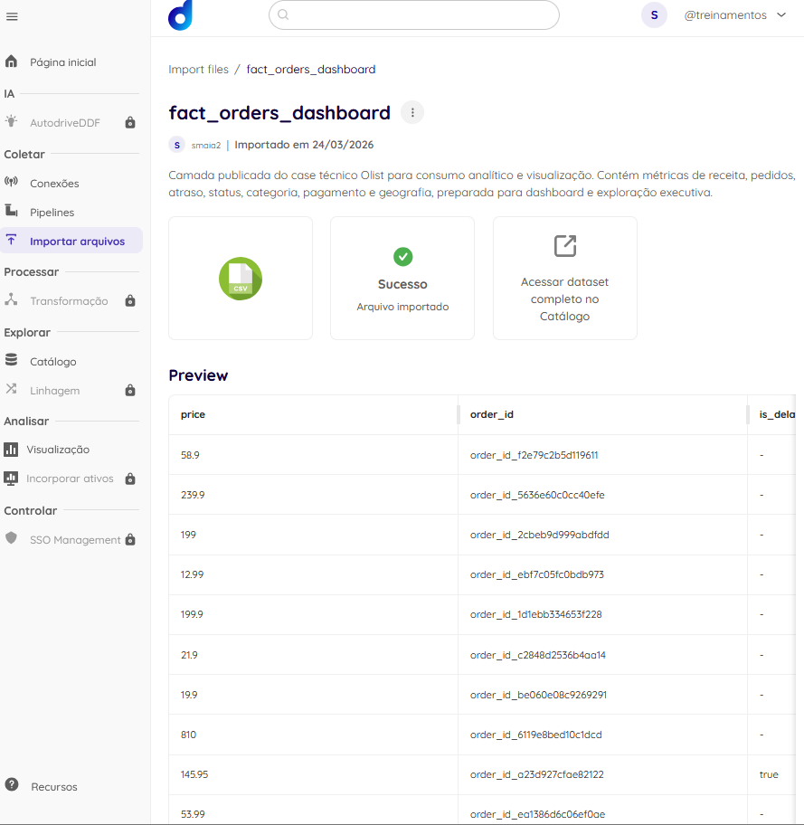
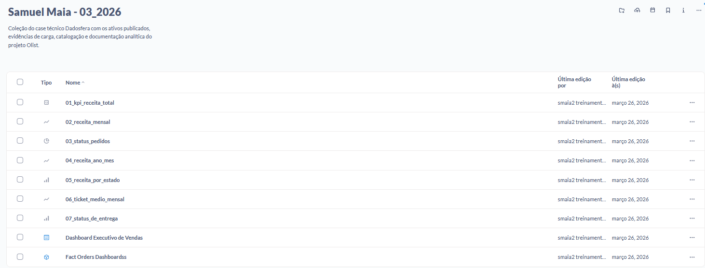
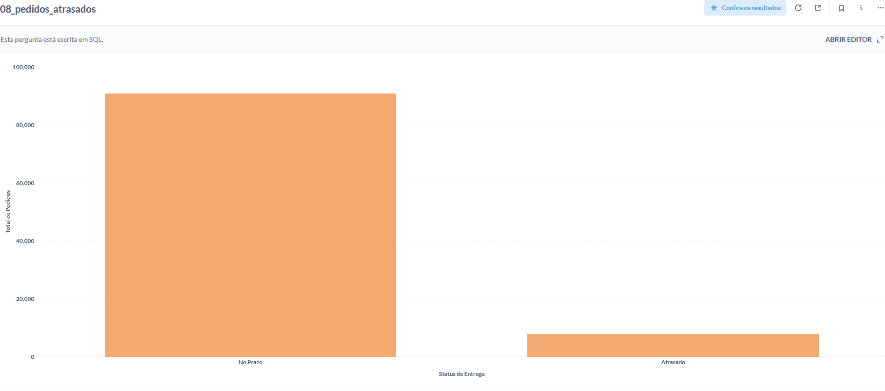
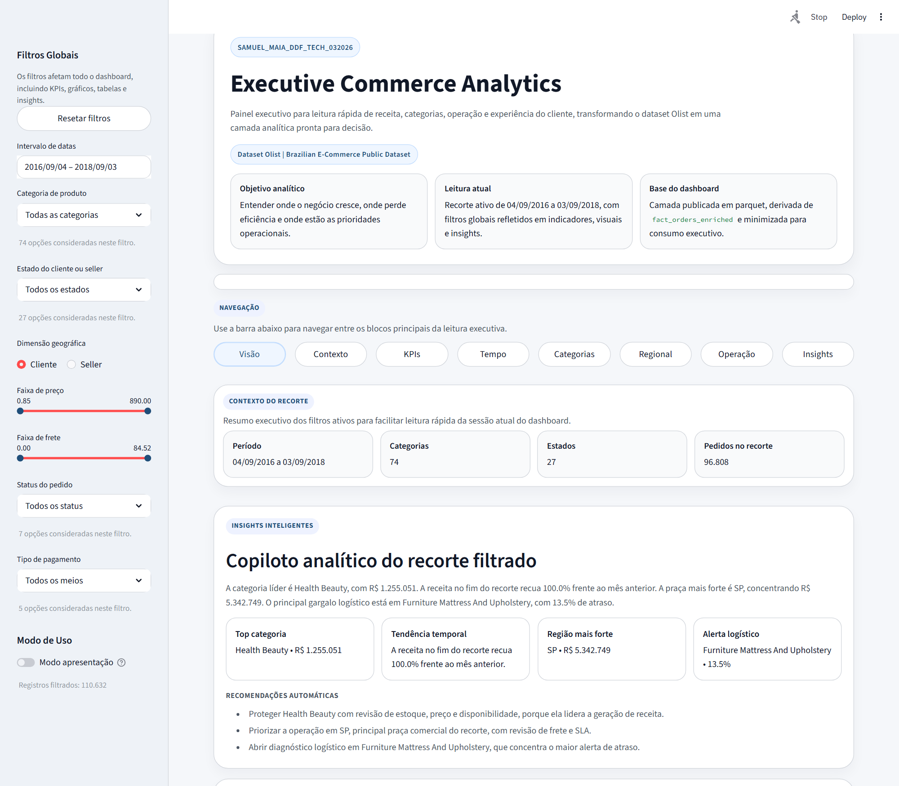
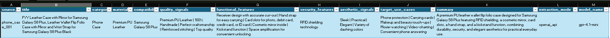

# Apresentação do Video Case Dadosfera

## Acesso Rápido

- Repositório: `https://github.com/samuelmaia-analytics/SAMUEL_MAIA_DDF_TECH_032026`
- Dashboard Streamlit: `https://samuelmaia-032026.streamlit.app/`
- Coleção principal na Dadosfera: `https://metabase-treinamentos.dadosfera.ai/collection/1101-samuel-maia-03-2026`
- Ativo analítico principal na Dadosfera: `https://metabase-treinamentos.dadosfera.ai/model/2719-fact-orders-dashboard`
- Documentação de apoio: `docs/dadosfera_evidencias.md`

## Estrutura sugerida

- `6 slides`
- `4 minutos e 20 segundos a 4 minutos e 50 segundos`
- `1 imagem principal por slide`

---

## Slide 1 - Abertura e objetivo do case

- Este case parte do dataset Olist e foi tratado como uma jornada completa de dados.
- A proposta foi transformar tabelas transacionais brutas em um ativo analítico confiável, documentado e pronto para consumo.
- A entrega reúne pipeline, modelagem, SQL, dashboard e publicação evidenciada na Dadosfera.



**Notas do apresentador:**
Eu começaria dizendo que a ideia aqui não foi só construir um painel. O objetivo foi mostrar uma jornada ponta a ponta, saindo do dado bruto até um ativo analítico pronto para uso. Então o foco do case foi combinar engenharia, governança, visualização e evidência real de publicação.

**Tempo estimado:** 40 segundos

---

## Slide 2 - Base analítica e arquitetura

- A tabela analítica principal do projeto é a `fact_orders_enriched`, com `112.650` registros.
- A arquitetura foi organizada em `raw`, `standardized`, `staging`, `curated` e `published`.
- O consumo executivo não usa a camada interna diretamente; ele usa uma camada publicada e controlada.

```text
raw/landing -> standardized -> staging -> curated -> published -> dashboard
```

**Notas do apresentador:**
Aqui eu explicaria que a arquitetura foi pensada para separar bem o que é dado bruto, o que é tratamento, o que é base interna e o que pode ser exposto para consumo. Isso ajuda a sustentar qualidade, rastreabilidade e governança. A camada publicada existe justamente para equilibrar uso executivo e controle técnico.

**Tempo estimado:** 45 segundos

---

## Slide 3 - Publicação na Dadosfera e coleção do case

- A coleção publicada na Dadosfera centraliza os ativos do case em um único ponto de navegação.
- Nela ficam organizados perguntas, visualizações, dashboard final e ativo analítico principal.
- O que está comprovado publicamente hoje é a coleção `Samuel Maia - 03_2026` e o modelo principal publicado em `https://metabase-treinamentos.dadosfera.ai/model/2719-fact-orders-dashboard`.



**Notas do apresentador:**
Esse slide mostra que a entrega não terminou no notebook ou no script local. Os ativos foram organizados em coleção, com uma estrutura mais próxima de produto analítico. E eu manteria honestidade técnica: a coleção pública está confirmada, o ativo principal está acessível e os links individuais ainda não confirmados foram tratados como pendência documentada.

**Tempo estimado:** 50 segundos

---

## Slide 4 - SQL e leituras de negócio

- A base analítica foi usada para responder perguntas executivas com SQL versionada no repositório.
- As leituras principais cobrem receita, evolução temporal, status dos pedidos, geografia e atraso logístico.
- Isso mostra que o projeto não para na modelagem; ele chega em consumo analítico reproduzível.



**Notas do apresentador:**
Aqui eu faria a ponte entre engenharia e decisão. Eu diria que a modelagem importa porque ela permite responder perguntas reais de negócio com consistência. A camada analítica não foi criada só para existir como tabela, mas para sustentar leitura prática sobre receita, operação e experiência.

**Tempo estimado:** 40 segundos

---

## Slide 5 - Dashboard executivo

- Com a camada publicada, eu construí um dashboard Streamlit com visão executiva da operação.
- O dashboard consolida KPIs, análise temporal, leitura geográfica e comportamento operacional.
- Isso cria uma camada de consumo simples para o avaliador explorar depois da apresentação.



**Notas do apresentador:**
Aqui eu mostraria o consumo executivo do case. O ponto principal é que o dashboard não está solto: ele conversa com a mesma lógica analítica publicada e mantém coerência com o restante da solução. Então existe alinhamento entre dado, pergunta de negócio, visualização e documentação.

**Tempo estimado:** 45 segundos

---

## Slide 6 - Encerramento e próximos passos

- O case entrega uma jornada defensável entre dado bruto, ativo analítico e consumo executivo.
- Já existe evidência real de publicação, documentação e governança mínima aplicada ao ativo.
- Como evolução, a solução pode avançar para pipeline recorrente, Data Apps, uso de GenAI sobre dados e operação mais nativa na Dadosfera.



**Notas do apresentador:**
Eu fecharia dizendo que esse case busca ser consistente, não inflado. O que está entregue hoje já demonstra pipeline, modelagem, publicação, consumo e documentação. E eu também destacaria que existe uma frente de GenAI no projeto, usada como extensão controlada para enriquecer a leitura analítica com dados textuais. O próximo passo natural é aprofundar essa camada junto da operação dentro da plataforma.

**Tempo estimado:** 40 segundos
