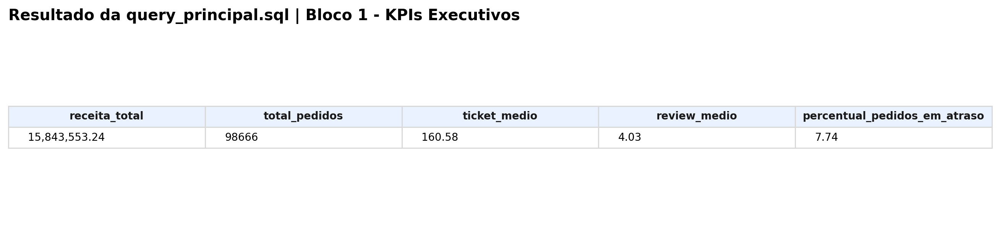
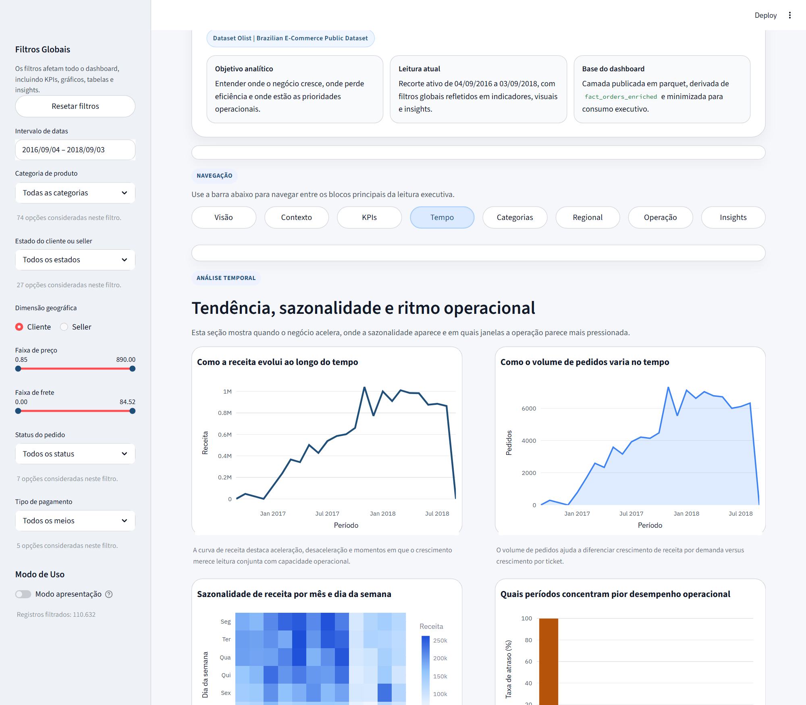
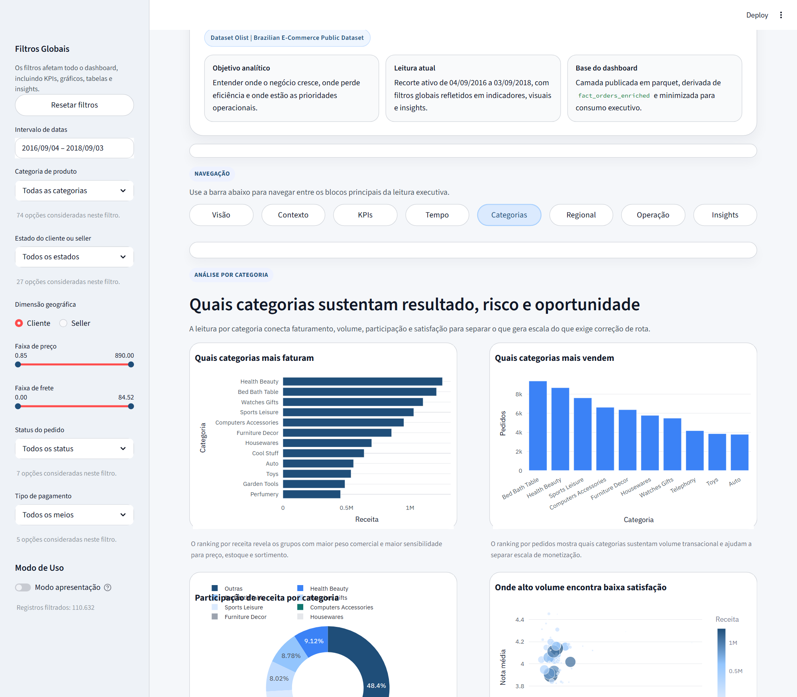
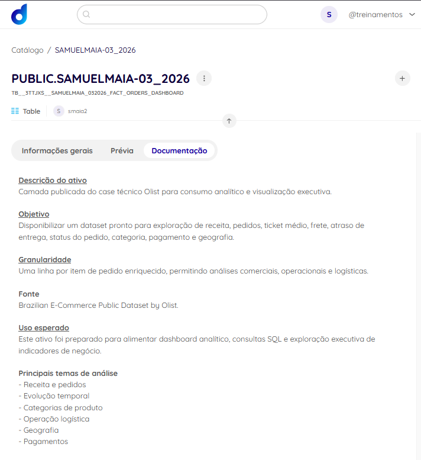
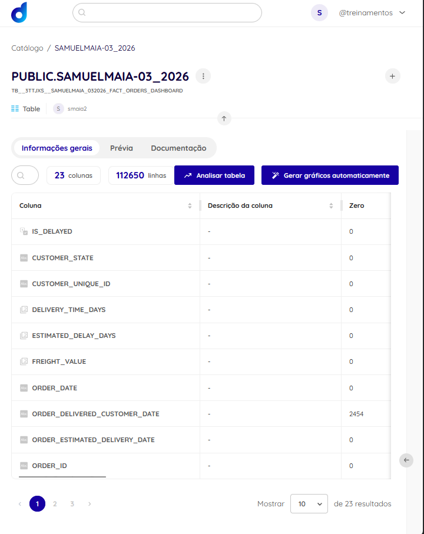

# Case Deck

## Slide 1 - Capa

- Projeto: `SAMUEL_MAIA_DDF_TECH_032026`
- Tema: Analytics Engineering e Data Product com dados do Olist
- Objetivo: transformar dados brutos de e-commerce em camada analítica confiável, consultável e pronta para consumo executivo

## Slide 2 - Problema

- O dataset Olist possui múltiplas tabelas transacionais e exige integração entre pedidos, itens, clientes, produtos, sellers, pagamentos e reviews
- O desafio do case é sair do dado bruto e chegar a uma base analítica que responda perguntas de negócio com rastreabilidade
- Além da análise, a entrega precisava contemplar documentação, SQL, dashboard e visão de publicação/catalogação

## Slide 3 - Arquitetura

- Camadas implementadas:
  - `data/raw/landing/olist/`
  - `data/standardized/olist/`
  - `data/staging/profiling/`
  - `data/curated/analytics/`
  - `data/curated/quality/`
  - `data/curated/catalog/`
  - `data/published/dashboard/`
- Referência visual: `docs/architecture.md`
- Sugestão de fala:
  - começar explicando que o projeto separa dado bruto, dado padronizado, dado analítico interno e dado publicado
  - enfatizar que o dashboard consome apenas a camada publicada

## Slide 4 - Pipeline

- `src/ingest.py`: valida arquivos de origem
- `src/preprocess.py`: padroniza e gera profiling
- `src/build_analytics.py`: constrói a `fact_orders_enriched`
- `src/quality.py`: executa checks de qualidade
- `src/publish_dashboard.py`: gera camada segura para consumo
- `src/run_case_pipeline.py`: orquestra tudo ponta a ponta

## Slide 5 - Tabela Analítica Principal

- Ativo central: [data/curated/analytics/fact_orders_enriched.parquet](C:\Users\samue\PycharmProjects\SAMUEL_MAIA_DDF_TECH_032026\data\curated\analytics\fact_orders_enriched.parquet)
- Granularidade: `1 linha por item de pedido`
- Volume final: `112.650` linhas
- Colunas: `48`
- Uso: SQL, qualidade, documentação e derivação da camada publicada
- Mensagem principal:
  - a modelagem foi feita para preservar detalhe operacional e ainda permitir leitura executiva

## Slide 6 - Governança e Publicação

- Camada interna: `fact_orders_enriched`
- Camada publicada: [data/published/dashboard/fact_orders_dashboard.parquet](C:\Users\samue\PycharmProjects\SAMUEL_MAIA_DDF_TECH_032026\data\published\dashboard\fact_orders_dashboard.parquet)
- Medidas aplicadas:
  - pseudonimização de `order_id` e `customer_unique_id`
  - remoção de identificadores e quase-identificadores desnecessários
- Referência: [docs/privacy_governance.md](C:\Users\samue\PycharmProjects\SAMUEL_MAIA_DDF_TECH_032026\docs\privacy_governance.md)

## Slide 7 - SQL e Insights

- Queries salvas em [sql/analytics/](C:\Users\samue\PycharmProjects\SAMUEL_MAIA_DDF_TECH_032026\sql\analytics)
- Resultados exportados em [data/curated/query_results/](C:\Users\samue\PycharmProjects\SAMUEL_MAIA_DDF_TECH_032026\data\curated\query_results)
- Evidências tabulares em [data/screenshots/query_results/](C:\Users\samue\PycharmProjects\SAMUEL_MAIA_DDF_TECH_032026\data\screenshots\query_results)
- Principais leituras:
  - concentração comercial em poucas categorias e estados
  - aceleração temporal com pressão operacional em meses de pico
  - alta dependência de `credit_card`
- Sugestão visual:
  - colocar um mosaico com 2 ou 3 screenshots de `data/screenshots/query_results/`

## Slide 8 - Dashboard

- App em `streamlit_app/app.py`
- Fonte exclusiva: `data/published/dashboard/fact_orders_dashboard.parquet`
- Blocos principais:
  - KPIs
  - tendência temporal
  - categorias
  - geografia
  - operação
  - insights executivos
- Screenshots finais já disponíveis:
  - `images/dashboard/01_overview.png`
  - `images/dashboard/02_kpis.png`
  - `images/dashboard/03_temporal.png`
  - `images/dashboard/04_categories.png`
  - `images/dashboard/05_geography.png`
- Sugestão de uso no slide:
  - imagem principal: `01_overview.png`
  - imagens de apoio: `03_temporal.png`, `04_categories.png` e `05_geography.png`
- Mensagem principal:
  - o dashboard não é apenas visual; ele consome uma camada publicada e minimizada, coerente com a governança do projeto

## Slide 9 - Catálogo e Dadosfera

- Existe catálogo local em:
  - [data/curated/catalog/dadosfera_collection.json](C:\Users\samue\PycharmProjects\SAMUEL_MAIA_DDF_TECH_032026\data\curated\catalog\dadosfera_collection.json)
  - [data/curated/catalog/collection_assets_inventory.csv](C:\Users\samue\PycharmProjects\SAMUEL_MAIA_DDF_TECH_032026\data\curated\catalog\collection_assets_inventory.csv)
- Status honesto:
  - estrutura de publicação e metadados está pronta localmente
  - o ativo principal já foi publicado e evidenciado na plataforma Dadosfera
  - o que permanece pendente é pipeline nativo na plataforma
- Recomendação para fala:
  - dizer explicitamente que o repositorio ja entrega o payload, o inventario e a prova visual do ativo publicado
  - não vender como integração por API ou pipeline real concluído
- Prints já disponíveis:
  - `images/dadosfera/01_importacao_dataset.png`
  - `images/dadosfera/02_catalogo_metadados.png`
  - `images/dadosfera/03_colecao_case.png`
  - `images/dadosfera/04_volume_100k.png`
- Referencia operacional: `docs/dadosfera_capture_runbook.md`

## Slide 10 - Testes e Robustez

- Suíte em [tests/](C:\Users\samue\PycharmProjects\SAMUEL_MAIA_DDF_TECH_032026\tests)
- Validações cobrindo:
  - build analítico
  - catálogo
  - filtros do dashboard
  - publicação segura
  - qualidade
  - runner do pipeline
  - contratos de schema

## Slide 11 - Bônus de BI

- Exports preparados em [data/processed/bi_exports/](C:\Users\samue\PycharmProjects\SAMUEL_MAIA_DDF_TECH_032026\data\processed\bi_exports)
- Status honesto:
  - base pronta para Power BI
  - documentação, evidência de query e screenshots já foram materializadas na pasta `powerbi/`
- Referencia operacional: `powerbi/delivery_plan.md`

## Slide 12 - GenAI

- caso de uso implementado:
  - extração de features estruturadas a partir de texto desestruturado de produto
- artefatos:
  - `data/external/genai/product_text_samples.csv`
  - `data/curated/genai/product_text_features.csv`
  - `src/genai_feature_extraction.py`
- status honesto:
  - execução real validada localmente com `gpt-4.1-mini`
  - saída final registra `openai_api` em `extraction_mode`

## Slide 13 - Próximos Passos

- preencher os links finais da apresentação
- gravar o vídeo final
- integrar os screenshots finais do Streamlit e da Dadosfera ao deck final
- opcional: criar pipeline nativo na Dadosfera
